<div align="right"><a href="./README.md">简体中文</a></div>

<div align="center">
  
  <h1>Yotsuba Ink</h1>
  <p><strong>AI-native workbench for long-form fiction</strong></p>
  <p>Plan, generate, review, recover, and export a complete novel through explicit stage artifacts and continuity-aware execution.</p>
  <p>
    
    
    
    <a href="LICENSE"></a>
  </p>
</div>

<p align="center">
  <a href="#production-workflow">Workflow</a> ·
  <a href="#creation-modes">Modes</a> ·
  <a href="#verified-v10-run">Verified run</a> ·
  <a href="#quick-start">Quick start</a>
</p>

<p align="center">
  
</p>

Yotsuba Ink is built for long-form projects that need sustained control over structure, characters, continuity, and versions. It turns model calls into a production workflow with explicit artifacts, author decisions, quality boundaries, and recovery records instead of asking one conversation to generate an entire book.

## Production workflow

Each stage owns one core Artifact. Downstream work starts from committed upstream decisions, and prose chapters are generated sequentially from the previous chapter's accepted state.

```mermaid
flowchart LR
  idea["Story idea"] --> brief["Brief<br/>Title, promise, rules, and voice"]
  brief --> spine["Spine<br/>Book-level causality and payoff"]
  spine --> cast["Cast<br/>Character bible and debut boundaries"]
  cast --> volumes["Volumes<br/>Promise, conflict, climax, and closure"]
  volumes --> detail["Detail<br/>Chapter purpose, scenes, and handoff"]
  detail --> text["Text<br/>Sequential chapter generation"]
  text --> gate{"Contract and quality gate"}
  gate -->|Pass| cover["Cover<br/>Visual brief and optional asset"]
  gate -->|One targeted revision| text
  gate -. Soft issues stay warnings .-> evidence["Evidence<br/>Findings, excerpts, and direction"]
  cover --> export["Export<br/>Versions, metadata, and ZIP"]

  classDef planning fill:#102a24,stroke:#2fd68f,color:#f2fff9;
  classDef writing fill:#172433,stroke:#69a7e8,color:#f4f8ff;
  classDef decision fill:#302819,stroke:#d8ad54,color:#fff9ec;
  classDef delivery fill:#26203a,stroke:#9a7ce2,color:#fbf8ff;
  class brief,spine,cast,volumes,detail planning;
  class text,evidence writing;
  class gate decision;
  class cover,export delivery;
```



| Stage | Core artifact | Author decision |
| --- | --- | --- |
| Brief | `StoryBriefArtifact` | Title, premise, world rules, theme, ending direction, and voice |
| Spine | `StorySpineArtifact` | Whether major changes form a causal chain and pay off the Brief |
| Cast | `CharacterBibleArtifact` | Subject roles, drives, arcs, limits, relationships, and debuts |
| Volumes | `VolumeArchitectureArtifact` | Each volume's promise, conflict, climax, closure, and handoff |
| Detail | `DetailArtifact` | Chapter purpose, POV, scene sequence, result, and next handoff |
| Text | `ChapterArtifact` | Accept, edit, or request an evidence-directed revision |
| Cover | `CoverArtifact` | Visual direction, image prompt, candidate asset, and final choice |
| Export | `ExportArtifact` | Accepted chapter versions, metadata, cover, and format |

## Why Yotsuba Ink

| Capability | How it works | Why it matters |
| --- | --- | --- |
| Structure before prose | Brief, Spine, Cast, Volumes, and Detail are committed in order | A long novel does not depend on improvising from one prompt |
| Bounded context | Each chapter receives a signed Context Manifest and only required references | Prompt growth and cross-chapter drift stay controlled |
| Sequential continuity | Chapter N+1 depends on chapter N's accepted prose, handoff, and temporary state | Location, knowledge, and consequences can carry forward coherently |
| Evidence-based review | Deterministic contracts can block; LLM reviewers provide evidence and warnings by default | Ambiguous literary opinions do not create infinite rewrite loops |
| One targeted revision | The UI shows the finding, exact evidence, and suggested direction | A clear defect can be corrected without reopening frozen structure |
| Recoverable execution | LangGraph checkpoints, operation receipts, SSE sequences, and terminal snapshots | Failures are traceable, streams reconnect, and completed runs do not replay history |
| Verifiable delivery | Export freezes accepted chapter versions, metadata, checksums, and receipts | The delivered manuscript can be traced back to approved work |

## Creation modes

All three modes use the same Artifacts, quality contracts, and export format. They differ only in model selection, author decision density, and review strength.

| Mode | Model path | Decisions | Quality and revision | Best for |
| --- | --- | --- | --- | --- |
| Fast | Primarily DeepSeek Flash | Stage and chapter decisions are accepted automatically | Hard gates remain active; one automatic targeted revision is allowed for a proven hard issue | Testing an idea and producing a complete first draft quickly |
| Balanced (recommended) | Pro for planning and prose; Flash for cover metadata | Every stage and chapter can be accepted, edited, regenerated, or cancelled | Continuity and character review are required; evidence and revision direction stay visible | Everyday long-form work with practical cost and control |
| Deep | Pro across Provider-backed stages | Every stage and chapter is finalized by the author | All three review lanes must return; selected structure values can be locked inside the feasible range | High-control drafting and formal revision |

## Quality and continuity boundaries

Yotsuba Ink separates issues that must stop production from issues that deserve attention:

- **Hard gates**: unrecoverable execution, invalid structured output, missing core Artifacts or prose, explicit upstream contract conflicts, subject authority violations, direct physical-state contradictions inside a chapter, a missed frozen book-length target, or an unusable export.
- **Warnings**: low-confidence reviewer findings, modest rhythm or style variation, detectable AI flavor, lengths near a reasonable boundary, evidence that does not directly name the subject, and identity concealment or delayed revelation that later prose can explain.
- **Revision limit**: one automatic or author-directed regeneration per stage or chapter. A second hard failure stops explicitly instead of hiding the root problem behind more generation.

```mermaid
flowchart TB
  ui["React workbench"] <--> api["FastAPI / SSE adapter"]
  api <--> graph["LangGraph<br/>single production runtime"]
  graph --> context["Context Compiler<br/>frozen references and budgets"]
  context --> gateway["Provider Gateway<br/>OpenAI-compatible"]
  gateway --> graph
  graph --> stores["Artifact / Chapter / Decision / Receipt Stores"]
  stores --> readmodel["Rebuildable Read Model"]
  readmodel --> api
  stores --> exportstore["Export files and integrity receipts"]

  classDef surface fill:#121d1a,stroke:#2fd68f,color:#f4fff9;
  classDef runtime fill:#172433,stroke:#69a7e8,color:#f4f8ff;
  classDef data fill:#2a2338,stroke:#9a7ce2,color:#fbf8ff;
  class ui,api surface;
  class graph,context,gateway runtime;
  class stores,readmodel,exportstore data;
```

## Verified v1.0 run

The official `official-deepseek-balanced` workflow has completed a real long-form production run above 100,000 characters:

| Metric | Result |
| --- | --- |
| Work | *明日来电* |
| Run / Project | `balanced-110k-v1-demo-20260817-040033` / `proj-e1007717ad` |
| Stages | 8/8 complete |
| Prose | 44 chapters, 107,613 non-whitespace characters |
| Chapter distribution | 1,710-3,692; average 2,445.75; P90 2,962 |
| Volumes | 14 / 14 / 16 chapters; 100% chapter and volume title completeness |
| Provider | 314 calls, 311 successful, 3 failed and recovered, 1,760,252 tokens |
| Export | Valid ZIP, 44 accepted chapter versions, verified SHA-256 |

<p align="center">
  
</p>

Cover image generation was skipped by configuration for this acceptance run; Cover metadata and Export still completed. See the [v1.0 long-form acceptance report](docs/engineering/yotsuba-ink-v1-balanced-110k-acceptance.md) for hard gates, continuity samples, chapter distribution, Provider receipts, and browser evidence.

## Quick start

### Requirements

- Python 3.12+
- Node.js 22+
- npm 10+

### 1. Install

```bash
git clone https://github.com/isla4ever/yotsuba-ink.git
cd yotsuba-ink

python3 -m venv .venv
.venv/bin/python -m pip install -U pip
.venv/bin/python -m pip install -e ".[dev]"

cd apps/web
npm ci
```

### 2. Start the backend

```bash
cd yotsuba-ink
.venv/bin/python -m uvicorn novel_workflow.api.app:app \
  --host 127.0.0.1 \
  --port 8787 \
  --reload
```

### 3. Start the frontend

```bash
cd yotsuba-ink/apps/web
npm run dev
```

Open [http://127.0.0.1:5173](http://127.0.0.1:5173). The development server proxies `/api` to `http://127.0.0.1:8787` by default.

## Provider configuration

The recommended path is **Model Settings** in the application. Select an official or custom OpenAI-compatible Provider, enter the API key and model, then run the readiness check. Secrets stay in local runtime data.

Environment variables are also supported:

```bash
export NOVEL_LLM_BASE_URL="https://your-provider.example/v1"
export NOVEL_LLM_API_KEY="your-text-api-key"
export NOVEL_LLM_MODEL="your-text-model"

# Only required for cover image generation
export NOVEL_IMAGE_BASE_URL="https://your-image-provider.example/v1"
export NOVEL_IMAGE_API_KEY="your-image-api-key"
export NOVEL_IMAGE_MODEL="your-image-model"
```

Never commit `.env` files, API keys, run history, Provider input snapshots, or user manuscripts.

## Development and verification

```bash
# Backend
.venv/bin/pytest -q
.venv/bin/python -m compileall -q src tests

# Frontend
cd apps/web
npm test
npm run build
npm run audit:css
npm run check:css-split
```

Current v1.0 baseline: backend `527 passed`; frontend `112` test files and `421 passed`; TypeScript, production build, CSS audit, CSS splitting, and desktop/390px browser checks pass.

## Repository layout

```text
apps/web/                    React creation workbench
src/novel_workflow/          LangGraph runtime, domain contracts, and FastAPI adapters
runtime/novel_workflow/      Official workflows, prompts, and local runtime data
tests/                       Contract, orchestration, Provider, recovery, and quality tests
docs/                        Architecture contracts and acceptance records
```

## Essential documentation

- [Architecture overview](docs/architecture/overview.md)
- [Stage Artifact contract](docs/architecture/stage-artifact-contract.md)
- [Phase 27 adaptive long-form architecture](docs/architecture/phase-27-adaptive-story-planning-reconstruction.md)
- [v1.0 balanced long-form acceptance](docs/engineering/yotsuba-ink-v1-balanced-110k-acceptance.md)

## License

Yotsuba Ink is open source under the [Apache License 2.0](LICENSE).
