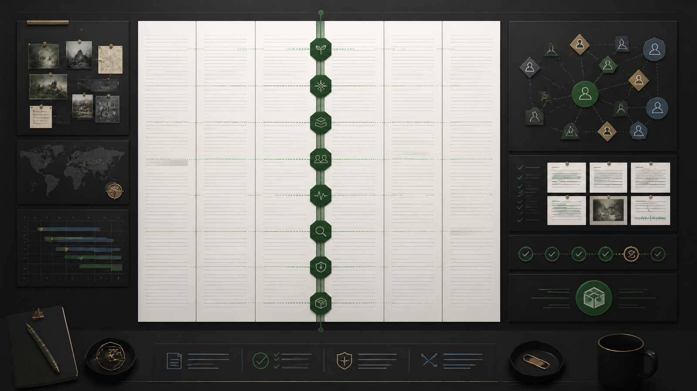
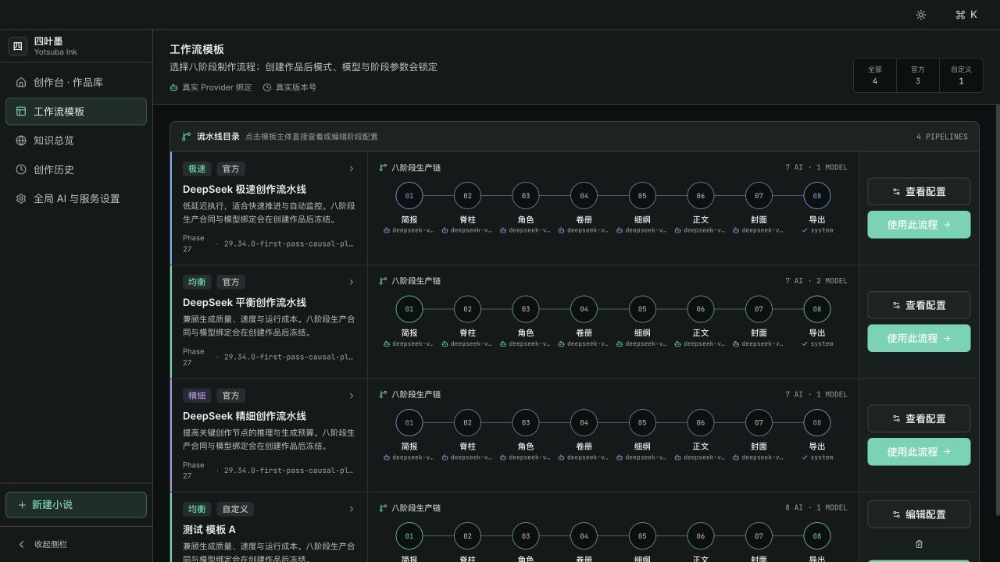
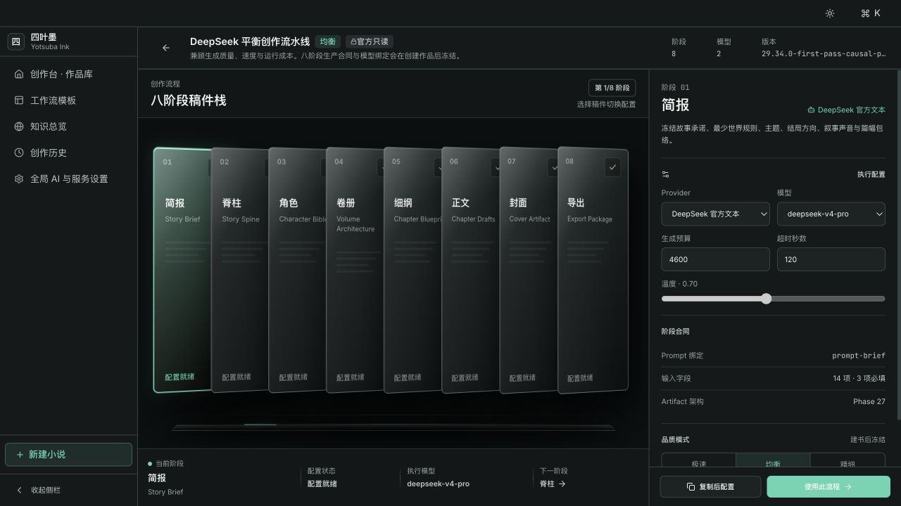
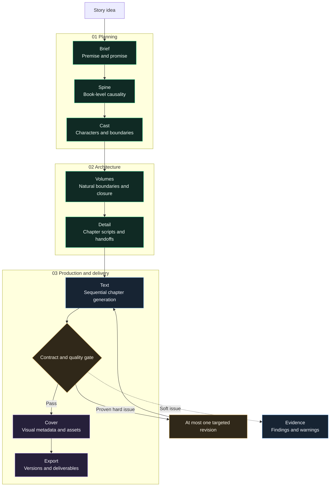
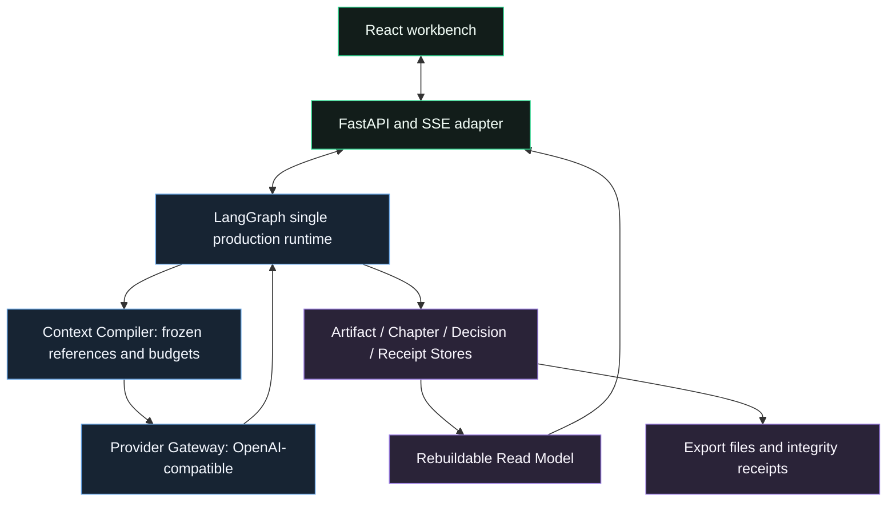
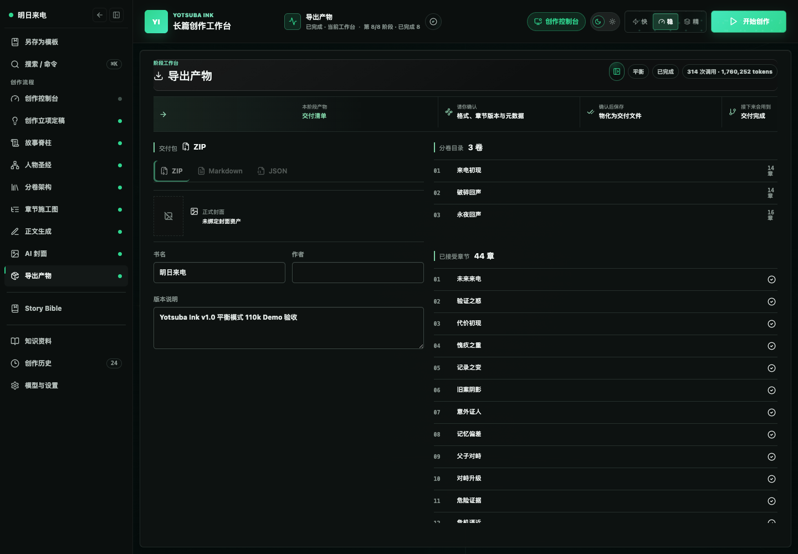

<div align="right"><a href="./README.md">简体中文</a></div>

<div align="center">
  
  <h1>Yotsuba Ink</h1>
  <p><strong>AI-native workbench for long-form fiction</strong></p>
  <p>Plan, generate, review, recover, and export a complete novel through explicit stage artifacts and continuity-aware execution.</p>
  <p>
    
    
    
    <a href="LICENSE"></a>
  </p>
</div>

<p align="center">
  <a href="#production-workflow">Workflow</a> ·
  <a href="#creation-modes">Modes</a> ·
  <a href="#v11-version-20-workbench">v1.1</a> ·
  <a href="#verified-v10-long-form-run">Verified run</a> ·
  <a href="#quick-start">Quick start</a>
</p>

<p align="center">
  
</p>

Yotsuba Ink is built for long-form projects that need sustained control over structure, characters, continuity, and versions. It turns model calls into a production workflow with explicit artifacts, author decisions, quality boundaries, and recovery records instead of asking one conversation to generate an entire book.

## v1.1: Version 20 workbench

v1.1 migrates the Figma Make Version 20 design into the only production frontend while keeping the same FastAPI, LangGraph, Artifact, SSE, and Provider contracts. The repository no longer contains a legacy frontend entry, dual router, or second theme.

- **Continuous pipeline catalog**: all eight stages appear as one production line; template bodies, configuration actions, and create-project actions use the real workflow API.
- **Stage-specific workbenches**: Spine turns, Cast roster, Volumes, and Detail/Text chapters retain a consistent secondary navigation rail; the header uses a restrained live ECG trace.
- **Run monitor and Story Bible**: the monitor switches between real stage Artifacts, prose, Provider usage, and event logs; characters, facts, foreshadowing, and world rules come from backend read models.
- **Deep-mode author collaboration**: Spine, Cast, Volumes, Detail, and Text support discussion, planning, and reviewable patches backed by context receipts, source-bound selections, thread history, SSE, and server-side writeback rules.
- **Unified loading and motion**: global and local loaders are mutually exclusive, async content fades in, and continuous motion stops under Reduced Motion.

<table width="100%">
  <tr>
    <td width="50%"></td>
    <td width="50%"></td>
  </tr>
  <tr>
    <td align="center">Continuous pipeline catalog</td>
    <td align="center">Eight-stage workflow configuration</td>
  </tr>
</table>

Local contracts, fake Provider behavior, frontend builds, and browser gates are recorded separately. Real-Provider quality and cost for Deep-mode collaboration still require a fresh Deep Run and are not implied by offline tests. See the [changelog](CHANGELOG.md) for the complete release record.

## Production workflow

Each stage owns one core Artifact. Downstream work starts from committed upstream decisions, and prose chapters are generated sequentially from the previous chapter's accepted state.



<table width="100%">
  <thead><tr><th width="14%">Stage</th><th width="25%">Core artifact</th><th width="43%">Author decision</th><th width="18%">Used by</th></tr></thead>
  <tbody>
    <tr><td>Brief</td><td><code>StoryBriefArtifact</code></td><td>Title, premise, world rules, theme, ending direction, and voice</td><td>Spine</td></tr>
    <tr><td>Spine</td><td><code>StorySpineArtifact</code></td><td>Whether major changes form a causal chain and pay off the Brief</td><td>Cast, Volumes</td></tr>
    <tr><td>Cast</td><td><code>CharacterBibleArtifact</code></td><td>Subject roles, drives, arcs, limits, relationships, and debuts</td><td>Volumes, Detail, Text</td></tr>
    <tr><td>Volumes</td><td><code>VolumeArchitectureArtifact</code></td><td>Each volume's promise, conflict, climax, closure, and handoff</td><td>Detail</td></tr>
    <tr><td>Detail</td><td><code>DetailArtifact</code></td><td>Chapter purpose, POV, scene sequence, result, and next handoff</td><td>Text, Cover</td></tr>
    <tr><td>Text</td><td><code>ChapterArtifact</code></td><td>Accept, edit, or request an evidence-directed revision</td><td>Next chapter, Cover, Export</td></tr>
    <tr><td>Cover</td><td><code>CoverArtifact</code></td><td>Visual direction, image prompt, candidate asset, and final choice</td><td>Export</td></tr>
    <tr><td>Export</td><td><code>ExportArtifact</code></td><td>Accepted chapter versions, metadata, cover, and format</td><td>Immutable deliverables</td></tr>
  </tbody>
</table>

## Why Yotsuba Ink

<table width="100%">
  <thead><tr><th width="20%">Capability</th><th width="44%">How it works</th><th width="36%">Why it matters</th></tr></thead>
  <tbody>
    <tr><td>Structure before prose</td><td>Brief, Spine, Cast, Volumes, and Detail are committed in order</td><td>A long novel does not depend on improvising from one prompt</td></tr>
    <tr><td>Bounded context</td><td>Each chapter receives a signed Context Manifest and only required references</td><td>Prompt growth and cross-chapter drift stay controlled</td></tr>
    <tr><td>Sequential continuity</td><td>Chapter N+1 depends on chapter N's accepted prose, handoff, and temporary state</td><td>Location, knowledge, and consequences can carry forward coherently</td></tr>
    <tr><td>Evidence-based review</td><td>Deterministic contracts can block; LLM reviewers provide evidence and warnings by default</td><td>Ambiguous literary opinions do not create infinite rewrite loops</td></tr>
    <tr><td>Author collaboration</td><td>Deep mode uses bounded context receipts and source-bound patches for discussion, plans, and revision</td><td>A model cannot change an authoritative Artifact without author confirmation</td></tr>
    <tr><td>Run monitoring</td><td>Stage content and health logs are projected from the same Run events, Artifacts, chapters, and usage read models</td><td>Automatic execution stays observable without timers or fake progress</td></tr>
    <tr><td>One targeted revision</td><td>The UI shows the finding, exact evidence, and suggested direction</td><td>A clear defect can be corrected without reopening frozen structure</td></tr>
    <tr><td>Recoverable execution</td><td>LangGraph checkpoints, operation receipts, SSE sequences, and terminal snapshots</td><td>Failures are traceable, streams reconnect, and completed runs do not replay history</td></tr>
    <tr><td>Verifiable delivery</td><td>Export freezes accepted chapter versions, metadata, checksums, and receipts</td><td>The delivered manuscript can be traced back to approved work</td></tr>
  </tbody>
</table>

## Creation modes

The repository includes `official-deepseek-fast`, `official-deepseek-balanced`, and `official-deepseek-deep` as three DeepSeek-based example pipelines. The modes define stage responsibilities, decision density, quality gates, and default parameters. Any Provider binding can be replaced with another OpenAI-compatible model; product capabilities are not tied to one model name.

<table width="100%">
  <thead><tr><th width="14%">Mode</th><th width="27%">Default model strategy</th><th width="20%">Decisions</th><th width="24%">Quality and revision</th><th width="15%">Best for</th></tr></thead>
  <tbody>
    <tr><td>Fast</td><td>Favor low-latency, economical models; a DeepSeek example is included</td><td>Stage and chapter decisions are accepted automatically</td><td>Hard gates remain active; a proven hard issue gets at most one targeted revision</td><td>Testing an idea and completing a first draft</td></tr>
    <tr><td>Balanced (recommended)</td><td>Use stronger models for high-leverage planning and prose, economical models for lighter nodes</td><td>Each stage and chapter can be accepted, edited, regenerated, or cancelled</td><td>Continuity and character review are required; evidence and direction remain visible</td><td>Everyday long-form creation</td></tr>
    <tr><td>Deep</td><td>Favor high-quality models across Provider-backed stages with denser author control</td><td>Every stage and chapter is finalized by the author; five core stages can open author collaboration</td><td>All three review lanes return; patches require preview confirmation and source binding</td><td>Formal revision and professional author collaboration</td></tr>
  </tbody>
</table>

## Quality and continuity boundaries

Yotsuba Ink separates issues that must stop production from issues that deserve attention:

- **Hard gates**: unrecoverable execution, invalid structured output, missing core Artifacts or prose, explicit upstream contract conflicts, subject authority violations, direct physical-state contradictions inside a chapter, a missed frozen book-length target, or an unusable export.
- **Warnings**: low-confidence reviewer findings, modest rhythm or style variation, detectable AI flavor, lengths near a reasonable boundary, evidence that does not directly name the subject, and identity concealment or delayed revelation that later prose can explain.
- **Revision limit**: one automatic or author-directed regeneration per stage or chapter. A second hard failure stops explicitly instead of hiding the root problem behind more generation.



## Verified v1.0 long-form run

The official `official-deepseek-balanced` workflow has completed a real long-form production run above 100,000 characters:

<table width="100%">
  <thead><tr><th width="18%">Metric</th><th width="45%">Result</th><th width="37%">Acceptance meaning</th></tr></thead>
  <tbody>
    <tr><td>Work</td><td><em>明日来电</em></td><td>A fresh urban suspense project, not a recovered historical run</td></tr>
    <tr><td>Run / Project</td><td><code>balanced-110k-v1-demo-20260817-040033</code> / <code>proj-e1007717ad</code></td><td>The run and project are independently traceable</td></tr>
    <tr><td>Stages</td><td>8/8 complete</td><td>The complete path from Brief through Export closed</td></tr>
    <tr><td>Prose</td><td>44 chapters, 107,613 non-whitespace characters</td><td>The frozen 100,000-character delivery target was met</td></tr>
    <tr><td>Chapter distribution</td><td>1,710-3,692; average 2,445.75; P90 2,962</td><td>Natural variation without 1,000/6,000-character extremes</td></tr>
    <tr><td>Volumes</td><td>14 / 14 / 16 chapters; 100% chapter and volume title completeness</td><td>Volume titles, chapter titles, and order are complete</td></tr>
    <tr><td>Provider</td><td>314 calls, 311 successful, 3 failed and recovered, 1,760,252 tokens</td><td>Failures and recovery remain receipted</td></tr>
    <tr><td>Export</td><td>Valid ZIP, 44 accepted chapter versions, verified SHA-256</td><td>The deliverable can be downloaded and integrity-checked</td></tr>
  </tbody>
</table>

<p align="center">
  
</p>

Cover image generation was skipped by configuration for this acceptance run; Cover metadata and Export still completed. See the [v1.0 long-form acceptance report](docs/engineering/yotsuba-ink-v1-balanced-110k-acceptance.md) for hard gates, continuity samples, chapter distribution, Provider receipts, and browser evidence.

## Quick start

### Requirements

- Python 3.12+
- Node.js 22+
- pnpm 9+

### 1. Install

```bash
git clone https://github.com/isla4ever/yotsuba-ink.git
cd yotsuba-ink

python3 -m venv .venv
.venv/bin/python -m pip install -U pip
.venv/bin/python -m pip install -e ".[dev]"

cd apps/web
pnpm install --frozen-lockfile
```

### 2. Start the backend

```bash
cd yotsuba-ink
.venv/bin/python -m uvicorn novel_workflow.api.app:app \
  --host 127.0.0.1 \
  --port 8787 \
  --reload
```

### 3. Start the frontend

```bash
cd yotsuba-ink/apps/web
pnpm dev
```

Open [http://127.0.0.1:5176](http://127.0.0.1:5176). The development server proxies `/api` to `http://127.0.0.1:8787` by default.

## Provider configuration

The recommended path is **Model Settings** in the application. Select an official or custom OpenAI-compatible Provider, enter the API key and model, then run the readiness check. Secrets stay in local runtime data.

Environment variables are also supported:

```bash
export NOVEL_LLM_BASE_URL="https://your-provider.example/v1"
export NOVEL_LLM_API_KEY="your-text-api-key"
export NOVEL_LLM_MODEL="your-text-model"

# Only required for cover image generation
export NOVEL_IMAGE_BASE_URL="https://your-image-provider.example/v1"
export NOVEL_IMAGE_API_KEY="your-image-api-key"
export NOVEL_IMAGE_MODEL="your-image-model"
```

Never commit `.env` files, API keys, run history, Provider input snapshots, or user manuscripts.

## Development and verification

```bash
# Backend
.venv/bin/pytest -q
.venv/bin/python -m compileall -q src tests

# Frontend
cd apps/web
pnpm test
pnpm build
pnpm audit:css
pnpm audit:structure
pnpm check:css-build
```

Before release, run the full backend suite and compileall, plus frontend tests, the TypeScript/Vite production build, CSS/structure audits, and real desktop/mobile browser checks. Real Provider and literary quality acceptance use a separate fresh Run and are not implied by offline gates.

## Repository layout

```text
apps/web/                    React creation workbench
src/novel_workflow/          LangGraph runtime, domain contracts, and FastAPI adapters
runtime/novel_workflow/      Official workflows, prompts, and local runtime data
tests/                       Contract, orchestration, Provider, recovery, and quality tests
docs/                        Architecture contracts and acceptance records
```

## Essential documentation

- [Architecture overview](docs/architecture/overview.md)
- [Stage Artifact contract](docs/architecture/stage-artifact-contract.md)
- [Phase 27 adaptive long-form architecture](docs/architecture/phase-27-adaptive-story-planning-reconstruction.md)
- [Phase 28 literary reliability and author control](docs/architecture/phase-28-v1.1-literary-reliability-and-author-control.md)
- [Phase 29 hierarchical long-form planning](docs/architecture/phase-29-v1.1-million-character-author-led-deep-mode.md)
- [Phase 30 Version 20 frontend migration](docs/architecture/phase-30-figma-ui-production-migration.md)
- [Phase 31 Deep-mode author collaboration](docs/architecture/phase-31-deep-mode-author-collaboration.md)
- [v1.0 balanced long-form acceptance](docs/engineering/yotsuba-ink-v1-balanced-110k-acceptance.md)
- [Changelog](CHANGELOG.md)

## License

Yotsuba Ink is open source under the [Apache License 2.0](LICENSE).
