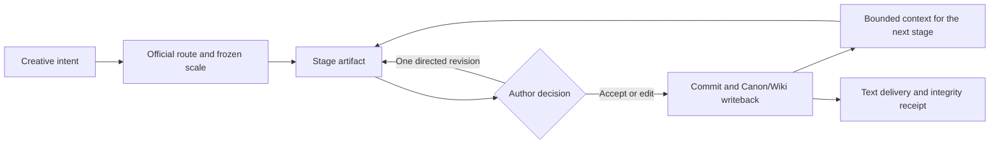

<div align="right"><a href="./README.md">简体中文</a></div>

<div align="center">
  
  <h1>Yotsuba Ink</h1>
  <p><strong>A reviewable, recoverable, and traceable production pipeline for AI-assisted writing.</strong></p>
  <p>
    
    
    
    <a href="LICENSE"></a>
  </p>
</div>

Yotsuba Ink is an AI-native workbench for screenplay samples, short fiction, and long-form novels. Each route has its own stage artifacts, author decisions, and delivery contract. All three share one runtime, Provider gateway, quality boundary, recovery model, writeback path, Story Bible, and run monitor.

The system does not ask a model to improvise an entire book in one conversation. Authors review and commit upstream artifacts first; downstream stages consume frozen references and bounded context. Model requests, candidates, decisions, and writebacks remain traceable.

## Three official creation routes

| Route | Official ID | Stage chain | Text delivery |
| --- | --- | --- | --- |
| Screenplay sample | `official.screenplay_sample` | Brief → Cast → Beat Board → Scene Deck → Script → Export | Structured scenes and a Fountain screenplay |
| Short fiction | `official.short_novel` | Brief → Story Map → Cast → Section Plan → Text → Cover → Export | Sequential prose, a cover brief, and a book manuscript |
| Long-form novel | `official.long_novel` | Brief → Book Architecture → Cast → Volumes → Rolling Detail → Text → Cover → Export | Volume architecture, rolling detail, sequential chapters, and a book manuscript |

The intended deliverable selects the route. Model choice, cost, and review density are execution settings rather than separate creative modes. New projects accept only these canonical official identities; retired mode IDs cannot enter a new run.

## A closed production loop



Every stage defines its artifact, author decision, writeback target, and downstream dependency. A candidate never silently overwrites a committed version. Interrupted work resumes from durable checkpoints, operation receipts, and the writeback outbox instead of inferring progress again.

## Quality, continuity, and recovery

- **Deterministic contracts** block invalid identity, references, order, coverage, frozen budgets, and writeback boundaries.
- **Evidence-backed findings** expose pacing, voice, and causal-confidence concerns without triggering unbounded hidden rewrites.
- **Sequential continuity** advances chapter N+1 only from the accepted prefix, prior handoff, and committed Canon/Wiki state.
- **Bounded revision** lets the author accept, edit, reject, or request one directed revision while original receipts stay immutable.
- **Observable execution** projects stage state, Provider attempts, usage, classified failures, recovery, and delivery from the same run authority.

## v0.1.0 acceptance boundary

This release closes the offline contracts, frontend/backend loop, and live DeepSeek text stability gate for all three routes. The standard long-form continuity sample completed 12/12 chapters and 12/12 writebacks. Three network failures across 48 transport attempts recovered within their original logical operations, and a cold process revalidated the frozen release evidence.

That is not a claim of finished literary quality. The sample still reports chapter-length shortfall, some procedural repetition, and causal-confidence gaps. Yotsuba Ink preserves those findings instead of presenting workflow success as literary acceptance.

Cover image generation is explicitly outside this release gate. Short and long fiction reach `image_deferred` after text and `CoverBrief`; the system does not fabricate a CoverAsset or label deferred image work as a complete finished product. Text-only screenplay export is unaffected.

## Quick start

### Requirements

- Python 3.12+
- Node.js 20+
- pnpm 9+
- [uv](https://docs.astral.sh/uv/) is recommended for Python environments

### Install and run

```bash
git clone https://github.com/isla4ever/yotsuba-ink.git
cd yotsuba-ink

uv sync --extra dev --frozen
pnpm --dir apps/web install --frozen-lockfile
```

Start the API and web workbench in separate terminals:

```bash
uv run novel-workflow-api
```

```bash
pnpm --dir apps/web dev
```

Open [http://127.0.0.1:5176](http://127.0.0.1:5176). The development server proxies `/api` to `http://127.0.0.1:8787`.

### Configure a text Provider

The in-app model settings support OpenAI-compatible Providers. For the built-in DeepSeek text profile, set this before starting the API:

```bash
export DEEPSEEK_API_KEY="your-api-key"
```

A generic OpenAI-compatible profile can use:

```bash
export NOVEL_LLM_BASE_URL="https://your-provider.example/v1"
export NOVEL_LLM_API_KEY="your-api-key"
export NOVEL_LLM_MODEL="your-model"
```

Explicitly allow any additional web origins that need direct API access:

```bash
export YOTSUBA_CORS_ORIGINS="https://studio.example.com,https://review.example.com"
```

Never commit `.env` files, API keys, local run data, Provider input snapshots, or user manuscripts.

## Development and release gates

```bash
# Backend
uv run pytest -q
uv run python -m compileall -q src tests

# Frontend
pnpm --dir apps/web test
pnpm --dir apps/web build
pnpm --dir apps/web audit:css
pnpm --dir apps/web audit:structure
pnpm --dir apps/web check:css-build
```

A release candidate also requires lockfile verification, dependency and secret scans, desktop/tablet/mobile browser acceptance, cold-process release-evidence verification, and a clean-checkout rebuild. Live Provider stability and literary quality are reported as separate results.

## Repository layout

```text
apps/web/                    React writing workbench
src/novel_workflow/api/      FastAPI adapter layer
src/novel_workflow/          Routes, orchestration, quality, storage, and Providers
runtime/novel_workflow/      Tracked official prompts/config; local run data is ignored
tests/                       Contract, recovery, quality, and API tests
docs/architecture/           Authoritative architecture and artifact contracts
docs/engineering/            Iteration, rehearsal, and release-evidence records
```

## Key documents

- [Three-route architecture](docs/architecture/phase-32-three-creation-routes-reconstruction.md)
- [Stage artifact contract](docs/architecture/stage-artifact-contract.md)
- [Optimization plan](docs/engineering/phase-32-optimization-iteration-plan.md)
- [v0.1.0 release candidate report](docs/engineering/phase-32-wave-67-release-candidate.md)
- [Changelog](CHANGELOG.md)

## License

Yotsuba Ink is licensed under the [Apache License 2.0](LICENSE).
