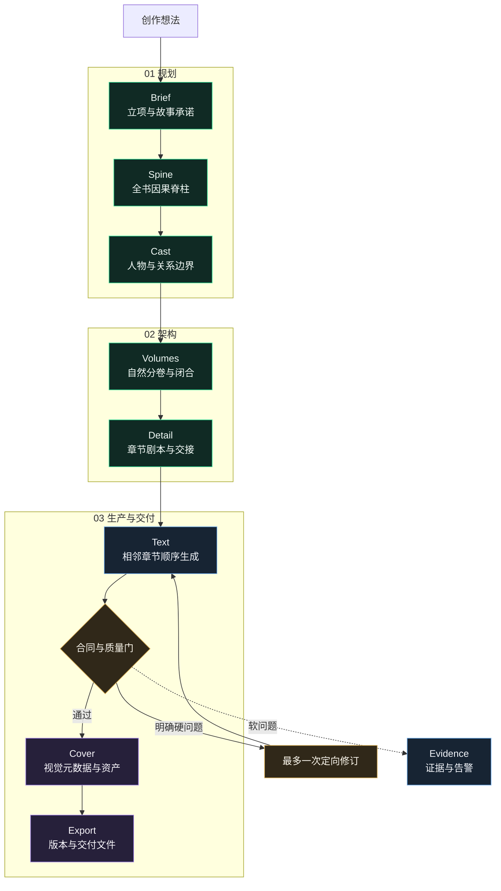
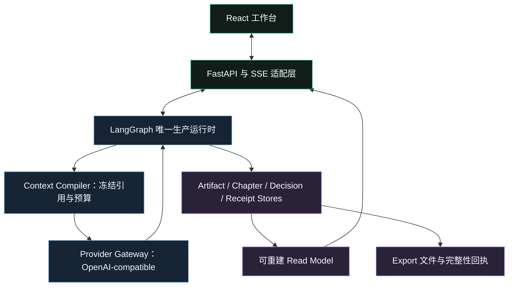

<div align="right"><a href="./README.en.md">English</a></div>

<div align="center">
  
  <h1>Yotsuba Ink</h1>
  <p><strong>AI 原生长篇小说创作工作台</strong></p>
  <p>用可审阅的阶段产物、连续性上下文和可恢复运行，完成从故事立项到整书导出的长篇创作流程。</p>
  <p>
    
    
    
    <a href="LICENSE"></a>
  </p>
</div>

<p align="center">
  <a href="#产品工作流">产品工作流</a> ·
  <a href="#三档创作模式">创作模式</a> ·
  <a href="#v10-实证">v1.0 实证</a> ·
  <a href="#快速开始">快速开始</a>
</p>

<p align="center">
  
</p>

Yotsuba Ink 面向需要持续控制结构、人物、连续性和版本的长篇创作。它把模型调用组织为一条有明确产物、人工决策、质量边界和恢复记录的生产链路，而不是把整本书交给一次对话生成。

## 产品工作流

每个阶段只负责一个核心 Artifact。上游定稿后才进入下游，正文按章节顺序生成并继承上一章的最终状态。



<table width="100%">
  <thead><tr><th width="14%">阶段</th><th width="25%">核心产物</th><th width="43%">作者在此阶段决定什么</th><th width="18%">下游使用</th></tr></thead>
  <tbody>
    <tr><td>Brief</td><td><code>StoryBriefArtifact</code></td><td>书名、故事承诺、规则、主题、结局方向与叙事声音</td><td>Spine</td></tr>
    <tr><td>Spine</td><td><code>StorySpineArtifact</code></td><td>关键变化是否形成完整因果链，结局是否兑现立项承诺</td><td>Cast、Volumes</td></tr>
    <tr><td>Cast</td><td><code>CharacterBibleArtifact</code></td><td>主体职责、欲望、变化、限制、关系与首次出场</td><td>Volumes、Detail、Text</td></tr>
    <tr><td>Volumes</td><td><code>VolumeArchitectureArtifact</code></td><td>每卷的承诺、冲突、高潮、闭合和卷间承接</td><td>Detail</td></tr>
    <tr><td>Detail</td><td><code>DetailArtifact</code></td><td>每章目的、POV、场景序列、结果与下一章交接</td><td>Text、Cover</td></tr>
    <tr><td>Text</td><td><code>ChapterArtifact</code></td><td>接受正文、人工编辑或按证据定向换稿</td><td>下一章、Cover、Export</td></tr>
    <tr><td>Cover</td><td><code>CoverArtifact</code></td><td>视觉方向、图像提示、候选资产与最终选择</td><td>Export</td></tr>
    <tr><td>Export</td><td><code>ExportArtifact</code></td><td>章节版本、书名/作者元数据、封面和交付格式</td><td>不可变交付文件</td></tr>
  </tbody>
</table>

## 核心优势

<table width="100%">
  <thead><tr><th width="20%">能力</th><th width="44%">如何工作</th><th width="36%">带来的价值</th></tr></thead>
  <tbody>
    <tr><td>结构先于正文</td><td>Brief、Spine、Cast、Volumes、Detail 逐层冻结</td><td>长篇不会只靠提示词临场续写</td></tr>
    <tr><td>有界上下文</td><td>当前章节只读取签名后的 Context Manifest 和必要引用</td><td>控制上下文膨胀，降低跨章信息漂移</td></tr>
    <tr><td>相邻章节连续</td><td>第 N+1 章依赖第 N 章已接受正文、handoff 与临时状态</td><td>人物位置、知识状态和行动结果可以顺序承接</td></tr>
    <tr><td>证据化审校</td><td>确定性合同可阻断；模型 reviewer 默认提供证据与告警</td><td>不因模糊文学判断触发无限重写</td></tr>
    <tr><td>一次定向换稿</td><td>页面展示问题、正文证据和建议方向；每阶段/章节最多一次</td><td>修复明确缺陷，同时保护已冻结结构</td></tr>
    <tr><td>可恢复运行</td><td>LangGraph checkpoint、operation receipt、SSE sequence 和静态终态投影</td><td>失败可定位、断线可续接、完成作品不会重放历史过程</td></tr>
    <tr><td>可核验交付</td><td>Export 固定已接受章节版本、元数据、文件哈希和下载回执</td><td>交付内容与创作过程可追溯</td></tr>
  </tbody>
</table>

## 三档创作模式

仓库内置 `official-deepseek-fast`、`official-deepseek-balanced` 与 `official-deepseek-deep` 三套 DeepSeek 示例流水线。三档模式定义的是阶段职责、决策密度、质量门与默认参数；所有 Provider 绑定都可以替换为兼容 OpenAI API 的其它模型，不把产品能力绑定在某个型号上。

<table width="100%">
  <thead><tr><th width="14%">模式</th><th width="27%">默认模型策略</th><th width="20%">决策方式</th><th width="24%">质量与换稿</th><th width="15%">适合场景</th></tr></thead>
  <tbody>
    <tr><td>极速</td><td>低延迟、低成本模型优先；内置 DeepSeek 示例配置</td><td>阶段与章节自动接受</td><td>保留硬门；明确硬问题最多自动定向修订一次</td><td>快速验证创意与完整初稿</td></tr>
    <tr><td>平衡（推荐）</td><td>高杠杆规划与正文优先高质量模型，轻量节点可选经济模型</td><td>每阶段、每章可接受、编辑、换稿或取消</td><td>连续性与人物审稿必需；证据和修订方向可见</td><td>日常中长篇创作</td></tr>
    <tr><td>精细</td><td>Provider 阶段优先高质量模型，并提高人工控制密度</td><td>每阶段、每章人工定稿</td><td>三路审稿全部返回；可锁定可行区间内的结构参数</td><td>正式稿精修与高控制创作</td></tr>
  </tbody>
</table>

## 质量与连续性边界

Yotsuba Ink 把“必须修复”和“值得留意”分开处理：

- **硬门**：流程无法恢复、结构化输出不可解析、关键 Artifact 或正文缺失、明确上游合同冲突、主体越权、章内物理状态直接矛盾、未达到冻结总量目标、导出不可用。
- **告警**：低置信 reviewer finding、轻微节奏或文风差异、AI 味、篇幅接近合理边界、没有直接命名主体的证据、可由后文解释的身份隐藏或延迟揭示。
- **换稿上限**：自动或人工定向换稿最多一次；第二次仍触发硬门时明确停止，不用无限生成掩盖底层故障。



## v1.0 实证

`official-deepseek-balanced` 已完成一轮真实 10 万字以上长篇生产：

<table width="100%">
  <thead><tr><th width="18%">指标</th><th width="45%">结果</th><th width="37%">验收含义</th></tr></thead>
  <tbody>
    <tr><td>作品</td><td>《明日来电》</td><td>全新都市悬疑题材，不沿用历史失败 Run</td></tr>
    <tr><td>Run / Project</td><td><code>balanced-110k-v1-demo-20260817-040033</code> / <code>proj-e1007717ad</code></td><td>运行与项目可独立追溯</td></tr>
    <tr><td>阶段</td><td>8/8 完成</td><td>从 Brief 到 Export 全链路闭环</td></tr>
    <tr><td>正文</td><td>44 章，107,613 个非空白字符</td><td>达到冻结的 10 万字交付目标</td></tr>
    <tr><td>单章分布</td><td>1,710-3,692，平均 2,445.75，P90 2,962</td><td>保留自然差异且无 1000/6000 字极端离散</td></tr>
    <tr><td>分卷</td><td>14 / 14 / 16 章，卷与章标题完整率 100%</td><td>卷名、章名与顺序完整</td></tr>
    <tr><td>Provider</td><td>314 次调用，311 成功，3 次失败后恢复，1,760,252 tokens</td><td>失败与恢复均保留回执</td></tr>
    <tr><td>Export</td><td>ZIP 可用，44 个已接受章节版本，SHA-256 已核验</td><td>交付文件可下载并校验完整性</td></tr>
  </tbody>
</table>

<p align="center">
  
</p>

本轮按配置跳过封面生图，Cover 元数据和 Export 仍完整闭环。完整硬门、连续性抽检、字数分布、Provider 回执与浏览器证据见 [v1.0 长篇验收报告](docs/engineering/yotsuba-ink-v1-balanced-110k-acceptance.md)。

## 快速开始

### 环境要求

- Python 3.12+
- Node.js 22+
- npm 10+

### 1. 安装

```bash
git clone https://github.com/isla4ever/yotsuba-ink.git
cd yotsuba-ink

python3 -m venv .venv
.venv/bin/python -m pip install -U pip
.venv/bin/python -m pip install -e ".[dev]"

cd apps/web
npm ci
```

### 2. 启动后端

```bash
cd yotsuba-ink
.venv/bin/python -m uvicorn novel_workflow.api.app:app \
  --host 127.0.0.1 \
  --port 8787 \
  --reload
```

### 3. 启动前端

```bash
cd yotsuba-ink/apps/web
npm run dev
```

打开 [http://127.0.0.1:5173](http://127.0.0.1:5173)。开发服务器默认把 `/api` 代理到 `http://127.0.0.1:8787`。

## Provider 配置

推荐在应用内进入 **模型与设置**，选择官方或自定义 OpenAI-compatible Provider，填写 API Key 和模型后执行就绪检查。密钥只保存在本地运行时数据中。

也可以使用环境变量：

```bash
export NOVEL_LLM_BASE_URL="https://your-provider.example/v1"
export NOVEL_LLM_API_KEY="your-text-api-key"
export NOVEL_LLM_MODEL="your-text-model"

# 仅在需要封面生图时配置
export NOVEL_IMAGE_BASE_URL="https://your-image-provider.example/v1"
export NOVEL_IMAGE_API_KEY="your-image-api-key"
export NOVEL_IMAGE_MODEL="your-image-model"
```

不要提交 `.env`、API Key、运行历史、Provider 输入快照或用户稿件。

## 开发与验证

```bash
# 后端
.venv/bin/pytest -q
.venv/bin/python -m compileall -q src tests

# 前端
cd apps/web
npm test
npm run build
npm run audit:css
npm run check:css-split
```

当前 v1.0 基线：后端 `527 passed`；前端 `114` 个测试文件、`425 passed`；TypeScript、生产构建、CSS 审计、CSS 分包检查与浏览器桌面/390px 验收通过。

## 仓库结构

```text
apps/web/                    React 创作工作台
src/novel_workflow/          LangGraph 运行时、领域合同与 FastAPI 适配层
runtime/novel_workflow/      官方工作流、Prompt 与本地运行时数据
tests/                       合同、编排、Provider、恢复和质量测试
docs/                        架构合同与验收记录
```

## 关键文档

- [架构概览](docs/architecture/overview.md)
- [阶段 Artifact 合同](docs/architecture/stage-artifact-contract.md)
- [Phase 27 自适应长篇架构](docs/architecture/phase-27-adaptive-story-planning-reconstruction.md)
- [v1.0 平衡模式长篇验收](docs/engineering/yotsuba-ink-v1-balanced-110k-acceptance.md)

## 许可证

Yotsuba Ink 采用 [Apache License 2.0](LICENSE) 开源。
