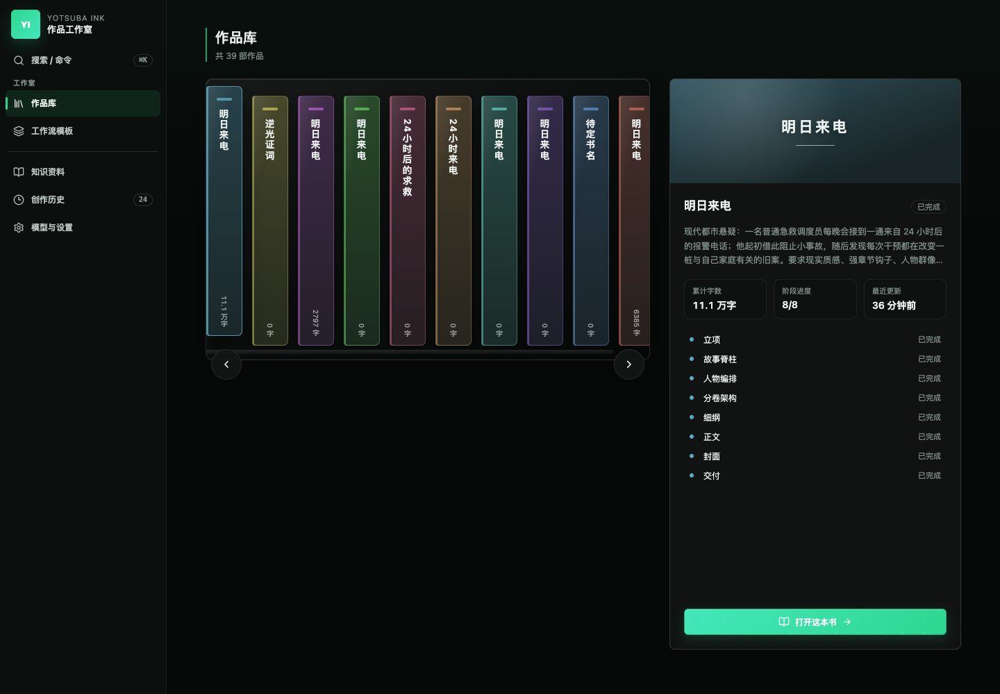

<div align="right"><a href="./README.en.md">English</a></div>

<div align="center">
  
  <h1>Yotsuba Ink</h1>
  <p><strong>AI 原生长篇小说创作工作台</strong></p>
  <p>用可审阅的阶段产物、连续性上下文和可恢复运行，完成从故事立项到整书导出的长篇创作流程。</p>
  <p>
    
    
    
    <a href="LICENSE"></a>
  </p>
</div>

<p align="center">
  <a href="#产品工作流">产品工作流</a> ·
  <a href="#三档创作模式">创作模式</a> ·
  <a href="#v10-实证">v1.0 实证</a> ·
  <a href="#快速开始">快速开始</a>
</p>

<p align="center">
  
</p>

Yotsuba Ink 面向需要持续控制结构、人物、连续性和版本的长篇创作。它把模型调用组织为一条有明确产物、人工决策、质量边界和恢复记录的生产链路，而不是把整本书交给一次对话生成。

## 产品工作流

每个阶段只负责一个核心 Artifact。上游定稿后才进入下游，正文按章节顺序生成并继承上一章的最终状态。

```mermaid
flowchart LR
  idea["创作想法"] --> brief["Brief<br/>书名、题材承诺、世界规则、声音"]
  brief --> spine["Spine<br/>全书因果脊柱与结局兑现"]
  spine --> cast["Cast<br/>人物圣经、关系与出场边界"]
  cast --> volumes["Volumes<br/>分卷承诺、冲突、高潮与闭合"]
  volumes --> detail["Detail<br/>逐章目的、场景、转折与交接"]
  detail --> text["Text<br/>相邻章节顺序生成"]
  text --> gate{"合同与质量门"}
  gate -->|通过| cover["Cover<br/>视觉 Brief 与可选封面资产"]
  gate -->|一次定向修订| text
  gate -. 软问题只告警 .-> evidence["Evidence<br/>证据、风险与修订方向"]
  cover --> export["Export<br/>版本清单、元数据与 ZIP"]

  classDef planning fill:#102a24,stroke:#2fd68f,color:#f2fff9;
  classDef writing fill:#172433,stroke:#69a7e8,color:#f4f8ff;
  classDef decision fill:#302819,stroke:#d8ad54,color:#fff9ec;
  classDef delivery fill:#26203a,stroke:#9a7ce2,color:#fbf8ff;
  class brief,spine,cast,volumes,detail planning;
  class text,evidence writing;
  class gate decision;
  class cover,export delivery;
```



| 阶段 | 核心产物 | 作者在此阶段决定什么 |
| --- | --- | --- |
| Brief | `StoryBriefArtifact` | 书名、故事承诺、规则、主题、结局方向与叙事声音 |
| Spine | `StorySpineArtifact` | 关键变化是否形成完整因果链，结局是否兑现立项承诺 |
| Cast | `CharacterBibleArtifact` | 主体职责、欲望、变化、限制、关系与首次出场 |
| Volumes | `VolumeArchitectureArtifact` | 每卷的承诺、冲突、高潮、闭合和卷间承接 |
| Detail | `DetailArtifact` | 每章目的、POV、场景序列、结果与下一章交接 |
| Text | `ChapterArtifact` | 接受正文、人工编辑或按证据定向换稿 |
| Cover | `CoverArtifact` | 视觉方向、图像提示、候选资产与最终选择 |
| Export | `ExportArtifact` | 章节版本、书名/作者元数据、封面和交付格式 |

## 核心优势

| 能力 | 如何工作 | 带来的价值 |
| --- | --- | --- |
| 结构先于正文 | Brief、Spine、Cast、Volumes、Detail 逐层冻结 | 长篇不会只靠提示词临场续写 |
| 有界上下文 | 当前章节只读取签名后的 Context Manifest 和必要引用 | 控制上下文膨胀，降低跨章信息漂移 |
| 相邻章节连续 | 第 N+1 章依赖第 N 章已接受正文、handoff 与临时状态 | 人物位置、知识状态和行动结果可以顺序承接 |
| 证据化审校 | 确定性合同可阻断；模型 reviewer 默认提供证据与告警 | 不因模糊文学判断触发无限重写 |
| 一次定向换稿 | 页面展示问题、正文证据和建议方向；每阶段/章节最多一次 | 修复明确缺陷，同时保护已冻结结构 |
| 可恢复运行 | LangGraph checkpoint、operation receipt、SSE sequence 和静态终态投影 | 失败可定位、断线可续接、完成作品不会重放历史过程 |
| 可核验交付 | Export 固定已接受章节版本、元数据、文件哈希和下载回执 | 交付内容与创作过程可追溯 |

## 三档创作模式

三档模式共享同一套 Artifact、质量合同和导出格式。区别只在模型配置、人工决策密度与审稿强度，不改变作品数据结构。

| 模式 | 模型路径 | 决策方式 | 质量与换稿 | 适合场景 |
| --- | --- | --- | --- | --- |
| 极速 | DeepSeek Flash 为主 | 阶段与章节自动接受 | 保留硬门；遇到明确硬问题最多自动定向修订一次 | 快速验证创意、得到完整初稿 |
| 平衡（推荐） | 规划与正文使用 Pro，封面元数据使用 Flash | 每阶段、每章均可接受、编辑、换稿或取消 | 连续性与人物审稿必需；问题和修订方向对作者可见 | 日常中长篇创作，兼顾成本与控制 |
| 精细 | Provider 阶段统一使用 Pro | 每阶段、每章人工定稿 | 三路审稿全部要求返回；可在可行区间内锁定部分结构参数 | 正式稿精修和高控制度创作 |

## 质量与连续性边界

Yotsuba Ink 把“必须修复”和“值得留意”分开处理：

- **硬门**：流程无法恢复、结构化输出不可解析、关键 Artifact 或正文缺失、明确上游合同冲突、主体越权、章内物理状态直接矛盾、未达到冻结总量目标、导出不可用。
- **告警**：低置信 reviewer finding、轻微节奏或文风差异、AI 味、篇幅接近合理边界、没有直接命名主体的证据、可由后文解释的身份隐藏或延迟揭示。
- **换稿上限**：自动或人工定向换稿最多一次；第二次仍触发硬门时明确停止，不用无限生成掩盖底层故障。

```mermaid
flowchart TB
  ui["React 工作台"] <--> api["FastAPI / SSE 适配层"]
  api <--> graph["LangGraph<br/>唯一生产运行时"]
  graph --> context["Context Compiler<br/>冻结引用与预算"]
  context --> gateway["Provider Gateway<br/>OpenAI-compatible"]
  gateway --> graph
  graph --> stores["Artifact / Chapter / Decision / Receipt Stores"]
  stores --> readmodel["可重建 Read Model"]
  readmodel --> api
  stores --> exportstore["Export 文件与完整性回执"]

  classDef surface fill:#121d1a,stroke:#2fd68f,color:#f4fff9;
  classDef runtime fill:#172433,stroke:#69a7e8,color:#f4f8ff;
  classDef data fill:#2a2338,stroke:#9a7ce2,color:#fbf8ff;
  class ui,api surface;
  class graph,context,gateway runtime;
  class stores,readmodel,exportstore data;
```

## v1.0 实证

`official-deepseek-balanced` 已完成一轮真实 10 万字以上长篇生产：

| 指标 | 结果 |
| --- | --- |
| 作品 | 《明日来电》 |
| Run / Project | `balanced-110k-v1-demo-20260817-040033` / `proj-e1007717ad` |
| 阶段 | 8/8 完成 |
| 正文 | 44 章，107,613 个非空白字符 |
| 单章分布 | 1,710-3,692，平均 2,445.75，P90 2,962 |
| 分卷 | 14 / 14 / 16 章，卷与章标题完整率 100% |
| Provider | 314 次调用，311 成功，3 次失败后恢复，1,760,252 tokens |
| Export | ZIP 可用，44 个已接受章节版本，SHA-256 已核验 |

<p align="center">
  
</p>

本轮按配置跳过封面生图，Cover 元数据和 Export 仍完整闭环。完整硬门、连续性抽检、字数分布、Provider 回执与浏览器证据见 [v1.0 长篇验收报告](docs/engineering/yotsuba-ink-v1-balanced-110k-acceptance.md)。

## 快速开始

### 环境要求

- Python 3.12+
- Node.js 22+
- npm 10+

### 1. 安装

```bash
git clone https://github.com/isla4ever/yotsuba-ink.git
cd yotsuba-ink

python3 -m venv .venv
.venv/bin/python -m pip install -U pip
.venv/bin/python -m pip install -e ".[dev]"

cd apps/web
npm ci
```

### 2. 启动后端

```bash
cd yotsuba-ink
.venv/bin/python -m uvicorn novel_workflow.api.app:app \
  --host 127.0.0.1 \
  --port 8787 \
  --reload
```

### 3. 启动前端

```bash
cd yotsuba-ink/apps/web
npm run dev
```

打开 [http://127.0.0.1:5173](http://127.0.0.1:5173)。开发服务器默认把 `/api` 代理到 `http://127.0.0.1:8787`。

## Provider 配置

推荐在应用内进入 **模型与设置**，选择官方或自定义 OpenAI-compatible Provider，填写 API Key 和模型后执行就绪检查。密钥只保存在本地运行时数据中。

也可以使用环境变量：

```bash
export NOVEL_LLM_BASE_URL="https://your-provider.example/v1"
export NOVEL_LLM_API_KEY="your-text-api-key"
export NOVEL_LLM_MODEL="your-text-model"

# 仅在需要封面生图时配置
export NOVEL_IMAGE_BASE_URL="https://your-image-provider.example/v1"
export NOVEL_IMAGE_API_KEY="your-image-api-key"
export NOVEL_IMAGE_MODEL="your-image-model"
```

不要提交 `.env`、API Key、运行历史、Provider 输入快照或用户稿件。

## 开发与验证

```bash
# 后端
.venv/bin/pytest -q
.venv/bin/python -m compileall -q src tests

# 前端
cd apps/web
npm test
npm run build
npm run audit:css
npm run check:css-split
```

当前 v1.0 基线：后端 `527 passed`；前端 `112` 个测试文件、`421 passed`；TypeScript、生产构建、CSS 审计、CSS 分包检查与浏览器桌面/390px 验收通过。

## 仓库结构

```text
apps/web/                    React 创作工作台
src/novel_workflow/          LangGraph 运行时、领域合同与 FastAPI 适配层
runtime/novel_workflow/      官方工作流、Prompt 与本地运行时数据
tests/                       合同、编排、Provider、恢复和质量测试
docs/                        架构合同与验收记录
```

## 关键文档

- [架构概览](docs/architecture/overview.md)
- [阶段 Artifact 合同](docs/architecture/stage-artifact-contract.md)
- [Phase 27 自适应长篇架构](docs/architecture/phase-27-adaptive-story-planning-reconstruction.md)
- [v1.0 平衡模式长篇验收](docs/engineering/yotsuba-ink-v1-balanced-110k-acceptance.md)

## 许可证

Yotsuba Ink 采用 [Apache License 2.0](LICENSE) 开源。
