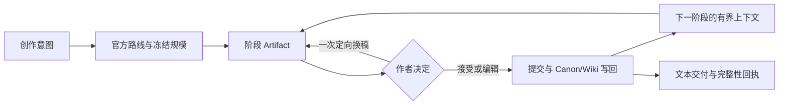

<div align="right"><a href="./README.en.md">English</a></div>

<div align="center">
  
  <h1>Yotsuba Ink</h1>
  <p><strong>把模型生成变成可审阅、可恢复、可追溯的创作生产线。</strong></p>
  <p>
    
    
    
    <a href="LICENSE"></a>
  </p>
</div>

Yotsuba Ink 是一个面向剧本样片、短中篇小说和长篇小说的 AI 原生创作工作台。每条路线都有自己的阶段产物、作者决策和交付合同；三条路线共享同一套运行时、Provider 调用、质量门、恢复、写回、Story Bible 和监控能力。

它不要求模型一次写完整部作品。上游产物先被作者审阅并提交，下游只读取冻结的引用和必要上下文；每次模型请求、候选、决定和写回都有可追踪记录。

## 三条官方创作路线

| 路线 | 官方 ID | 阶段链 | 文本交付 |
| --- | --- | --- | --- |
| 剧本样片 | `official.screenplay_sample` | Brief → Cast → Beat Board → Scene Deck → Script → Export | 结构化场景与 Fountain 剧本 |
| 短中篇小说 | `official.short_novel` | Brief → Story Map → Cast → Section Plan → Text → Cover → Export | 顺序正文、封面说明与书稿交付 |
| 长篇小说 | `official.long_novel` | Brief → Book Architecture → Cast → Volumes → Rolling Detail → Text → Cover → Export | 分卷架构、滚动细纲、顺序章节与书稿交付 |

作品类型决定路线；模型、成本和人工审阅密度属于运行配置，不再伪装成另一种创作模式。新建项目只接受以上三种官方身份，旧模式 ID 不会进入新运行。

## 一条可闭环的生产链



每个阶段都回答四个问题：产物是什么、作者决定什么、提交到哪里、下一阶段依赖什么。候选内容不会自动覆盖已提交版本；中断后从持久化 checkpoint、operation receipt 和 writeback outbox 恢复，而不是重新猜测进度。

## 质量、连续性与恢复

- **确定性合同**：身份、引用、顺序、覆盖、冻结预算和写回边界不满足时直接阻断。
- **证据化告警**：节奏、文风、因果可信度等文学判断附证据展示，不触发无限隐藏重写。
- **顺序连续性**：长篇第 N+1 章只从已接受前缀、上一章交接和 Canon/Wiki 状态继续。
- **有界修订**：候选可接受、人工编辑、拒绝或执行一次定向换稿；原始回执保持不可变。
- **可观察运行**：运行监控统一投影阶段状态、Provider 尝试、用量、失败分类、恢复和交付状态。

## v0.1.0 的验收边界

本版本已完成三路线的离线合同、前后端闭环和真实 DeepSeek 文本稳定性验证。标准长篇连续性样本完成 12/12 章与 12/12 写回；48 次传输尝试中 3 次网络失败均在同一 operation 内恢复。冻结发布证据可由冷启动状态重新验证。

这不等于文学成品已经通过：该样本仍暴露章节长度不足、局部流程性重复和部分因果可信度不足。系统会保留这些质量告警，不把“链路成功”包装成“文学质量通过”。

封面图片生成明确不属于本次验收。短中篇与长篇完成文本和 `CoverBrief` 后进入 `image_deferred`；不会伪造 CoverAsset，也不会把图片延后标为完整成品完成。剧本路线的纯文本导出不受此边界影响。

## 快速开始

### 环境

- Python 3.12+
- Node.js 20+
- pnpm 9+
- 推荐使用 [uv](https://docs.astral.sh/uv/) 管理 Python 环境

### 安装与启动

```bash
git clone https://github.com/isla4ever/yotsuba-ink.git
cd yotsuba-ink

uv sync --extra dev --frozen
pnpm --dir apps/web install --frozen-lockfile
```

在两个终端分别启动 API 与工作台：

```bash
uv run novel-workflow-api
```

```bash
pnpm --dir apps/web dev
```

打开 [http://127.0.0.1:5176](http://127.0.0.1:5176)。开发服务器会把 `/api` 代理到 `http://127.0.0.1:8787`。

### 配置文本 Provider

应用内的“模型与设置”可以配置 OpenAI-compatible Provider。使用内置 DeepSeek 文本配置时，也可在启动 API 前设置：

```bash
export DEEPSEEK_API_KEY="your-api-key"
```

通用 OpenAI-compatible 配置支持：

```bash
export NOVEL_LLM_BASE_URL="https://your-provider.example/v1"
export NOVEL_LLM_API_KEY="your-api-key"
export NOVEL_LLM_MODEL="your-model"
```

如需从其他 Web 来源访问 API，应显式设置来源白名单：

```bash
export YOTSUBA_CORS_ORIGINS="https://studio.example.com,https://review.example.com"
```

不要提交 `.env`、API Key、本地运行记录、Provider 输入快照或用户稿件。

## 开发与发布门

```bash
# 后端
uv run pytest -q
uv run python -m compileall -q src tests

# 前端
pnpm --dir apps/web test
pnpm --dir apps/web build
pnpm --dir apps/web audit:css
pnpm --dir apps/web audit:structure
pnpm --dir apps/web check:css-build
```

发布候选还必须通过锁文件检查、依赖与敏感信息扫描、真实浏览器桌面/平板/移动端验收、发布证据冷启动复验以及干净检出的重复构建。真实 Provider 结果和文学质量必须分别报告。

## 仓库结构

```text
apps/web/                    React 创作工作台
src/novel_workflow/api/      FastAPI 适配层
src/novel_workflow/          路线、编排、质量、存储与 Provider 领域代码
runtime/novel_workflow/      可提交的官方 Prompt/配置；本地运行数据被忽略
tests/                       合同、恢复、质量与 API 测试
docs/architecture/           权威架构与 Artifact 合同
docs/engineering/            迭代、演练与发布证据记录
```

## 关键文档

- [三路线架构](docs/architecture/phase-32-three-creation-routes-reconstruction.md)
- [阶段 Artifact 合同](docs/architecture/stage-artifact-contract.md)
- [优化迭代计划](docs/engineering/phase-32-optimization-iteration-plan.md)
- [v0.1.0 发布候选报告](docs/engineering/phase-32-wave-67-release-candidate.md)
- [变更日志](CHANGELOG.md)

## 许可证

Yotsuba Ink 采用 [Apache License 2.0](LICENSE) 开源。
