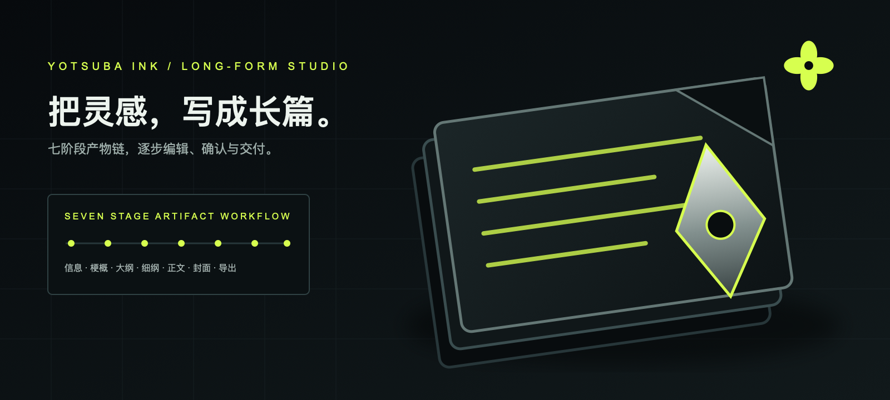

# Yotsuba Ink

[简体中文](README.md) | [English](README.en.md)

<p align="center">
  
</p>

<p align="center"><strong>把灵感，写成可交付的长篇。</strong><br />面向长篇小说的阶段化创作与交付工作台</p>

<p align="center">
  
  
  
</p>

<p align="center"><a href="README.md">中文</a> · <a href="README.en.md">English</a></p>

<p align="center"></p>

> 品牌资产：商标为 `2048×2048`，横幅为 `1600×720`。本地演示不依赖封面生图，封面阶段仍会保存完整视觉元数据。

Yotsuba Ink 是一个面向长篇小说的开源创作工作台。它不追求一次提示词生成整本书，而是把小说信息、全书梗概、分卷大纲、章节细纲、正文、封面和导出组织成可编辑、可确认、可追溯、可恢复的生产链路。

> 当前版本：`1.0.0 Demo`。本版本完成了官方平衡模式的真实 10 万字以上长篇闭环，并以静态终态投影保证作品库打开不会重放历史 SSE。真实模型的文学质量仍需结合人工冷读持续评估。

## 核心能力

- **八阶段 Artifact 工作流**：创作立项、故事脊柱、人物编排、分卷架构、章节施工图、正文、封面元数据、导出交付。
- **三种创作模式**：极速生产、平衡创作、精细定稿，对应不同的成本、人工确认点和自动化程度。
- **Artifact 优先**：当前稿、确认定稿和正式写回相互分离，候选稿不会提前污染 Story Bible 或正典事实。
- **长篇连续性**：人物关系、世界观、伏笔账本、Wiki/Canon 和章节上下文共同约束跨章承接。
- **审校与修订**：质量报告、事实写回、选区修订、版本历史和稳定检查点形成可恢复闭环。
- **终态可浏览**：已完成作品直接恢复最终工作台，可查看所有已定稿阶段、44 章正文版本与不可变导出回执，不重新播放历史运行过程。
- **单行作品库**：书架保持一排书脊，支持左右按钮、触控板和触摸横向浏览，选中作品后在阅读桌查看阶段摘要。
- **并行交付**：章节施工图确认后，正文与封面可以并行；导出等待两路产物汇合并完成校验。封面生图可按 Run 配置跳过，但不会丢失 Cover 元数据。
- **真实 Provider 边界**：生产代码使用 OpenAI-compatible 文本/图片 Provider；Fake Provider 只存在于测试中。

## 创作流程

```text
创作规划
  -> Brief 创作立项
  -> Spine 故事脊柱
  -> Cast 人物编排
  -> Volumes 分卷架构
  -> Detail 章节施工图
  -> [Text 正文 || Cover 封面元数据]
  -> 导出交付
```

三种模式共享同一套阶段产物和写回合同：

| 模式 | 用户控制 | 默认流程 |
| --- | --- | --- |
| 极速生产 | 最少干预 | 配置完成后自动推进完整链路 |
| 平衡创作 | 确认 Brief | Brief 定稿后自动推进，版本对比由用户主动触发 |
| 精细定稿 | 逐阶段审阅 | 每个文本阶段可换稿、编辑、确认后继续 |

AI 封面和导出拥有各自的候选、确认和交付决策，不强制套用文本阶段的三栏换稿形式。

## 技术栈

- 前端：React、TypeScript、Vite、GSAP、Motion、Radix UI、Three.js
- 后端：Python、FastAPI、Pydantic、SSE
- 模型接入：OpenAI-compatible 文本与图片接口、Provider 模板和故障转移
- 持久化：项目、运行历史、稳定快照、Provider 配置、Wiki、知识库与导出收据

## 仓库结构

```text
apps/web/                    React 创作工作台
src/novel_workflow/          Python 领域逻辑与 FastAPI 适配层
runtime/novel_workflow/      本地运行时配置和数据目录
tests/                       后端合同、编排、质量与 Prompt 回归
docs/                        产品、阶段合同和架构文档
```

前端 `features/pipeline` 只使用 `layout/`、`planning/`、`brief/`、`running/`、`settings/`、`state/`、`services/`、`contracts/` 和 `lib/` 这一套目录语义。后端 `api/` 只负责 HTTP/SSE 适配，编排、质量和持久化规则位于对应领域包。

## 本地运行

### 1. 环境要求

- Python 3.12 或更高版本
- Node.js 与 npm

### 2. 安装后端

```bash
python3 -m venv .venv
.venv/bin/python -m pip install -U pip
.venv/bin/python -m pip install -e ".[dev]"
```

### 3. 启动后端

```bash
.venv/bin/python -m uvicorn novel_workflow.api.app:app \
  --host 127.0.0.1 \
  --port 8787 \
  --reload
```

### 4. 启动前端

```bash
cd apps/web
npm install
npm run dev
```

打开 [http://127.0.0.1:5173](http://127.0.0.1:5173)。Vite 默认把 `/api` 代理到 `http://127.0.0.1:8787`；需要修改时设置 `NOVEL_API_PROXY`。

## Provider 配置

推荐在应用的“设置 -> 模型接口”中选择厂商模板，填写 API Key 和默认模型，然后执行“保存并检查”。密钥写入本地运行时存储，不应提交到仓库。

也可以使用通用环境变量启动 OpenAI-compatible Provider：

```bash
export NOVEL_LLM_BASE_URL="https://your-text-provider.example/v1"
export NOVEL_LLM_API_KEY="your-text-api-key"
export NOVEL_LLM_MODEL="your-text-model"

export NOVEL_IMAGE_BASE_URL="https://your-image-provider.example/v1"
export NOVEL_IMAGE_API_KEY="your-image-api-key"
export NOVEL_IMAGE_MODEL="your-image-model"
```

只浏览配置、项目和历史界面不需要密钥；启动真实生成前必须完成 Provider 就绪检查。不要把 `.env`、API Key、运行历史或用户稿件提交到公开仓库。

## v1.0 Demo 验收

官方 `official-deepseek-balanced` 已完成一次真实长篇 Run：

- 作品：`明日来电`；Project `proj-e1007717ad`；Run `balanced-110k-v1-demo-20260817-040033`
- `8/8` 阶段完成，44 章，107,613 个非空白字符；章节范围 1,710–3,692，平均 2,445.75，P90 2,962
- 分卷为 14/14/16 章；标题完整率 100%；Export ZIP 可下载
- Provider：314 次调用、311 成功、3 失败后恢复；总 tokens 1,760,252
- 封面生图按配置跳过，Cover 元数据和 Export 仍闭环

详细硬门、连续性抽检、Provider 回执、软告警与浏览器截图见 [v1.0 平衡模式验收报告](docs/engineering/yotsuba-ink-v1-balanced-110k-acceptance.md)；历史问题见 [v1.0 后续迭代记录](docs/engineering/yotsuba-ink-v1-open-findings.md)。

## 验证

```bash
# 后端全量测试（必须使用仓库虚拟环境）
.venv/bin/pytest -q

# 前端测试、生产构建与样式门禁
cd apps/web
npm test
npm run build
npm run audit:css
npm run check:css-split
```

自动化测试、生产构建、CSS 审计与浏览器验收应在发布前全部运行。自动化通过证明本地合同与 UI 投影；真实 Provider 的文学质量、AI 味和完整人工冷读仍以验收报告中的证据和后续冷读为准。

## 关键文档

- [产品与架构概览](docs/architecture/overview.md)
- [阶段 Artifact 合同](docs/architecture/stage-artifact-contract.md)
- [生产工作流](docs/architecture/product-production-workflow.md)
- [Story Bible、Wiki 与质量边界](docs/architecture/story-bible-quality.md)
- [人工偏好校准协议](docs/architecture/preference-calibration-protocol.md)
- [Phase 27 前后端交接](docs/architecture/phase-27-frontend-backend-handoff.md)
- [DeepSeek Harness 采纳评审](docs/architecture/deepseek-harness-adoption-review.md)
- [v1.0 平衡模式长篇验收](docs/engineering/yotsuba-ink-v1-balanced-110k-acceptance.md)
- [v1.0 历史问题与后续迭代](docs/engineering/yotsuba-ink-v1-open-findings.md)
- [工作树清理记录](docs/architecture/worktree-cleanup-2026-08-15.md)
- [仓库协作规则](AGENTS.md)

## 路线图

- 使用明确授权的真实文本 Provider 验证跨卷、跨章承接和文学质量。
- 使用真实图片 Provider 验证封面生成、失败恢复、候选确认和导出打包。
- 完成发布安全检查、部署说明和可观测性基线。
- 到 `v1.0` 再评估开源基础版与线上增强版的代码边界；当前保持单仓演进。

## 许可证

Yotsuba Ink 使用 [Apache License 2.0](LICENSE) 发布。第三方依赖继续遵循各自许可证。

仓库地址：[github.com/isla4ever/yotsuba-ink](https://github.com/isla4ever/yotsuba-ink)
