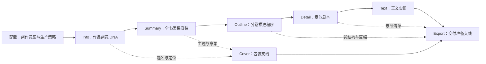

# Phase 21：细纲优先的叙事生产与模式分层质量运行时

> 状态：本地实施已由 Phase 22 收口；真实三章 A/B、人工盲读和单卷验收仍未完成。后续事实以 Phase 22 的正式调用前门槛为准。
>
> 日期：2026-08-07。
>
> 范围：阶段职责、Detail 剧本合同、正文 Context、RAG 启动边界、质量模式、Agent 分工、前端工作台和 LangGraph 迁移顺序。
>
> 前置关系：本阶段继承 Phase 19 的 Narrative Program、Prompt Compiler 和 Reality Reconciliation，也继承 Phase 20 的 LangGraph 控制面边界；在本阶段三档模式和正文生产合同通过真实 A/B 前，暂停 Phase 20F Stage / Global Graph 扩张。

## 1. 结论先行

Yotsuba Ink 下一轮不继续为正文增加规则、Reviewer 或更长 Prompt。正确的产品主线是：

```text
前置阶段负责逐层做决定
        -> Detail 把决定编译成可执行剧本
        -> Writer 在剧本内自由创作
        -> 最小生产门保证能继续写下一章
        -> 诊断与精修按模式分层
        -> 正文现实决定 Canon 和后续章节状态
```

阶段多不等于堆料。每个阶段只有在满足以下四项时才有存在意义：

1. 产生一个下一阶段无法可靠自行推导的独立决策；
2. 用户能理解并在必要时修改这个决策；
3. 产物拥有明确写回目标和权威等级；
4. 下一阶段只消费它的压缩投影，不重复接收全部上游原文。

正文不是第二个规划器，也不是审稿器。它的任务是把当前场景剧本写成自然发生的小说，在不改变人物核心信息、因果结果和事实边界的前提下，自由决定动作细节、对白、潜台词、感官、意象、句法和局部策略。

## 2. 产品评审

### 2.1 用户判断中正确的部分

- 细纲应成为正文最主要的计划来源，而不是正文 Prompt 中的一个附属板块。
- 人物选择、关系变化、信息揭示、伏笔动作、章节进入和离场状态应在细纲阶段确定。
- 正文约束过多会让模型转而完成检查清单，损失叙事自然度和创造力。
- Fast 和 Balanced 必须具备自动生产能力，不能默认要求作者逐章裁决。
- RAG 只有在用户上传资料库并明确启用时才成立，不能用空检索制造“已使用知识库”的假象。
- 用户上传资料的理解应发生在立项和世界构建阶段，不应让正文 Writer 临时检索、判断和消化原始资料。
- 前端必须随阶段合同变化，不得继续展示已经不属于该阶段的全套观测面板。

### 2.2 需要修正的部分

- 细纲不能规定所有微观动作。它应冻结不可替代的剧情承诺，同时明确创作自由区，否则只是把正文僵化提前到 Detail。
- 正文仍需极小范围硬门：空稿、明显截断、无法形成可执行交接、明确 Canon 冲突和明确 POV 越权不能被文学自由旁路。
- RAG 与小说内部长期召回不是同一个系统。用户资料库 RAG 应只服务外部依据；已发生小说事实的远程召回属于 Narrative Recall，来源是 Canon、Wiki 和章节账本。
- Fast、Balanced、Deep 不能承诺同样的投稿准备度。Fast 交付完整草稿，Balanced 交付可读初稿，Deep 才以编辑候选稿为目标。

### 2.3 本期产品决定

- 不删除 Story Bible、人物关系、Foreshadow Ledger、Canon、Wiki、Reality Reconciliation 或 LangGraph。
- 不把这些系统同时注入 Writer；它们先由确定性 Context Broker 编译为最小执行简报。
- 不再用单一质量总分决定章节是否可用。
- 不再因普通文风、模板味、章长偏差或 AI 化风险自动重写整章。
- 不让 Reviewer、Retriever 或 Writer 直接写 Canon/Wiki。
- 不继续迁移旧质量策略到 LangGraph 主路径，先完成 Phase 21 的模式合同和三章 A/B。

## 3. 阶段不是七次生成，而是一条决策编译链



### 3.1 阶段责任总表

| 阶段 | 唯一问题 | 权威产物 | 用户决策 | 下一阶段只消费 |
| --- | --- | --- | --- | --- |
| 配置 | 这次如何创作 | `RunIntent` | 模式、模型、篇幅、可选资料源 | 冻结运行策略 |
| Info | 这是什么作品 | `StoryDNA` | 题名、定位、世界基线、主要人物 | 创意承诺、硬规则、人物基线 |
| Summary | 为什么故事会这样发展 | `CausalSpine` | 因果链、关键选择、结局方向 | 关键转折和不可逆结果 |
| Outline | 每一卷如何推进全书 | `VolumeProgram[]` | 卷目标、代价、结算、轨迹和伏笔窗口 | 当前卷程序和相邻卷交接 |
| Detail | 每章具体要演什么 | `ChapterScript[]` | 场景顺序、人物选择、代价、揭示和交接 | 当前章/场执行简报 |
| Text | 剧本如何成为小说 | `ChapterArtifact` | 可选局部修改、版本与定稿 | 已发生现实、摘要和下一章交接 |
| Cover | 如何包装作品 | `CoverArtifact` | brief、候选、选中封面 | 最终封面资产和元数据 |
| Export | 如何形成交付物 | `ExportManifest` | 格式、元数据、范围和包内容 | 已验证的最终文件 |

配置是运行准备，不计入七个创作产物阶段。Cover 和 Export 是正式阶段，但采用支线依赖，不等待整本正文写完才开始准备。

## 4. 每个阶段的产物与边界

### 4.1 配置：Run Intent

负责：

- 作品类型、目标篇幅、章节规模和语言；
- Fast / Balanced / Deep；
- 叙事角色与风格方向；
- Provider、模型、预算和失败策略；
- 用户是否上传资料，以及是否允许本次运行使用资料库。

不负责：

- 生成世界观、人物、Wiki、质量结论；
- 展示运行态人物关系网或 Canon；
- 默认启用不存在的 RAG。

前端：一个紧凑启动工作台。资料库区域只有在存在已上传文档时才显示“用于本次作品”选择；未上传时显示普通上传入口，不展示检索状态、命中数或 RAG 动画。

### 4.2 Info：Story DNA

负责：

- 核心概念、阅读承诺、题材定位和目标读者；
- 世界硬规则、可变区域和禁区；
- 主要人物的身份、欲望、恐惧、秘密、能力边界和初始关系；
- 叙事视角、声音方向和下游不可违反的约束；
- 在 RAG 启用时，把用户资料编译成带来源的 `WorldSourcePack`。

不负责：

- 写完整全书剧情；
- 预先安排每章伏笔；
- 把外部资料原文带入后续每个 Prompt。

前端：主区是可编辑的作品方案；人物与世界是两个明确的支撑视图。`WorldSourcePack` 仅在真实启用 RAG 时出现，展示来源、采用的事实/限制和未采用原因，不显示向量、chunk 或内部分数。

### 4.3 Summary：Causal Spine

负责：

- 初始失衡、人物选择链、对手/阻力系统；
- 每个关键转折改变了哪些后续可能性；
- 主角和主要人物的不可逆变化；
- 结局方向和必须兑现的阅读承诺。

不负责：

- 逐卷平均分配章节；
- 场景动作、逐章对白或正文修辞；
- 重复注入完整 Story DNA。

前端：长梗概是主工作面，因果脊柱和关键选择是支撑轨。人物关系只显示 Summary 新产生的压力变化；世界观只显示本阶段实际使用或改变的规则。

### 4.4 Outline：Volume Program

负责：

- 每卷 `state_in -> pressure -> irreversible_change -> state_out`；
- 卷目标、卷代价、卷结算和与相邻卷的因果交接；
- 主要人物在本卷的轨迹片段；
- 关系走向、世界揭示和伏笔处理窗口；
- 合理章节范围，而不是机械平均章数。

不负责：

- 决定每场微观动作；
- 让所有人物每卷平均出场；
- 提前形成正文事实。

前端：主区是分卷节拍板与卷列表，不用通用卡片墙。人物、世界和伏笔分别以专用入口打开本卷变化，不在主画布重复展示全量账本。

### 4.5 Detail：Chapter Script

Detail 是整本小说的剧本阶段，也是正文质量的主要计划责任层。

每章必须回答：

- 从哪个真实状态进入；
- 本章为什么现在必须发生；
- 哪个角色想得到什么；
- 谁或什么形成阻力；
- 人物采取什么关键策略与选择；
- 选择付出什么代价；
- 哪些信息被谁获得、误解、隐瞒或揭示；
- 哪个关系发生可观察变化；
- 伏笔在本章投放、推进、回收还是延后；
- 本章结束后局势如何变化；
- 下一章必须承接什么压力。

#### Detail 三层产物

1. `ChapterDramaticPlan`：作者可读的本章因果链、人物选择链、信息链和伏笔链。
2. `SceneScript[]`：机器可验证的场景顺序与稳定计划 ID。
3. `SceneExecutionBrief[]`：正文 Writer 唯一消费的短剧本。

#### SceneScript 建议合同

```text
scene_id
order
pov
location
entry_handoff_id
dramatic_goal
opposition
strategy
irreversible_turn
character_choice
cost
knowledge_delta
relationship_delta
planned_fact_actions[]
foreshadow_actions[]
exit_state
handoff_out
freedom_envelope
```

`freedom_envelope` 明确允许 Writer 自由创造的范围，例如对白、感官、次要动作、场面调度、意象、句法、局部误导和不改变结果的策略变化。

#### 逐章连续生成与章前施工单

Detail 不是一次性把整本细纲塞给模型，也不是每章重新调用一个规划 Agent。生产采用“完成一章，冻结一份交接；生成下一章前，确定性编译一份章前施工单”的节奏：

1. 当前章的末场输出唯一 `handoff_out_id`，并随 `chapter_state_out`、未完动作、人物情绪/知识余波、下一压力一起持久化。
2. 下一章开始前，`DetailChapterPreflight` 只压缩上一章交接、当前卷职责和最近两章轨迹，生成当前批次的 `must_continue_from`、`current_volume_program`、`recent_trajectory` 与 `decision_contract`。
3. Provider 只收到当前章节范围和这份施工单；Balanced/Deep 默认逐章生成，Fast 才允许有界批量，批量内部仍按 handoff 顺序串联，不能并行猜测相邻章节。
4. 施工单是确定性投影，不额外调用模型；模型负责在本章剧本内安排动作、对白、感官和自由表达，不得重新规划上一章或另造第二份章前计划。

自然语言交接用于作者可读的因果说明，稳定 ID 用于机器校验和跨批恢复。只要 ID 引用正确，视角切换、时间跳切或信息重新感知可以改写文字；只有旧兼容 Artifact 缺少 ID 时才使用逐字文本回退。

#### 去重和容错

- 第一场 `entry_state` 与末场 `exit_state` 是权威来源，章级状态由系统投影，不要求模型填写重复值。
- 后一场引用前一场 `handoff_id`，不要求两段自然语言逐字相等。
- `planned_fact_actions` 统一事实揭示和 Wiki 计划来源，Wiki 候选由系统派生。
- 场景数默认 1-3；高潮、群像或复杂调查章可扩展到 4-5 场，并显示成本提示，不做全局硬阻断。
- Detail 只验证因果可执行性、引用合法性和相邻交接；文学性、句式和段落不在此阶段判断。

#### 卷级剧本预演

Detail 定稿前先做一次确定性卷级检查：

- 相邻章节进入/离场状态能否连接；
- 人物是否在不可能的时间或地点出现；
- 角色知识是否无来源增长；
- 主要人物轨迹是否有长期空洞；
- 伏笔窗口是否存在无处理终点；
- 卷目标是否在卷末获得结算。

Balanced/Deep 的高风险章可调用一个 Planner Proposal，提出桥接或冲突修复建议；它不能写正文，也不能直接修改 Detail。

前端：主区改为“章节施工表 + 选中章节剧本稿纸”。作者先阅读本章戏剧计划，再沿场景轨编辑选择、代价、转折和交接。人物、事实、伏笔以本章内联摘要呈现，深度编辑进入对应专用弹窗，不重复展示全局关系网、世界观和 Wiki 大面板。

### 4.6 Text：Prose Realization

Writer 只接收一份 `SceneExecutionBrief`，包含：

1. 当前场必须承接的上一场/上一章真实结果；
2. 当前场目标、阻力、关键选择、代价、转折和必须到达的离场状态；
3. 当前 POV 已知、误信和未知的最小边界；
4. 当前仍有效的少量人物、物件、地点和世界硬事实；
5. 本场 1-3 条表达差量；
6. 明确的创作自由区。

Writer 不接收：

- 完整 Story DNA、Summary、Outline 或整卷 Detail；
- 全量人物关系网、Wiki、Canon、RAG 结果或历史正文；
- 质量最低分、Reviewer Rubric、AI 检测标准或写回 Schema；
- 所有禁止项组成的长清单；
- 用户上传资料库的实时检索结果。

正文身份提示保持短而清晰：你是当前作品的小说作者，理解剧本和人物后自然落笔；剧本冻结结果，表达过程由你决定。不要要求 Writer 在输出前逐项自证或解释。

正文长度使用目标区间而非精确字符合同。正常偏差只记录建议；只有明显截断、输出失控或无法形成离场结果时才进入一次有界修复。压缩不要求模型精确删除指定字符数。

前端：正文稿纸占主体。左栏只保留章节导航、当前章状态和修订历史；右侧默认收成一个紧凑“本章剧本”入口和质量提示入口。Fast/Balanced 的建议不遮挡正文、不强制弹窗；Deep 才展示完整审校与写回决策。

### 4.7 Cover：Packaging Branch

Cover 不必等待正文全部完成：

- Info 定稿后可建立题名、类型和受众方向；
- Summary 定稿后可生成主题意象与构图 brief；
- Outline 定稿后可生成不泄露错误剧情的候选方向；
- 正文未完成时标记为 `provisional`，允许作者提前选择和迭代；
- 最终导出前只需复核题名、作者名、文案和正文现实是否发生重大偏移。

前端：独立封面工作台，只展示 brief、prompt、候选、选中资产和最终校验，不携带正文 Reviewer 或人物关系网。

### 4.8 Export：Delivery Branch

Export 同样分为准备和最终交付：

- Outline 后可建立预计卷/章结构和格式偏好；
- Detail 后可建立章节 Manifest 和命名规则；
- 正文生成过程中持续更新完成度，但不伪装为可下载成品；
- 正文、封面和必要提交完成后执行最终文件校验与打包。

前端：单页交付清单，区分“准备中、可预览、可导出、阻断”。不展示创作阶段的关系图和世界观面板。

## 5. Context 分层与预算

### 5.1 权威顺序

```text
冻结正文现实
  > 已提交 Canon / 当前有效叙事状态
  > 当前 Chapter Script / Scene Script
  > 当前卷 Program
  > Summary / Story DNA
  > 外部参考资料
```

低权威内容不能覆盖高权威内容。Writer 只看到已经裁决后的结果，不负责在冲突来源中自行选择。

### 5.2 阶段 Context 投影

| 目标阶段 | 必须输入 | 不得直接输入 | 目标字符预算 |
| --- | --- | --- | ---: |
| Info | Run Intent、用户明确选择的上传资料 | 运行态 Wiki/Canon | 6K-8K |
| Summary | Story DNA 压缩投影 | Info 原始完整 JSON、资料原文 | 6K-8K |
| Outline | Causal Spine、人物弧、世界揭示边界 | 完整 Info/Summary 重复文本 | 每卷 8K-10K |
| Detail | 当前卷 Program、最近 1-2 章剧本交接、风险命中 | 全部历史章节 ledger | 每批 10K-12K |
| Text | SceneExecutionBrief、真实交接、最小事实/POV | 全量上游、RAG、Reviewer Rubric | 常态 4K-6K，硬上限 8K |
| Review | 冻结正文、相关剧本承诺、必要证据 | Writer 未使用的背景堆料 | 8K-12K |

Context Broker 是确定性编译器，不默认调用模型。任何可选 Planner 或 Retriever 只返回 Proposal/Evidence，最终 Snapshot 仍由确定性规则冻结。

## 6. RAG 与 Narrative Recall 边界

### 6.1 用户资料库 RAG 的启动条件

只有同时满足以下条件才启动：

```text
用户已上传至少一份资料
AND 用户在本次作品中选择了资料
AND Info 配置明确启用“使用资料库”
```

未满足条件时：

- 不发起知识库查询；
- 不生成 RAG 事件、命中数或空结果面板；
- Smart Search、URL 或未启用资料库的普通 Run 不因空知识库阻断；
- 用户已经显式选择“用户知识库”模式但未选择可索引文档时，在启动前返回配置错误，不进入 Run；
- 不用通用网络搜索结果冒充用户知识库命中。

### 6.2 RAG 的唯一主产物

Info 阶段将检索结果编译为 `WorldSourcePack`：

- `source_id / title / version`；
- 可采用事实与适用范围；
- 风格或题材参考，只记录抽象规律，不复制表达；
- 与用户创意冲突的内容；
- 下游允许使用的压缩结论；
- 来源签名和作者确认状态。

后续阶段读取已经确认的 Source Pack 投影，不再次检索用户原始资料。正文阶段禁止直接查询用户资料库。

### 6.3 小说内部长期召回

小说内部召回命名为 `Narrative Recall`，避免与用户 RAG 混淆：

- 最近 2-3 章：直接读取冻结摘要、尾文和 handoff ledger；
- 长期事实：按实体、物件、地点、伏笔 ID 从 Canon/Wiki 召回；
- 召回只在当前剧本引用远期内容或风险检测命中时发生；
- 零命中不阻断，且不能用低相关内容填满 Context；
- 每条命中必须带来源、版本、权威等级和签名。

## 7. 三档生产合同

### 7.1 质量层级

| 层级 | 内容 | Fast | Balanced | Deep |
| --- | --- | --- | --- | --- |
| L0 输出信封 | Provider 失败、空稿、明显截断、正文不可解析 | 阻断并有界恢复 | 同左 | 同左 |
| L1 可继续性 | 无离场状态、无法构造下一章交接 | 一次场景修复，失败暂停当前章 | 同左 | 同左 |
| L2 叙事硬事实 | 明确 Canon、POV、时间地点和身份冲突 | 警告且不写冲突事实 | 一次局部修补；可安全派生时带警告继续 | 阻断并等待裁决/修补 |
| L3 编辑诊断 | 文风、模板味、节奏、信息增量、章长偏差 | 异步记录 | 建议，可选接受 | 审校工作台 |
| L4 投稿诊断 | 冷编辑、盲读、兑现度和全卷审读 | 不运行 | 卷末可选 | 必选但不自动整章重写 |

### 7.2 Fast

- 目标：尽快形成完整草稿；
- 每场一次 Writer，零模型审稿；
- 仅 L0/L1 阻断；
- 文学与普通一致性问题进入待办，不中断全书；
- 冲突或低置信事实不写正式 Canon，也不进入下一章的已验证状态；正文保留为带警告的快速草稿；
- 无人工阶段确认。

### 7.3 Balanced

- 目标：形成可读、连续、可继续编辑的初稿；
- Info 保留一次强确认，后续默认自动；
- 只在风险触发时调用一个语义/衔接主审；
- 每章最多一次、只修改可定位片段的局部修补；
- 可安全派生下一章状态时，以 `accepted_with_warnings` 自动继续；
- 作者可以随时暂停和处理建议，但不是默认阻断条件。

### 7.4 Deep

- 目标：形成编辑候选稿，不承诺无需人工即可投稿；
- 每阶段和卷级检查点允许人工确认；
- 语义主审必选，因果/终章专项按结构触发，文学冷读只作诊断；
- 同章 Reviewer 只读同一冻结稿并行；
- 只对证据可定位的问题进行一次局部精修；
- 未决硬事实、写回证据和关键兑现可阻断定稿。

## 8. Agent 与 LangGraph 分工

### 8.1 Agent 角色

| 角色 | 何时运行 | 输出 | 禁止事项 |
| --- | --- | --- | --- |
| Source Curator | RAG 启用后的 Info | Source Pack Proposal | 直接改 Story DNA |
| Detail Planner | Balanced/Deep 高风险章 | 桥接/冲突建议 | 写正文、改 Canon |
| Character Rehearsal | Deep 的复杂群像/认知章 | 角色行动 Proposal | 直接合并场景现实 |
| Writer | 每个场景 | 正文候选 | 重新规划全书、写 Wiki |
| Semantic Reviewer | Balanced 风险触发/Deep | 语义与衔接证据 | 直接改正文 |
| Hard Specialist | Deep 结构触发 | 因果/终章证据 | 自行增加 Reviewer |
| Cold Editor | Deep 或卷末可选 | 文学建议 | 阻断硬门、整章重写 |

多 Agent 的价值放在规划预演和窄职责审稿，不把多个 Agent 变成多个正文作者。相邻章节不能并行生成；下一章必须消费上一章正文现实和交接状态。

### 8.2 LangGraph 边界

LangGraph 负责：

- 阶段和章节节点、条件边、有限循环；
- 模式路由、风险触发、interrupt/resume；
- 同一冻结稿的 Reviewer 并行；
- checkpoint、operation receipt 和幂等恢复；
- 映射为现有领域 SSE 事件。

LangGraph 不负责：

- 决定事实权威；
- 编写 Prompt 文案；
- 让 Agent 直接修改 Canon/Wiki；
- 用 Checkpointer 代替 Artifact 和领域 Store；
- 自动扩大修订次数或 Agent 数量。

## 9. 前端信息架构调整

### 9.1 共通原则

- 每个阶段只有一个主 Artifact、一个支撑区域和一个主要决策；
- 全局人物关系、世界观、Wiki 和质量不再常驻每一页；
- 支撑系统只显示“本阶段新增或实际使用的变化”；
- Fast/Balanced 的建议不抢占主工作面，Deep 才展开完整审校；
- 不展示 Prompt、ContextSnapshot、RAG chunk、稳定 ID 或原始 JSON；
- 模式色来自统一动态 Token，不在同一页面混入第二套强强调色。

### 9.2 页面映射

| 页面 | 主工作面 | 支撑区域 | 主操作 |
| --- | --- | --- | --- |
| Info | 作品方案编辑器 | 人物/世界切换视图，可选 Source Pack | 确认作品基线 |
| Summary | 长梗概编辑器 | 因果脊柱、关键选择 | 确认故事因果 |
| Outline | 分卷节拍板 | 当前卷轨迹/伏笔入口 | 确认分卷程序 |
| Detail | 章节施工表与剧本稿纸 | 本章选择、揭示、交接摘要 | 确认章节剧本 |
| Text | 大幅正文稿纸 | 章节导航、剧本/建议入口 | 继续生产或局部修改 |
| Cover | 封面 brief 与候选画廊 | 质量/导出准备 | 选中封面 |
| Export | Manifest 与文件清单 | 校验摘要 | 生成交付包 |

### 9.3 响应式密度

- 1280-1440 宽度：主体优先占约 68%-74%，支撑区保持窄列或抽屉；
- 更窄桌面：支撑区变为 Tab/Sheet，不压缩正文和剧本稿纸；
- 移动端：阶段主 Artifact 单列，支撑信息按需进入全屏 Sheet；
- 页面只保留一个纵向滚动所有者；长表格、正文和弹窗可内部滚动；
- Header 删除重复阶段说明，只保留阶段、状态和主操作；
- Tab、弹窗和候选切换使用稳定尺寸与淡入淡出，不以重建整个页面制造闪烁。

### 9.4 状态表达

- `generating`：主 Artifact 局部流式写入，不使用除 Info 外的全屏遮罩；
- `ready`：产物可读可编辑；
- `accepted_with_warnings`：不阻断，但在阶段/章节导航保留可追溯提示；
- `needs_attention`：只在确实无法安全继续时占用主操作；
- `confirmed`：写入当前阶段正式 Artifact；
- `stale`：上游变化后明确提示受影响范围，不静默复用旧建议或旧写回。

## 10. 应保留、降级、废弃和重写的内容

### 10.1 保留

- Stage Artifact 与当前稿/正式写回分离；
- Prompt Compiler 与 Context Snapshot 签名；
- Reality Reconciliation 五态；
- Canon、Wiki、人物、伏笔的来源证据；
- Provider receipt、预算、恢复和幂等；
- LangGraph 作为控制面而非事实内核。

### 10.2 降级

- `scene_repetition`：只有逐字/近逐字重复且明显为 Provider 故障时才是硬门；普通相似降为诊断；
- 章长：从硬目标改为软区间和宽容安全上限；
- 模板味、Voice 漂移、信息增量和文学评分：Fast/Balanced 不阻断；
- RAG 零命中：记录但不阻断；
- Reviewer 分歧：只有双方都有可定位证据时才进入裁决。

### 10.3 废弃

- 质量总分决定章节是否可用；
- Writer Prompt 中的 Reviewer Rubric 和最低分；
- 为通过评分自动整章重写；
- 固定字符数精确删减；
- 每章固定调用多个 Reviewer；
- Writer 临时检索用户资料库；
- 自然语言 handoff 逐字复制合同；
- 同一事实在 Detail、Wiki 候选、Context 和 Prompt 中重复出现多份权威版本。

### 10.4 重写

- Detail v2 向三层 `ChapterDramaticPlan / SceneScript / SceneExecutionBrief` 投影演进；
- QualityEngine 从单一 `passed` 改为模式感知的 `production_status + diagnostics`；
- RAG 事件和 UI 只在真实上传并启用时出现；
- Text 工作台从“正文 + 全套观测面板”改为“正文主体 + 按需剧本/建议入口”；
- Phase 20 Chapter Graph 按新模式合同重做路由基线。

## 11. 实施波次

### Wave 21A：合同与可观测基线

- 冻结本文和阶段责任矩阵；
- 盘点所有正文 finding、Reviewer 和写回门，分为 L0-L4；
- 记录 Fast/Balanced/Deep 当前三章完成率、人工中断、Provider 调用和 Prompt 字符；
- 暂停 Phase 20F，不改旧 Run 恢复语义。

退出：每个门都有责任层、模式行为和 UI 表达，不存在隐式 blocking。

### Wave 21B：RAG 与 Source Pack

- 将用户资料 RAG 改为三条件显式启动；
- 在 Info 形成 `WorldSourcePack`；
- 下游只消费确认投影；
- 删除正文阶段对用户资料库的调用路径和伪 RAG 事件；
- 将内部远程事实检索命名为 Narrative Recall。

退出：无上传时零 RAG 调用、零 RAG 事件；有上传时来源可追溯且正文不直接检索。

### Wave 21C：Detail 剧本编译器

- 先基于现有 Detail v2 构建三层投影，不立即破坏旧 Artifact；
- 用 handoff ID 和结构状态替代自然语言逐字相等；
- 引入 `freedom_envelope`；
- 采用确定性 `DetailChapterPreflight`，按章冻结上一章现实并压缩最近两章轨迹；
- Fast/Balanced/Deep 按模式选择批次大小，旧 Provider 返回整本章节时只接受目标范围并做越界裁切；
- 建立卷级剧本预演和模式感知风险分类；
- 为旧 Run 保留只读适配器。

退出：同一章的人类剧本、机器计划和 Writer 简报可相互追溯，没有重复权威字段。

### Wave 21D：Writer 与模式质量运行时

- 从 Writer 移除质量评分、Reviewer Rubric、RAG 和重复上游；
- 将正文输入硬限收至 SceneExecutionBrief；
- QualityEngine 输出 `production_status` 与 `diagnostics`；
- Fast/Balanced/Deep 使用不同阻断和自动继续合同；
- 保留一次有界、可定位的局部修补，删除评分驱动整章重写。

退出：Fast 无模型审稿，Balanced 可选干预，Deep 保持专业审校；三者都不因文学总分卡死。

### Wave 21E：前端工作台迁移

- 按第 9 节逐页调整 Info、Summary、Outline、Detail、Text、Cover、Export；
- 删除阶段无关面板和重复说明；
- 增加 Source Pack、剧本稿纸、自由发挥区和非阻断建议状态；
- 完成窄桌面、移动端、弹窗、键盘和 Reduced Motion 验收。

退出：每页能回答“当前产物、作者决定、写回目标、下一阶段依赖”，无卡片堆料和内容遮挡。

### Wave 21F：LangGraph 新合同接入

- 更新 Chapter Graph 的模式路由和 ReviewLaneSpec；
- Shadow 比较新旧生产状态、调用数、预算和写回；
- 新 Run feature flag 开启，旧 Run 永远使用旧合同恢复；
- 通过后再恢复 Stage / Global Graph 迁移。

退出：无重复 Provider、无重复扣费、无重复写回，Graph 不扩大 Agent 或修订次数。

### Wave 21G：真实质量验收

1. 同一题材、同一上游产物做三档前三章 A/B；
2. 人工盲读章节衔接、人物声音、因果、节奏和自然度；
3. 通过后生成 8-12 章单卷；
4. 卷级检查人物轨迹、关系变化、伏笔窗口和 Canon；
5. 单卷通过后才允许完整长篇验收。

禁止整本写完再首次检查，也禁止用 AI Detector 单分数证明投稿质量。

## 12. 验收指标

### 12.1 阶段有效性

- 七个创作阶段都有独立 Artifact、用户决策、写回和下一阶段消费字段；
- 下游 Prompt 不包含完整上游 Artifact 的重复副本；
- 每个阶段至少有一项产物被下一阶段真实读取，未被消费的字段删除或降级为 UI 注释。

### 12.2 Context 与 Token

- Text 常态 Prompt 4K-6K 字符，硬上限 8K；
- 同一 world rule、人物状态、前章结果和场景承诺只出现一次；
- Detail 后期批次不随章节总数线性增长；
- Fast 每场只有一次正常 Writer 调用，质量诊断不增加模型调用；
- Balanced 的额外审稿/修补由风险触发并可计量。

### 12.3 自动生产

- Fast 固定三章样例无需人工完成率不低于 95%，Provider 故障单独统计；
- Balanced 非 Provider 原因的人工阻断率低于 5%；
- 任一模式都不因文学总分、模板味或普通章长偏差整章重写；
- `accepted_with_warnings` 能继续生产并保留可追溯诊断。

### 12.4 叙事质量

- 相邻章节人工盲读连续性均值不低于 4/5；
- 8-12 章单卷无明确 Canon、人物身份、POV、时间地点硬冲突；
- Detail 承诺以 `realized/deferred/omitted/contradicted/superseded` 对账，不要求正文逐字复述；
- 人物关键选择、代价和关系变化能在正文中找到证据；
- 伏笔允许延后，但每次延后必须形成新的处理窗口。

### 12.5 RAG

- 未上传/未选择资料时，用户资料库检索调用数为 0；
- 启用后每个 Source Pack 条目有来源、版本、签名和采用状态；
- 正文阶段用户资料库查询数为 0；
- Narrative Recall 零命中不阻断且不填充低相关内容。

### 12.6 前端

- 1280x920、1440x1000、1728x1100 和 390x844 无页面级横向溢出；
- 主 Artifact 始终是最大、最清晰的工作面；
- 支撑系统不重复占据多个阶段首屏；
- 每个弹窗只有一个滚动所有者，遮罩阻止背景交互并支持安全 backdrop 关闭；
- Fast/Balanced 的非阻断建议不遮挡正文；
- Tab、弹窗、候选和章节切换无闪屏、布局跳变或重复 Provider 调用。

## 13. 回滚与兼容

- 旧 Run 冻结 `artifact_schema_version`、`quality_contract_version` 和 `runtime_engine`，不原地升级；
- Detail v2 继续只读，新的三层剧本先作为派生投影；
- 新合同只对 feature flag 新 Run 生效；
- Graph 或新质量合同失败时保留失败 Run 证据，创建新的 legacy Run，不修改旧历史；
- 已正式提交 Canon/Wiki 只能通过修订分支变更；
- UI 能识别旧 Artifact 并隐藏新合同专属操作，不伪造自由区、Source Pack 或新状态。

## 14. Definition of Done

Phase 21 只有同时满足以下条件才算完成：

1. 每个阶段都有不可替代的决策价值，不再为了填充流程存在；
2. Detail 成为正文唯一主要剧本来源，并同时保留作者可读性和机器可验证性；
3. Writer 在剧本与人物边界内拥有清晰创作自由，不接收审稿清单和资料库检索；
4. Fast、Balanced、Deep 的阻断、Agent、人工和交付目标真实不同；
5. RAG 只在用户上传并启用资料时运行，正文不直接检索用户资料；
6. Narrative Recall 与用户 RAG 分离，最近章节以冻结交接账本为主；
7. 文学诊断不会自动升级为普通模式硬门或整章重写；
8. Canon/Wiki 仍只接受正文证据和 Reality Reconciliation 结果；
9. 七个阶段 UI 与新 Artifact、决策和写回边界一致；
10. 三章 A/B、单卷真实验收、浏览器多视口和恢复幂等全部通过；
11. Phase 20F 只在上述合同通过后恢复，LangGraph 不承载已经被否决的旧策略。

## 15. 当前实施进度（2026-08-07）

### 已完成并验证

- 新增集中式正文质量门策略，把 finding 的检测证据与当前模式下的阻断结论分开；运行编排、质量报告和 UI 读取同一份有效 `blocking`。
- 明确短稿/不可用结构和 Provider 明显重复仍为全模式硬门；Canon/POV 冲突按 Fast 警告、Balanced 一次局部修补、Deep 阻断分流。
- 章长、模板味、Voice 漂移等文学诊断不再使用质量总分阻断正文。
- Writer Prompt 不再包含最低质量分、Reviewer Rubric 或检查项；结构化非正文阶段暂保留既有 Rubric，等待后续按阶段合同复核。
- Smart Search 只执行联网参考，不再隐式查询用户知识库，也不再生成 `rag_query_started/rag_results_found`。
- 用户知识库只在显式选择该模式、选择文档且文档已索引时查询，并将 `doc_ids` 限定为本次作品选择集合。
- Info 资料命中会编译为 `WorldSourcePack`：每条来源有来源 ID、版本、证据摘录和签名；Fast 自动确认，Balanced/Deep 保留待确认状态，审批时不丢失来源投影。无资料命中时不创建 Source Pack。
- Detail 场景合同新增可选 `freedom_envelope`，并投影到 `SceneContract` / 正文 Prompt，明确冻结结果与自由表达的边界；旧 Run 继续走兼容默认值。
- Detail 已完成 `ChapterDramaticPlan -> SceneScript -> SceneExecutionBrief` 纯函数投影；新增 `DetailChapterPreflight`，按章/批次只携带上一章 handoff、当前卷程序和最近两章轨迹；稳定 handoff ID 在 v2 批次和旧兼容批次的持久化链路中均可恢复。
- Detail Provider 越界输出只接受包含目标章节的确定性子集；批次首场按 `handoff_in_id` 承接上一批，只有真正旧 Artifact 才回退自然语言逐字匹配。
- 前端质量合同同步读取 `production_status`；`accepted_with_warnings` 显示为可继续的有提示状态，只有 `needs_repair/blocked` 阻断正文交付和正式写回。
- 当前工作树后端全量 `1318 passed, 1 skipped`；前端全量 `134` 个测试文件、`523 passed`，TypeScript 与生产构建通过；Prompt 快照、Python 编译、运行时 JSON 解析与 `git diff --check` 通过。仓库当前未安装 Ruff，未执行 Ruff 检查。

### 后续收口（由 Phase 22 接管）

本节原列出的 `production_status`、Canon/临时叙事资格过滤、`WorldSourcePack` 采用态、三层 Detail 投影、`ReviewLaneSpec`、角色级预算/超时/恢复和前端合同同步均已落地并具有本地回归覆盖，不再作为重复开发清单。

仍未完成的产品证据只有：

- 固定三章真实链路与人工盲读；
- 三章通过后的单卷 8-12 章连续性、成本、恢复与卷级 Canon 验收；
- 单卷通过后的完整长篇；
- Phase 20F 新运行时 Shadow/Dual 对照和 legacy 回滚演练。

执行顺序以 `phase-22-chapter-rhythm-and-detail-first.md` 第 9 节为准。本地结构回归仍不等于真实模型质量或投稿准备度通过。
