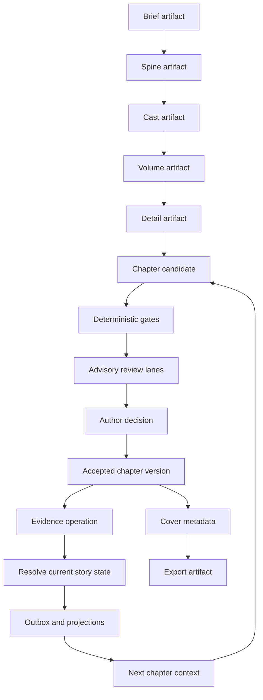

# Phase 28：Yotsuba Ink v1.1 文学可靠性与作者控制计划

状态：实施中；Wave 28.0 已批准，Wave 28.1-28.4 已通过各自退出门，Wave 28.5 保留为历史真实 Provider 验收记录，Wave 28.6 正在进行不调用 Provider 的全链路合同修复

日期：2026-08-17

适用生产主线：`brief -> spine -> cast -> volumes -> detail -> text -> cover -> export`

本文件是 v1.1 的实施边界和验收计划，不是生产代码变更，也不授权 Provider 调用。Phase 27 的八阶段、LangGraph 单一运行权威、Artifact 合同和一次定向换稿上限继续有效。

## 1. 执行摘要

### 1.1 产品决定

v1.1 只解决一件事：让长篇生成在不牺牲稳定性的情况下，能够可靠地保持长期事实、中心谜题和跨章交接，并把“必须处理的问题”和“作者可以接受的文学差异”清楚分开。

不新增创作阶段，不恢复历史 Run，不引入第二套 Canon，不用更换模型掩盖上游合同问题，也不把全书正文塞进 Prompt。所有修复都回到最低责任层：Artifact 合同、确定性投影、Context Manifest、Evidence 事务、质量决策或 UI 投影。

### 1.2 质量门政策

硬门只包括以下情况：

- 流程崩溃、死锁、无法恢复或恢复后状态漂移；
- 结构化输出无法解析；
- 关键 Artifact 缺失或正文为空；
- 章节标题、分卷标题缺失；
- 有直接证据的上游硬约束冲突；
- 同一叙事时间和同一物理规则下的主体越权或不可共存状态；
- 总正文低于冻结软目标的 70%，或单章低于自身冻结目标的 50%；
- 导出不可用。

模型审稿的低置信判断、没有直接点名主体的证据、轻微节奏和文风差异、篇幅接近合理区间、文学偏好、疑似 AI 味全部降级为告警。告警不能自动阻断，也不能触发无限换稿。

每章最多一次定向换稿。自动换稿只针对明确、可定位、影响读者理解的硬门问题；审稿告警默认只生成“建议换稿”卡片，由作者决定是否使用一次额度。

### 1.3 转折与冲突的产品判定

“传闻某人死亡，后来发现是假死或换了身份”是合法转折，不是冲突。系统只有在以下条件同时满足时才报告硬冲突：同一主体和属性、同一有效时间范围、同一认知/证据层级下，存在互斥的确定状态，且 Detail 没有声明替代、揭示、伪装、分身或时间机制。

以下情况应进入 `supersedes` 或 `resolves` 链，而不是阻断：

1. 旧值是传闻、人物误判或未证实记录，后续出现证据并标记为揭示或反驳；
2. 同一人物使用新身份，身份变化有来源、发生章节和后果；
3. 读者已知但 POV 尚未知，后续只是认知揭示；
4. 时间循环或回放已由 Brief/Detail 明确授权，复现服务于不同的知识、关系或风险变化。

真正阻断的是“同一人在同一时刻既在急救中心又在另一地点行动，且没有分身或记录解释”这类物理状态直接矛盾，而不是“读者以为他死了，后来真相改变”。

## 2. v1.0 事实与当前权威图

### 2.1 已验证的 v1.0 基线

Phase 27 的最新收口记录显示：全新的 `official-deepseek-balanced` Run 完成 8/8 阶段、44 章、107,613 个非空白字符，Cover metadata 和 Export ZIP 可用；作品库进入定稿详情时使用静态快照，不重放历史 SSE。该结果证明链路可以交付 Demo，不等于文学精修或投稿质量验收。

当前评估和代码追踪记录了以下责任边界：

| 概念 | 当前生产写入者 | 当前消费者 | 持久化/恢复 owner | v1.0 暴露的缺口 |
| --- | --- | --- | --- | --- |
| 阶段 Artifact | `ArtifactStore` 与 `runtime/graph/stage_executor.py` | 下游阶段、工作台 read model | Run checkpoint + ArtifactStore | 合同完整，但长期事实不在 Artifact 之外被解析成当前态 |
| 章节正文 | `ChapterStore`、`chapter_scene_generation.py` | 下一章、审稿、导出 | ChapterStore + checkpoint | 章节可接受不代表所有 Evidence 已成功 |
| Evidence | `runtime/graph/chapter_writeback.py` | EvidenceStore、Outbox | `EvidenceStore` | 结构校验失败时返回空引用，可能静默越过 |
| Canon/Wiki | `CanonStore`、`domain_outbox.py`、`wiki_projection.py` | Context compiler、工作台 | Outbox + Canon/Wiki projection | Canon 主要是追加 claim，没有可解析的当前值和 supersession |
| 上下文 | `runtime/graph/context_compiler.py` | Provider 请求、审稿 | `ContextManifestStore` | Canon 默认取最近 30 条，重要旧状态可能被淘汰 |
| 确定性质量门 | `chapter_review.py` | `chapter_decision.py`、SSE | 事件投影 | 世界规则检查仍偏自然语言正则，覆盖不了结构化时间状态 |
| LLM 审稿 | `chapter_review.py` | 质量 read model、作者决策卡 | Provider receipt + review lane | 已正确降级为告警，但 UI 仍需明确区分告警与硬门 |
| 作者决策 | `chapter_decision.py` | LangGraph interrupt/resume | EventProjection + checkpoint | 一次换稿已有限制，原因需升级为结构化决策合同 |
| 前端投影 | `apps/web/src/features/pipeline/running/` | 工作台、章节导航、导出页 | SSE/read model | `accepted` 容易被误解为“质量全部通过” |

### 2.2 当前根因

1. `src/novel_workflow/memory/canon_store.py` 的事实模型偏追加 claim，没有 `effective_from`、`supersedes`、`epistemic_status` 和当前态 resolver。
2. `src/novel_workflow/runtime/graph/context_compiler.py` 的 `_canon_claims()` 以最近窗口为主，无法保证跨长篇保留已建立但不常重复的事实。
3. `src/novel_workflow/runtime/graph/chapter_writeback.py` 的 Evidence contract 异常会记录失败但返回空引用，后续仍可能接受章节并继续，造成 Canon/Wiki 缺口。
4. `src/novel_workflow/runtime/graph/chapter_review.py` 的世界规则检查已能捕获一部分时间冲突，但仍依赖自然语言正则，无法稳定判断“预测时间、事件时间、响铃时间、例外机制”。
5. LLM finding 的 `severity` 不应直接成为阻断依据；现有 `hard_review_findings()` 已返回空列表，但质量 read model 和 UI 还需要显式类型化。
6. Detail 已有主体、章名、handoff 和容量合同，但缺少中心谜题证明表、状态迁移表和“重复是否被上游授权”的确定性投影。

### 2.3 当前链路的唯一权威

```text
作者创意
  -> 冻结 Run inputs
  -> Story/Character/Volume/Detail Artifact
  -> LangGraph sequential chapter node
  -> ContextManifest
  -> Provider request and receipt
  -> ChapterArtifact candidate
  -> deterministic contract gates and advisory review lanes
  -> author decision interrupt
  -> ChapterStore accepted version
  -> Evidence operation
  -> Outbox transaction
  -> immutable Canon facts and derived Wiki/state projections
  -> next chapter context
  -> Cover metadata and Export
```

v1.1 不改变这条链，只在 Canon/Evidence/Quality decision 三个边界补足当前态和恢复语义。

## 3. 外部参考账本

调研时间：2026-08-17。以下版本为当日 GitHub 可见的最新稳定版本；预览版只用于判断趋势，不作为生产依赖。

| 项目 | 版本与提交 | 许可证 | 直接参考 | 复用边界 |
| --- | --- | --- | --- | --- |
| [novelWriter](https://github.com/vkbo/novelWriter) | `v26.1.2`，tag commit `bc7befd4a8aca4f65f8506fa5bf8b8f2f9cec0d9`，2026-07-25；另有未稳定的 `v26.2rc1` | GPL-3.0 | [release](https://github.com/vkbo/novelWriter/releases/tag/v26.1.2)、[project roots](https://github.com/vkbo/novelWriter/blob/bc7befd4a8aca4f65f8506fa5bf8b8f2f9cec0d9/docs/source/usage/organising_project.rst)、[tags and references](https://github.com/vkbo/novelWriter/blob/bc7befd4a8aca4f65f8506fa5bf8b8f2f9cec0d9/docs/source/usage/tags_and_references.rst) | 只借鉴信息架构和索引可重建思想，不复制 GPL 代码、桌面 UI 或文件格式 |
| [Webnovel Writer](https://github.com/lingfengQAQ/webnovel-writer) | `v6.2.1`，tag commit `59654ccaa17f240c5ae41fe51db9443284f8ca1f`，2026-07-07；`v7` 仍是 RFC，不是稳定版 | GPL-3.0 | [v6.2.1 release](https://github.com/lingfengQAQ/webnovel-writer/releases/tag/v6.2.1)、[v6.2.0 recovery release](https://github.com/lingfengQAQ/webnovel-writer/releases/tag/v6.2.0)、[commit schema](https://github.com/lingfengQAQ/webnovel-writer/blob/59654ccaa17f240c5ae41fe51db9443284f8ca1f/webnovel-writer/scripts/data_modules/chapter_commit_schema.py)、[projection log](https://github.com/lingfengQAQ/webnovel-writer/blob/59654ccaa17f240c5ae41fe51db9443284f8ca1f/webnovel-writer/scripts/data_modules/projection_log.py)、[memory schema](https://github.com/lingfengQAQ/webnovel-writer/blob/59654ccaa17f240c5ae41fe51db9443284f8ca1f/webnovel-writer/scripts/data_modules/memory/schema.py) | 只借鉴 chapter ratchet、投影日志、恢复报告和记忆状态；不引入其 CLI、BM25 fallback、Git-as-runtime 或多持久权威 |

### 3.1 参考项目的可迁移经验

| 参考 | 采用 | 适配到 Yotsuba Ink | 明确拒绝 |
| --- | --- | --- | --- |
| novelWriter | 类型化的 Novel、Plot、Characters、Locations、Timeline、Objects、Entities 根分类；显式 `@pov`、`@char`、`@plot`、`@time`、`@location`、`@mention`；索引可重建；Archive/Trash 与 manuscript build 分离；用户拥有 Status/Importance 标签 | 用 `cast.subjects`、`world rules`、`timeline`、`story promises` 的只读投影实现“可导航、可筛选、可追溯”；用稳定 subject ID 和 Artifact ref 取代自由文本 tag；为工作台提供“当前态/来源/章节”视图 | GPL 代码与文件格式；把自由文本标签当成生产事实；让用户标签改变合同；复制桌面编辑器的全量项目树 |
| Webnovel Writer | `.story-system` 作为已接受章节输入；`CHAPTER_COMMIT` 作为 ratchet；`state/index/summaries/memory` 是可重建投影；projection log；preflight/write-gate/doctor；completed/partial/needs action/failed 作者状态；active/outdated/contradicted/tentative 记忆状态；working/episodic/semantic 分层 | 把 ratchet 映射为 ChapterStore accepted version；把 projection log 映射为现有 Provider receipt、Outbox 和 EventProjection；用 `ResolvedStoryState` 统一当前态；用 `needs_action` 显示 Evidence degraded；在同一冻结 snapshot 上恢复而不重写已接受正文 | 其命令行代理工作流、多个持久权威、BM25 兜底检索、Git 作为运行时、v7 RFC 的未发布设计、旧字段兼容读取；不把外部项目的状态文件直接接入 Yotsuba |

## 4. v1.1 范围与非目标

### 4.1 目标范围

**P0：必须完成**

- 不可变事实事件 + `ResolvedStoryState` 当前态投影，支持 `supersedes`、`resolves` 和 epistemic status；
- 中心谜题与读者承诺的 `MysteryPromiseLedger`，在 Spine/Detail commit 前可确定性检查；
- Brief world rules 的结构化时间/职业规则投影；
- Detail 的主体引用、状态迁移、重复用途、相邻 handoff 和末段功能检查；
- Evidence 一次合同纠正重试、可恢复 interrupt、明确失败状态；失败不触发正文换稿；
- 确定性硬门与 LLM 告警使用不同合同和事件类型；
- 作者决策卡显示 blocker、warning、evidence degraded、建议方向和 `0/1` 换稿额度。

**P1：完成核心链路后加入**

- 质量驾驶舱：全书状态冲突、未回收承诺、章节功能分布、Evidence 健康度、Provider 失败恢复；
- 终稿报告中区分“结构合同通过”和“仍有文学告警”；
- 12-20 章跨卷集成 Run，验证旧状态不因窗口淘汰。

**P2：有余量再做**

- AI 模式遥测：高频开头、结尾功能、动作模板、重复意象和对话声纹；
- 基于章节功能和授权 loop 的重复检测；
- 新的 100k+ 平衡模式验收 Run 与人工冷读记录。

### 4.2 非目标

- 不新增 `info` 或其他创作阶段；
- 不把全书正文、全量 Canon、全量 Wiki 或全量 RAG 注入单章；
- 不追求每章字数相等，不以风格偏好阻断流程；
- 不让 Reviewer 改写整章、重排 Detail 或直接写入 Canon；
- 不恢复 `balanced-110k-v1-demo-20260817-040033` 作为新验收；
- 不引入第二套 runtime、兼容 schema、隐式 Provider 切换或无限换稿；
- 不复制 GPL 项目的实现、资产、命令、文件格式或品牌内容。

## 5. v1.1 最小合同

### 5.1 `StoryStateEvent` 与 `ResolvedStoryState`

原始 Evidence/Canon 继续不可变保存；新增一个由确定性代码生成的当前态投影，不成为可编辑 Artifact。

```text
StoryStateEvent
  event_id
  subject_id or entity_key
  property_key
  value
  epistemic_status: fact | rumour | belief | reveal | refutation
  lifecycle: active | supersedes | resolves | contradicted
  source_ref
  effective_from_chapter
  effective_to_chapter?
  supersedes_event_ids[]
  resolves_event_ids[]

ResolvedStoryState
  subject_id
  property_key
  current_value
  current_epistemic_status
  current_source_ref
  source_chain[]
  unresolved_conflicts[]
```

resolver 规则：

1. 同一 `subject_id + property_key` 按有效章节排序；后续 `supersedes` 或 `resolves` 会将旧状态保留为历史但从 current projection 移出；
2. rumor/belief 被 reveal/refutation 取代是正常闭环，不产生 blocker；
3. 两个 active fact 在有效时间重叠且值互斥，且没有合法替代链，产生 deterministic blocker；
4. resolver 不推测“可能是假死”，所有合法转折必须来自 Detail/正文 Evidence 的显式关系；
5. Context Manifest 只携带当前章相关主体的 resolved state、必要来源链和上一章 handoff，不携带完整历史。

### 5.2 `MysteryPromiseLedger`

它是由 Brief、Spine 和 Detail 确定性投影的质量 read model，不是第九阶段，也不是新的用户编辑面板。

```text
promise_id
kind: central_mystery | reader_promise | world_rule | relationship
question_or_promise
setup_refs[]
misdirection_refs[]
reveal_ref
consequence_ref
status: open | resolved | deferred_allowed | missing
```

中心谜题在 Detail commit 前必须至少有：问题主体、真相/答案、动机或机制、证据链、误导、揭示动作和揭示后的代价。核心谜题为 `missing` 时阻断 Detail；非核心开放线可标记 `deferred_allowed`，不阻断本书终局。

### 5.3 `DetailChapterContract`

Detail 每章增加确定性投影，不扩大 Provider 的自由 JSON：

- `chapter_id`、冻结 `title`、`cast_ids`；
- `progress_vector`：`action`、`knowledge`、`relationship`、`risk` 至少一项产生新状态；
- `state_delta_refs[]`：本章允许创建、更新或反驳的状态；
- `authorized_repetition_refs[]`：loop、回放或刻意复现的上游授权；
- `handoff`：时间、地点、掌握信息、下一步和未解决状态；
- `promise_refs[]` 与 `reveal_refs[]`。

相邻章节不能同时拥有相同 title/purpose 且没有新的状态增量。授权重复只提示变奏建议；未授权的整段重复或重复结案才进入硬门候选。

### 5.4 `EvidenceAttempt` 与质量决策

Evidence 由独立 sidecar 保存：

```text
EvidenceAttempt
  operation_key
  chapter_version_id
  status: pending | succeeded | retryable | failed | needs_action
  contract_error?
  attempt: 1 | 2
  evidence_refs[]
  provider_receipt_ref
```

质量决策 read model 使用明确字段，不再依赖 `severity` 字符串推断：

```text
QualityDecision
  contract_blockers[]
  review_warnings[]
  evidence_degraded: boolean
  regeneration_recommendation?
  regeneration_used: 0 | 1
  regeneration_limit: 1
  accepted: boolean
```

`accepted=true` 仅表示当前版本已被接受，不表示所有文学告警消失。

## 6. 运行时、失败和恢复语义

### 6.1 正常路径



### 6.2 Evidence 失败

1. Provider 返回结构化合同错误时，在同一 `EvidenceAttempt.operation_key`、章节版本和正文 hash 下发送一次精确合同纠正请求；不同输入使用独立、确定性的 Provider receipt ref，不覆盖首次收据，也不重新生成正文。
2. 第二次仍失败，写入 `EvidenceAttempt.status=needs_action`，发出 `evidence.recovery_required`，Run 进入可恢复 interrupt。
3. UI 提供“重试证据提取”，恢复使用同一 `chapter_version_id` 和同一正文 hash；禁止从头写章。
4. 在 Evidence 未成功前，不得把空 Evidence 当成完成的 Canon/Wiki 写回，也不得静默进入下一章。
5. 失败本身不是正文硬冲突；它是 `needs_action`，可在重试成功后继续。若外部 Provider 不可用，报告调用失败、恢复位置和不受影响的已接受章节。

### 6.3 质量决策与换稿

- deterministic blocker：允许一次定向换稿；方向只描述缺陷、证据和不能改变的冻结边界；
- reviewer warning：默认 `accept` 或作者主动 `regenerate`，不自动阻断；
- blocker 在一次换稿后仍存在：停止当前章节并显示不可继续原因，不再自动调用；
- Evidence degraded：只允许 Evidence recovery，不消耗章节换稿额度；
- checkpoint/resume 必须复用同一 Evidence operation identity、章节正文 hash 和冻结 context；每次物理请求重放自己的不可变 receipt，重复恢复不得重复调用或写回。

### 6.4 转折检查顺序

每个确定性状态 finding 按此顺序解释：

1. 是否同一 `subject_id`，而不是同名或不同历史主体；
2. 是否同一 `property_key`，而不是“生死”“身份”“人物认知”被错误合并；
3. 是否同一有效章节范围和叙事时间；
4. 是否同一 epistemic layer；
5. 是否存在 `supersedes/resolves`、reveal、disguise、loop 或记录载体；
6. 是否存在不可调和的物理状态。

前五项可解释时输出转折说明或告警；第六项且没有合法解释时才是硬门。

## 7. 前端作者控制与信息架构

前端继续使用 `apps/web/src/features/pipeline` 的既有目录语义，新增内容放在 `running/`、`contracts/`、`services/` 和 `lib/` 对应边界，不创建新的 `components/` 或 `panels/` 顶层目录。

### 7.1 章节决策卡

按固定顺序显示：

1. 结构合同：通过/阻断；
2. 确定性冲突：主体、属性、时间、证据和修复方向；
3. 审稿告警：原文证据、影响范围和置信说明；
4. Evidence：已完成、待重试或需要处理；
5. 换稿额度：`0/1` 或 `1/1`；
6. 操作：接受、按建议换稿、编辑后接受、取消或重试 Evidence。

页面不展示 raw JSON，不把 `accepted` 渲染成“质量 100 分”，不把 reviewer 的自评 `blocking` 直接改写成系统阻断。

### 7.2 全书质量驾驶舱

P1 只显示能支持作者决策的指标：

- 章节/分卷标题完整率；
- 已解决与仍开放的中心承诺；
- 当前态冲突数和 unresolved state 数；
- Evidence 成功率、待处理章节和恢复次数；
- 章节功能分布：行动、知识、关系、风险；
- reviewer 告警按主题聚合，不按单次低置信 finding 计分；
- Provider 调用、失败、重试和恢复位置。

## 8. 保留、迁移、删除、归档矩阵

| 类别 | 路径/对象 | v1.1 动作 | 退出要求 |
| --- | --- | --- | --- |
| 保留 | `src/novel_workflow/output_contracts/artifacts_vnext.py` | 保持八阶段核心 Artifact；只增加最小引用/投影合同 | 现有 Artifact fixture 全部通过，未增加第二套可编辑事实 |
| 保留并扩展 | `src/novel_workflow/memory/canon_store.py` | 保留不可变原始事实；补充状态事件元数据和 resolver 输入 | 原始证据可审计，旧 claim 不直接作为 current state |
| 新增 | `src/novel_workflow/memory/resolved_story_state.py` | 负责 deterministic resolver 与 supersession projection | 状态链、揭示、假死和物理冲突 fixture 全通过 |
| 迁移 | `src/novel_workflow/runtime/graph/context_compiler.py` | 用相关主体 current state 替代 `_canon_claims()` 最近 30 条窗口 | 60+ claim 压力测试中关键旧状态仍被命中；ContextManifest hash 稳定 |
| 迁移 | `src/novel_workflow/runtime/graph/chapter_writeback.py` | 把 Evidence contract failure 改为一次纠正重试 + recoverable interrupt | 失败不产生空写回，不重写已接受正文 |
| 迁移 | `src/novel_workflow/runtime/graph/chapter_review.py` | 由结构化 world-rule projection 驱动确定性门；LLM findings 仍为 warning | 授权循环不误报，明确物理冲突可复现阻断 |
| 迁移 | `src/novel_workflow/runtime/graph/chapter_decision.py` | 消费 `QualityDecision`，维持每章最多一次换稿 | blocker/warning/evidence 状态在事件和恢复中一致 |
| 新增 | `src/novel_workflow/quality/decision_contract.py` | 定义质量决策 read model 与 revision direction | API、SSE、前端 TypeScript 合同共享同一字段语义 |
| 新增 | `src/novel_workflow/runtime/graph/detail_preflight.py` | Detail commit 前检查 promise、主体、状态、重复和 handoff | 未登记主体、核心谜题缺口和重复结案均有最小 fixture |
| 保留 | `src/novel_workflow/storage/domain_outbox.py`、`context_manifest_store.py` | 继续作为事务与签名 sidecar owner | 重放幂等、失败可观测、没有 UI 私有写回 |
| 归档 | `phase-26-*`、旧失败 Run、历史 v1 报告 | 只读失败证据；不再作为生产输入或回归基线 | archive viewer 可读，Provider 不可从归档启动 |
| 删除 | “空 Evidence 也继续”的隐式成功分支、旧最近窗口作为事实权威 | 在同一 Wave 中删除，不保留兼容 fallback | 静态搜索和拒绝测试证明旧路径无法执行 |

## 9. 迭代 Epic、依赖与工作量

工作量为单人有效工作日估计，不包含真实 Provider 等待和人工冷读；每个 Epic 只有在其退出门通过后才能进入下一项。

| Epic | 优先级 | 主要产出 | 依赖 | 估计 |
| --- | --- | --- | --- | ---: |
| E1 状态事件与 resolver | P0 | `StoryStateEvent`、`ResolvedStoryState`、状态链 fixture | 文档批准 | 4-6 天 |
| E2 World rule 与 mystery ledger | P0 | 结构化时间规则、承诺/谜题投影、Detail preflight | E1 的 subject/source refs | 4-5 天 |
| E3 Evidence 可恢复事务 | P0 | 一次合同重试、recovery interrupt、Outbox 防空写回 | E1 source refs | 2-3 天 |
| E4 质量决策合同 | P0 | blocker/warning/evidence typed read model、revision direction | E2、E3 | 2-3 天 |
| E5 作者决策卡与驾驶舱 | P1 | running workbench 投影、SSE、恢复操作 | E4 API/read model | 3-4 天 |
| E6 AI 模式遥测 | P2 | 语料级告警，不阻断 | E5、accepted chapters | 2-3 天 |
| E7 长篇验证与报告 | P1/P2 | 12-20 章 Run、100k+ Run、人工冷读报告 | E1-E5 离线门 | 4-7 天加 Provider 时间 |

## 10. Migration Waves 与退出门

### Wave 28.0：方案评审门

- 正向路径：本文件成为 v1.1 唯一计划；
- 删除路径：不在评审前改生产代码、启动 Provider 或恢复历史 Run；
- 测试：Markdown、Mermaid、source ledger、`git diff --check`；
- 退出门：用户确认范围、硬门政策和状态权威。

### Wave 28.1：合同和 resolver

- 正向路径：不可变 StateEvent -> ResolvedStoryState -> ContextManifest；
- 删除路径：最近 30 条 Canon claim 不再作为 current state authority；
- 测试：状态 supersession、rumour/reveal、hidden identity、false death、同名不同主体、物理冲突；
- 退出门：resolver 对所有 fixture 给出预期结果，原始证据仍可审计。

### Wave 28.2：规划确定性门

- 正向路径：Brief structured rules + Spine promise ledger + Detail preflight；
- 删除路径：扩展自然语言 regex 作为唯一世界规则方案；
- 测试：中心谜题缺项、主体越权、重复 purpose、未产生状态增量、授权 loop、末段提前结案；
- 退出门：错误在正文生成前被定位，正常转折不被阻断。

### Wave 28.3：Evidence 与恢复

- 正向路径：accepted Chapter -> EvidenceAttempt -> bounded retry -> Outbox；
- 删除路径：异常后返回空 refs 并继续的隐式成功分支；
- 测试：span 超限、未知 span、Provider timeout、重复 resume、失败后无空 Canon；
- 退出门：已接受正文不被重写，Evidence 失败有可见状态和恢复操作。

### Wave 28.4：质量决策和前端投影

- 正向路径：deterministic gate + advisory review -> QualityDecision -> interrupt/UI；
- 删除路径：LLM `severity=blocking` 直接阻断；
- 测试：warning 可接受、blocker 一次换稿、额度耗尽、evidence degraded 独立恢复；
- 退出门：API、SSE、前端合同显示同一状态，不出现“accepted=全通过”。

### Wave 28.5：长篇验收

- 正向路径：新鲜 12-20 章跨卷 Run，再执行全新 100k+ balanced Run；
- 删除路径：不把历史 Run 伪装成新验收，不逐章文学微调；
- 测试：开篇 3 章、中段、结尾 15% 检查点；章节顺序、标题、卷标题、导出、Provider receipts；
- 退出门：硬门零缺陷；告警有证据、影响和处理记录；真实 Provider、浏览器和人工冷读分别报告。

## 11. 测试与验收指标

### 11.1 离线合同门

- `ResolvedStoryState`：状态事件顺序、supersession、epistemic shift、同一物理时刻冲突全部有正反例；
- Context：构造超过 60 条事实，关键旧事实仍按主体和属性进入 Manifest；输入字符预算、source hash 和 manifest hash 一致；
- Detail：100% 章节标题与卷标题存在；所有 cast 引用可解析；核心 promise 有 reveal/consequence；相邻章节有状态增量；
- Evidence：第一次结构错误只产生一次纠正重试；第二次失败产生 recovery event，不产生空 Canon transaction；
- Review：LLM finding 永远进入 warning lane；确定性物理冲突可以阻断；授权假死/循环不阻断；
- Recovery：断开 SSE、重启 worker、重复 resume 后 operation key、artifact version 和写回 transaction 不重复。

### 11.2 浏览器与真实 Provider 门

- 桌面、短桌面和 390px 视口下，决策卡不遮挡正文，状态颜色和文字同时可读；
- 作品库进入详情只加载静态 Artifact/read model，不重放历史 SSE；
- 新鲜 12-20 章 Run 至少覆盖一次跨卷状态更新、一次合法揭示、一次 Evidence recover；
- 新鲜 100k+ Run 达到 100,000 非空白字符，章节和分卷标题完整，Export ZIP 可下载；
- 记录 Provider/model、调用数、失败数、恢复数、Evidence 状态、换稿次数和脱敏 receipt；
- 人工冷读只记录读者可感知的硬冲突、连续性、AI 味和趣味性，不把偏好意见伪装成阻断。

### 11.3 目标阈值

| 指标 | v1.1 目标 |
| --- | ---: |
| 关键 Artifact 解析成功率 | 100%（测试夹具和验收 Run） |
| 标题完整率 | 100% |
| 未解释的确定性状态冲突 | 0 |
| Evidence 空写回 | 0 |
| Evidence 失败可见并可恢复 | 100% |
| 每章自动换稿次数 | 不超过 1 次 |
| LLM 告警导致的自动阻断 | 0 |
| 总正文长度 | `>= 100,000` 非空白字符 |
| Export 可用率 | 100% |

## 12. 风险与控制

| 风险 | 触发信号 | 控制 |
| --- | --- | --- |
| 状态 ledger 变成第二套 Canon | 同一事实在两个模块可编辑 | StateEvent 只由 Evidence/Outbox 派生，resolved projection 不可编辑 |
| resolver 误杀经典转折 | 假死、身份隐藏 fixture 被判 blocker | 强制 epistemic/effective/supersession 检查；没有链只给证据缺口告警或 Detail blocker |
| Context 过长 | Manifest 字符数随章节线性增长 | 只选相关主体 current state、当前 Detail、上一章 handoff 和明确必要来源 |
| Evidence 重试变成隐性换稿 | 正文版本号或 Provider call 发生变化 | retry 只接受同一 chapter version，operation key 固定 |
| Reviewer 再次主导产品 | warning 数量阻断 Run 或自动循环 | typed QualityDecision，warning lane 与 blocker lane 分离，最多一次换稿 |
| UI 堆指标而不帮助创作 | 作者无法回答下一步做什么 | 每个指标必须对应证据、影响和单一动作；无动作的统计延后 |
| 真实 Run 成本失控 | 未完成小 Run 就开始 100k+ | 先跑离线门，再跑 12-20 章 checkpoint，最后才做全书验收 |

## 13. 明确拒绝的替代方案

1. **继续堆 Prompt 正则**：不能解决 Canon 没有当前态和 Evidence 无恢复的问题。
2. **让 Reviewer 直接决定是否换稿**：Reviewer 只能给证据和建议，确定性门才拥有阻断权。
3. **把全书历史注入每章**：会扩大上下文、增加 AI 味和漂移，且没有事实优先级。
4. **引入外部项目的 Git/CLI 运行时**：与当前 LangGraph、ArtifactStore、Outbox 权威冲突。
5. **为旧 Run 增加兼容转换器**：历史 Run 只做只读对照，不进入生产执行。
6. **用更强模型解决上游契约**：模型不能替代状态解析、结构校验和幂等恢复。

## 14. 评审后执行顺序

只有 Wave 28.0 通过后才允许修改生产代码。批准后按以下顺序执行：

1. 建立 resolver、promise ledger 和 Evidence recovery 的最小合同测试；
2. 实现 E1-E3，跑后端定向测试、全量测试、compileall 和静态删除检查；
3. 实现 E4，确认一次换稿和 LLM 告警边界；
4. 实现 E5，做浏览器矩阵和真实 SSE 恢复验证；
5. 先做 12-20 章真实 Provider checkpoint，再决定是否启动全新 100k+ Run；
6. 整理质量验收报告、历史问题记录和下一版 backlog；
7. 只有所有硬门和导出门通过后，才进行 GitHub 大版本发布。

## 15. 已确认的实施决策

- 本文件已作为 v1.1 唯一实施边界；
- Evidence 失败采用“正文保留、Run 暂停在可恢复状态、禁止静默进入下一章”的产品语义；
- 中心谜题缺失在 Detail commit 阻断，而非等到正文阶段再换稿；
- 完成 P0 和浏览器门后，才允许启动新的 100k+ Provider Run。

Wave 28.1 未调用 Provider、未恢复历史 Run、未修改前端，也未提交或推送代码。

## 16. Wave 28.1 实施记录

实施日期：2026-08-17。

### 16.1 正向生产路径

- `CanonFact` 保持不可变账本语义，增加可选的主体、属性、值、认知状态、生效章节和替代/解决引用；非状态型 Evidence 保持 `story` scope，运行时不猜测归属。
- `memory/resolved_story_state.py` 提供唯一的确定性当前态投影。显式 `supersedes`/`resolves` 会保留完整来源链并移出旧 current value；rumour/belief 不被当作物理事实冲突；同一主体、属性和有效范围内的互斥确定状态继续暴露为 conflict。
- `ContextManifest`、continuity reviewer、正文场景 Prompt 和量化事实扫描统一读取 `story.current_state`；相邻章节仍按顺序消费上一章已经提交的状态。
- Evidence 请求现在携带当前 Detail 章节的冻结主体和上一章 resolved state。Provider 只能引用上下文中真实存在的 `source_fact_id`，且状态替代必须保持同一主体和属性；生效章节由运行时代码绑定，不能由模型指定。
- EvidenceStore、Canon Outbox 和 branch clone 保留同一组状态元数据；resolved state 仍是可重建只读投影，不成为第二套可编辑权威。

### 16.2 同 Wave 删除的旧路径

- 删除 Context compiler 的 `_CANON_CLAIM_LIMIT`、`_canon_claims()` 和章节号字符串排序辅助函数；
- 删除生产源码、测试和官方运行时 Prompt 镜像中的 `canon.established_facts` 与 `canon_facts` 消费；
- 删除“最近 30 条 Canon claim 即当前事实”的生产权威，改由完整不可变账本经过主体/属性/有效章节解析后投影。

静态扫描以下标记在 `src/`、`tests/`、官方 Prompt 镜像和三套官方流水线模板中均为零命中：

```text
canon.established_facts
_canon_claims
_CANON_CLAIM_LIMIT
canon_facts
```

`runtime/novel_workflow/workflows/wf-proj-*.json` 是既有项目专属持久快照，不是生产源码或官方模板；本 Wave 按工作树保护边界保留原样，不批量改写、不作为新 Run 验收输入。

### 16.3 合同证据

- resolver fixture 覆盖显式假死揭示、隐藏身份多段替代链、同名不同主体、rumour/belief 非物理冲突、未解决互斥确定状态和超过旧 30 条窗口的长期状态；
- Provider/Evidence fixture 证明输入包含 `frozen_state.frozen_subjects` 和先前 `story_state.source_fact_id`，未知主体、未知来源事实和跨主体/属性替代会在写入前被拒绝；
- 两章 fake Provider 全链证明状态元数据从 Provider result 进入 EvidenceStore、CanonFact、resolver、下一章 ContextManifest 和 continuity reviewer，`effective_from_chapter` 分别由运行时绑定为 1、2；
- 定向合同集：`57 passed`；
- 完整 `tests/test_langgraph_narrative_runtime.py`：`45 passed`，未复现 continuity 作用域错误或等待超时；
- 后端全量：`534 passed, 1 warning`，告警来自第三方 Starlette/httpx 弃用提示；
- `.venv/bin/python -m compileall -q src tests`：通过；
- production closure audit：无 legacy runtime marker，无异常 pipeline 顶层目录。

### 16.4 尚未证明和下一门

- 本 Wave 没有真实 Provider、浏览器、SSE 断线恢复或文学冷读证据，不得据此宣称 v1.1 完成；
- Evidence 一次合同纠正、`needs_action` interrupt 和防空写回属于 Wave 28.3，当前没有提前改变其失败语义；
- 本记录完成时 Wave 28.2 尚未开始；其后续实施与退出证据见第 17 节。

## 17. Wave 28.2 实施记录

实施日期：2026-08-17。

### 17.1 正向生产路径

- `StoryBriefArtifact.world_rules` 继续保存作者确认的原始字符串并保持唯一可编辑权威；`quality/planning_contracts.py` 只从该 Artifact 重建带稳定 rule id、source hash、类别、周期、未来小时偏移和固定时间标记的 `WorldRuleSet`，不建立第二套世界观事实。
- `MysteryPromiseLedger` 从 Brief、Spine milestone 和 Detail turn coverage 派生读者承诺、中心谜题与开放问题状态。中心谜题缺少结构性证据链、揭示或后果时在正文前暴露；`spine.open_questions` 保持 `deferred_allowed`，不会被伪装成必须在本书回收的中心谜题。
- Detail layout、每个 Detail segment、正文 `brief.world_rules` 稳定 snippet 和 continuity reviewer 统一消费同一份结构化 world-rule projection。正文 Manifest 仍保留稳定 ref，但不再把原始字符串列表交给确定性时间门。
- `detail_preflight.py` 为每章投影 frozen cast、progress vector、state delta、合法重复授权、handoff 和 promise refs；相邻章节只有在 turn refs、最终结果和 handoff 全部相同时才报告 `missing_state_delta`。周期或 loop 可以复用形式，但每次仍必须产生新的行动、知识、关系或风险状态。
- `StageExecutor.validate_candidate()` 在 Detail 候选进入用户决策前执行唯一 deterministic preflight；`commit_candidate()` 会复用同一校验，因此替换候选也不能绕过。该门只处理正文无法补救的规划合同缺口，不调用 Reviewer 或 Provider，也不增加隐藏换稿。
- 明确的提前结案、未冻结主体、历史主体在当下行动、中心谜题结构缺口和无状态增量可以阻断；假死揭示、隐藏身份、传闻反驳、有新状态的周期回环和开放问题延后均有正向夹具证明不会被误判。

### 17.2 同 Wave 删除的旧路径

- continuity context 删除原始 `world_rules` 列表，统一改为 `world_rule_projection`；正文确定性时间门不再从 Brief 原始字符串重新解析 24 小时偏移或固定时间，而是读取 `WorldRuleSet` 的 typed fields。
- Detail 的 Prompt material 合同、默认 Prompt、前端共享 fixture、独立 Prompt 镜像和三套官方工作流镜像同步增加同一 `world_rule_projection` 变量；没有兼容 alias、双轨字段或项目历史快照批量迁移。
- 没有新增创作阶段、可编辑 Artifact 字段、Provider 调用、UI surface 或自动换稿路径。

### 17.3 合同证据

- 规划夹具覆盖 temporal/professional 分类、24 小时未来偏移、固定时间、中心谜题缺 evidence chain、未冻结主体、相邻章无状态增量、未授权重复、授权周期回环、高潮前明确结案、假死与隐藏身份揭示、短 Spine milestone 重叠以及 `StageExecutor.validate_candidate()` 的真实阻断边界；
- Detail 长篇 fake Provider 现在按绝对章号产生不同最终状态，证明 mock/demo 流不会依赖重复结果绕过新门；
- 规划、Detail、Prompt、官方模板与完整 LangGraph 定向集：`104 passed, 1 warning`；
- 后端全量：`543 passed, 1 warning`，告警仍来自第三方 Starlette/httpx 弃用提示；
- `.venv/bin/python -m compileall -q src tests` 与 `git diff --check`：通过；
- Prompt/官方工作流代码权威与磁盘镜像逐项相等；生产源码中没有 continuity 原始 `world_rules` 消费，也没有 `canon.established_facts`、`_canon_claims`、`_CANON_CLAIM_LIMIT` 或 `canon_facts` 残留；
- production closure audit：无 legacy runtime marker，无异常 pipeline 顶层目录。

### 17.4 尚未证明和下一门

- 本 Wave 没有真实 Provider、浏览器、SSE 断线恢复、长篇文学冷读或新 100k+ Run 证据，不得据此宣称 v1.1 或文学质量验收完成；
- `WorldRuleSet` 是规则投影和确定性窄门，不是通用自然语言推理器。没有直接结构证据的文学判断继续留在 advisory reviewer lane，不得升级为 blocker；
- Wave 28.3 的实现与退出证据见第 18 节；Wave 28.4 的 QualityDecision/UI 退出证据见第 19 节，Wave 28.5 的真实 Provider 验收记录见第 20 节。

## 18. Wave 28.3 实施记录

实施日期：2026-08-17。

### 18.1 正向生产路径

- `EvidenceStore` 新增持久 `EvidenceAttempt`，以同一领域 operation identity 绑定 `run_id`、已接受 `chapter_version_id` 和正文 SHA-256；同一 identity 一旦指向不同正文即拒绝，恢复不能漂移到另一章节版本。
- `chapter_evidence.py` 只在第一次结构合同错误后执行一次完整合同纠正。重复 span、未知 span、空 claims、Schema/主体/来源事实错误均不能写 Evidence；Provider timeout 不伪装成合同问题，也不消耗自动纠正次数。
- 第二次合同失败或 Provider 不可用写入 `status=needs_action`，发出 `evidence.recovery_required` 和 `evidence_recovery_decision` interrupt。Run 保持在当前已接受章节，允许 `retry_evidence` 或取消；显式恢复继续使用同一章节版本、正文 hash 和 Evidence identity。
- `chapter_writeback.py` 只接受 `status=succeeded` 且非空、与当前 accepted Chapter 精确匹配的 Evidence refs。Outbox、Canon 和 Wiki 继续使用原有 exactly-once transaction；完成后才清空恢复引用并进入下一章。
- `retry_evidence` 已进入通用决策 API，但本 Wave 不提前实现 Wave 28.4 的前端决策卡。重复 `recover()` 保留同一 interrupt，重复提交同一恢复决定复用 decision receipt，不重复 Provider 调用、Evidence、Canon、Wiki 或 Outbox 写回。

### 18.2 同 Wave 删除的旧路径

- 删除 Evidence operation 失败后返回空 `pending_evidence_refs` 并静默进入 `enqueue_domain_commit -> 下一章` 的隐式成功分支；
- 删除 `enqueue_domain_commit()` 对空 refs 返回空写回引用的跳过逻辑；Evidence 未成功现在无法创建 Outbox；
- 不增加旧 Run 转换器、Provider fallback、正文重写、第二套 Canon、兼容状态或额外自动换稿路径。

### 18.3 合同证据

- 新增六组恢复合同用例，覆盖重复 span、未知 span、空 claims、一次合同纠正成功、连续两次合同失败、Provider timeout、主动恢复、重复 `recover()`、重复恢复决定和 accepted prose identity 漂移；
- 夹具证明失败期间 Evidence/Canon/Wiki 均为空且 Outbox 不存在；恢复成功后各自只写一次，章节版本保持 `chapter-1-v1-accepted`，正文 hash 不变，`chapter_attempts[chapter-1]` 仍为 `1`；
- LangGraph、Evidence、resolver、domain stores 与 API 定向集：`83 passed, 1 warning`；
- 后端全量：`549 passed, 1 warning`，唯一告警仍来自第三方 Starlette/httpx 弃用提示；
- `.venv/bin/python -m compileall -q src tests`、`git diff --check` 与 production closure audit：通过；无 legacy runtime marker，无异常 pipeline 顶层目录，新增生产模块均低于 500 行；
- 本 Wave 未启动服务、未调用真实 Provider、未恢复历史 Run、未修改前端，也未提交或推送代码。

### 18.4 尚未证明和下一门

- 当前只证明离线合同、持久状态、Graph interrupt/resume 与 Outbox 防空写回，不等于浏览器 SSE 恢复、真实 Provider 或文学质量验收；
- 下一步只允许进入 Wave 28.4：实现 typed `QualityDecision`、`evidence_degraded` 与前端恢复/建议换稿投影，确保 deterministic blocker、review warning 和 Evidence needs_action 在 API、SSE 与页面中语义一致；
- Wave 28.4 浏览器门已通过；Wave 28.5 的新 Run 已创建，但真实 Provider 额度门尚未通过，GitHub 大版本发布继续保持阻塞。

## 19. Wave 28.4 实施记录

实施日期：2026-08-17。

### 19.1 正向生产路径

- `quality/decision_contract.py` 成为正文质量决定的类型权威，统一表达确定性合同、审稿告警、Evidence 状态、`0/1` 换稿额度和 accepted 正文状态；Run read model、`decision.required` SSE payload 与前端只消费同一份 `quality_decision`。
- Reviewer 自报 `severity=blocking` 只保留为 `source_severity`，始终进入 advisory `review_warnings`。没有直接结构证据的节奏、文风、AI 味与文学偏好可以接受或定向换稿，但不能阻断或自动循环。
- 第一次确定性 blocker 允许一次带证据与明确方向的定向换稿；Fast 模式也服从同一额度。换稿后仍有硬冲突时进入可见 interrupt，接受和再次换稿均不可用，只允许取消。
- Evidence `needs_action` 投影为独立恢复决定：当前正文继续保持 accepted，页面只允许 `retry_evidence` 或取消；恢复不生成正文版本，也不消耗换稿额度。
- 章节决策面按固定顺序展示结构合同、确定性冲突、审稿告警、Evidence、换稿额度与操作。accepted 正文仍保留审稿告警，并明确不等于“质量全部通过”。

### 19.2 同 Wave 删除的旧路径

- 删除前端从 `reason.blocking_findings`、`reason.warning_findings` 和 Reviewer severity 重建系统阻断的兼容投影；正文决策不再存在两套质量语义。
- 删除 LLM finding 直接进入 blocker lane 的生产路径；确定性合同与模型建议不再共用 severity 判定。
- 不增加第二次自动换稿、Evidence 失败后的正文重写、旧 Run 转换器、Provider fallback 或历史 `reason` schema 兼容读取。

### 19.3 合同与浏览器证据

- 新增合同测试覆盖 warning 可接受、LLM `blocking` 自评仍为 warning、确定性 blocker 一次换稿、额度耗尽显式停止、accepted + Evidence degraded 独立恢复，以及 Run read model 与 `decision.required` SSE payload 完全相等；新增断言定向集 `6 passed`。
- 后端全量：`554 passed, 1 warning`；唯一告警仍来自第三方 Starlette/httpx 弃用提示。`.venv/bin/python -m compileall -q src tests` 通过。
- 前端全量：`431 passed`；TypeScript/Vite 生产构建通过。现有 3D vendor 大 chunk 提示不属于本 Wave 回归。
- CSS audit、CSS split 和首屏分包通过；新增决策面审核后更新单调基线，首屏 CSS gzip 保持 `28.2 KiB`，没有新增 entry 或跨文件重复 selector。
- 使用全新本地 Uvicorn/Vite 服务与 dev-only 事件夹具浏览真实工作台：`1280x920`、`1024x700` 和 `390x844` 均无横向溢出，控制台 `0 error / 0 warning`。告警状态保留接受与推荐换稿；硬门额度耗尽时接受/换稿禁用且取消可用；Evidence 状态只显示重试证据与取消。
- 浏览器证据：`output/playwright/wave-28.4-warning-1280x920.png`、`wave-28.4-blocked-1280x920.png`、`wave-28.4-evidence-1280x920.png`、`wave-28.4-evidence-390x844.png` 和 `wave-28.4-warning-1024x700.png`。
- production closure audit 无 legacy runtime marker、无异常 pipeline 顶层目录；`git diff --check` 通过。

### 19.4 尚未证明和下一门

- 本 Wave 的浏览器证据来自与生产组件、合同和事件 reducer 相同的 dev-only fixture，不等于真实 Provider、真实 SSE 断线重连或长篇人工冷读；API/SSE 等值由运行时合同测试证明。
- 本 Wave 没有调用 Provider、创建或恢复 Run、改写历史 v1.0 验收、提交或推送 GitHub。历史 balanced Run 继续只作对照证据。
- 下一步沿第 20 节的同一 Run 恢复 Evidence，完成正文、Cover metadata 与 Export；大版本发布仍以 Wave 28.5 硬门、Export 与质量报告全部闭环为前提。

## 20. Wave 28.5 真实 Provider 验收记录（进行中）

实施日期：2026-08-17。

### 20.1 当前 Run 与阶段事实

- Project：`proj-376c1e1e08`；Run：`balanced-110k-v11-final-20260817-190000`；模板：`official-deepseek-balanced`；题材为现代都市急救调度悬疑，Brief 生成书名《明日来电》；目标非空白字符 `110,000`。
- `brief -> spine -> cast -> volumes -> detail` 已完成；Detail 冻结 44 章、3 卷、卷章分配 `14/16/14`，单章目标 `2,383-2,687`。
- 正文第 1-4 章已接受，累计 `9,601` 字；第 4 章《劫案变数》为 `2,330` 字，accepted prose hash 已冻结。
- 当前状态：`awaiting_decision`，第 4 章 Evidence `recovery-3`，`domain_revision=9`；允许动作仅为 `retry_evidence` 或 `cancel`。正文版本、换稿额度与 Evidence identity 未漂移。

### 20.2 Provider 阻断证据

- 第 4 章 Evidence 初次调用、`recovery-1`、`recovery-2` 均由冻结绑定 `provider-deepseek-text / deepseek-v4-pro` 返回“Provider 余额或调用额度不足”，无 token 用量。
- 独立 Provider smoke test 复现同一 `insufficient_balance`，因此当前根因属于 Provider 账户/额度层，不是结构化解析、上下文、Artifact 合同、状态迁移或持久化故障。
- 截至本记录：`98` 次 Provider operations，`93` 成功，`5` 失败，`571,993` tokens；Run 未继续盲点恢复，也未切换 Provider 或伪造成功。

### 20.3 本轮合同与浏览器收口

- Cover Prompt 已增加 `negative_constraints <= 16` 的确定性提示，并补充三套官方磁盘模板一致性合同测试；新增断言后模板定向测试 `3 passed`。
- 作品库打开待决策 Run 现在只读取 Run、提交 Artifact、`/chapters` 和 Context Manifest；read model 的 pending decision 会合成静态 `decision.required` 快照事件。`awaiting_decision` 不再自动回放 `/events`，真正 `created/running` 仍保留实时订阅。
- 浏览器真实服务证据：`1440x920` 作品库与静态正文工作台截图为 `output/playwright/wave-28.5-library-1440x920.png`、`wave-28.5-static-recovery-fixed-1440x920.png`；`390x844` 截图为 `output/playwright/wave-28.5-static-recovery-fixed-390x844.png`。静态打开网络无 `/events`，章节正文与 Evidence 决策卡可见，控制台 `0 error / 0 warning`，无横向溢出。
- 回归门：后端 `556 passed, 1 warning`；前端 `432 passed`；TypeScript/Vite build、`compileall`、CSS audit/split、`git diff --check` 和 production closure audit 通过。Vite 已停止，`8787` Uvicorn 保留以等待 Run 恢复。

### 20.4 未闭合硬门

- 真实 Provider 额度恢复前，不继续第 5-44 章，不启动 Cover/Export，不生成质量验收报告，也不提交或推送 GitHub。
- Provider 恢复后只提交当前 `recovery-3`，成功后按相邻章节顺序继续；LLM reviewer 的低置信判断、AI 味和文学偏好继续记录为 warning，不升级为阻断。

### 20.5 额度恢复复核（2026-08-17 20:01 +0800）

- 通过现有 Uvicorn 的 `POST /api/providers/test` 对冻结的 `provider-deepseek-text / deepseek-v4-pro` 发起一次最低成本冒烟请求，使用本地 SQLite secret store 中的密钥，不回显密钥，也不触碰当前 Run。
- 返回仍为 `error_code=insufficient_balance`，消息为“Provider 余额或调用额度不足，请充值或切换到有可用额度的账号后重试”。本地密钥更新时间仍为 `2026-08-12`，进程环境未配置 `DEEPSEEK_API_KEY` 或 `NOVEL_LLM_API_KEY`。
- 本次冒烟未产生 Run Provider operation；当前 Run 仍保持 `awaiting_decision`、第 4 章 `recovery-3`、`domain_revision=9`，98 次 operation（93 成功、5 失败）账本不变。最低责任层继续定位为 Provider 账号/额度或本地密钥未更新，而非解析、上下文、Artifact、状态迁移、持久化或 UI。
- 在本地保存新密钥并通过同一冒烟门之前，不提交 `retry_evidence`，不新增失败调用，不切换模型或 Provider，不继续正文、Cover、Export，也不提交/推送 GitHub。

## 21. Wave 28.6 全链路合同修复记录（进行中，2026-08-21）

本 Wave 只修改生产合同、确定性运行时和前端投影，不恢复或改写任何历史 Run，不启动服务，不调用 DeepSeek 或其他真实 Provider，也不执行 5 万字重跑。

### 21.1 已闭合生产缺口

- 必需 reviewer 不可用投影为 `required_review_unavailable` + `resolution=manual`，只允许取消；删除 reviewer 格式错误后的隐藏二次调用。
- Detail preflight 与 StageExecutor 已接入人物身份、未注册因果主体、debut 窗口、非相邻章节戏剧任务重复、线索来源/转交/核验/回收、证据来源漂移和高潮临时责任等跨 Artifact 确定性合同。
- Context Manifest 增加最近四章结构窗口与 Evidence/knowledge/object/clue 分类的 Story State 投影；正文和 continuity reviewer 读取同一有界上下文。
- 场景首稿中的新具名人物、亲属绑定、权限/钥匙、文书证据、来源/持有人和职业前史若不在冻结上下文中，operation 直接 `contract_rejected`。这类持久事实不进入量化事实局部修复；运行时测试证明没有 `scene_attempt=2`，避免隐藏空烧 Token。
- Evidence assertion 只允许 `evidence.<clue>.source|owner|custody`、`knowledge.<fact>`、`object.<object>.state`、`clue.<clue>.status` 四类保留命名空间；已存在的主体属性必须引用 `source_fact_id` 走 transition。
- 最后一章写回后、Cover 前新增 `ManuscriptQualityReport` 与 `manuscript_quality_decision`。章节集合/章题/accepted 状态、引号、重复正文和 Story State 冲突是 blocker；模型审稿与模板动作复用是 warning，系统不自动改写历史章节。
- 前端已接入 `ContractBlocker.resolution`、`quality.manuscript_evaluated`、`quality_report` 和 chapterless 的全书决策。最终章 committed 不再吞掉全书门禁；工作台和监控台均能显示 blockers/warnings 与“不自动改写历史章节”策略。

### 21.2 当前离线证据

- 正文持久事实纯合同 `12 passed`；运行时“单次拒绝、无隐藏修复” `1 passed`。
- Evidence recovery、命名空间和当前态投影 `24 passed`。
- 前端全书报告、决策投影、章节质量与监控台定向回归 `17 passed`，`tsc --noEmit` 通过。
- 初次后端全量暴露 `8` 个失败。根因不是 Provider：长篇 fake Detail 重复同一戏剧任务并使 blocker 数量超过任意的 `64` 条模型上限；单场与短章夹具又分别删除了线索生命周期承载、复制了相同正文；分支失败是 Detail 候选未能进入正常 Artifact 决策的级联结果；API 全链断言尚未纳入新的全书终检决定。修复后相关 Detail/规划/运行时/API 与 26 章跨剧情库循环回归合计 `83 passed, 1 warning`。
- `DetailPreflightReport` 不再以 Pydantic 长度错误吞掉完整 blocker 证据；fake Detail 在恢复、分段、单场、24 章人物批次和跨基础剧情库循环时均保持不同戏剧任务，母带来源、核验和公开链完整。短章夹具保持低于软目标但不复制段落、不引入额外量化事实。
- 后端全量 `.venv/bin/pytest -q`：`666 passed, 1 warning`；唯一告警仍是第三方 Starlette/httpx 弃用提示。`.venv/bin/python -m compileall -q src tests` 与 `git diff --check` 通过。
- 前端全量：`123` 个测试文件、`461 passed`；`pnpm build` 通过，TypeScript 编译包含在 build 中。仅保留既有 `graph-3d-vendor` 大于 500 kB 告警。
- CSS audit 与 split check 通过；经结构审查后同步单调基线，import/owner/entry 完整，跨文件重复 selector、动画和无限动画数量未增长，首屏 CSS gzip 为 `30.2 KiB`。
- production closure audit 无 legacy runtime marker、无异常 pipeline 顶层目录。`stage_executor.py` 等既有大模块与 `chapter_scene_contract_execution.py` 的 `503` 行继续列入责任审查，但本 Wave 不为满足行数机械拆分。

### 21.3 本 Wave 边界

- 本节证明的是唯一生产链路的离线合同、fake Provider 全链、API 决策、前端投影和静态构建门；不等于真实 Provider、5 万字稳定性、文学连续性、真实服务浏览器、Cover 图片、Export 内容或发布验收。
- 本轮没有启动服务、调用 DeepSeek 或其他真实 Provider、恢复或改写历史 Run、执行 5 万字重跑、提交或推送。真实重试保持暂停，后续必须由用户重新授权并使用全新 Run 分级验收。
