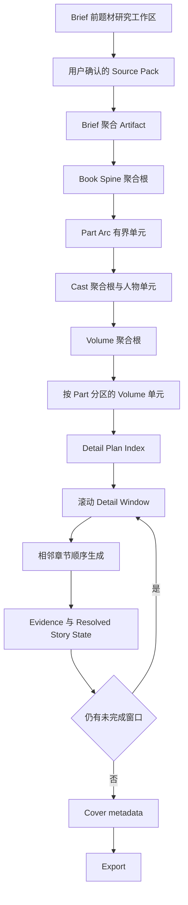
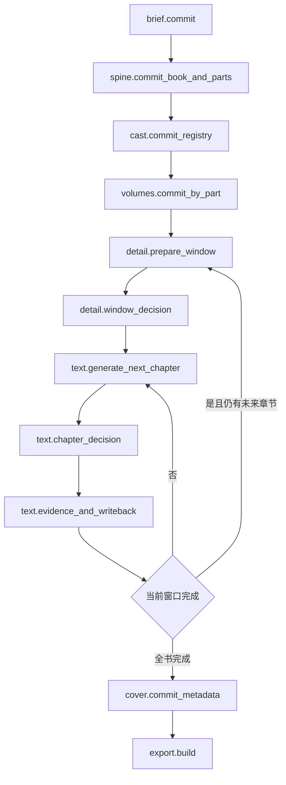

# Phase 29：Yotsuba Ink v1.1 百万字作者主导精细模式

状态：已批准进入实施；Wave 29.1 进行中；当前不授权服务启动、历史 Run 恢复或真实 Provider 调用

日期：2026-08-18

适用目标：全新 `official-deepseek-deep` 精细模式 Run，冻结正文目标 `>= 1,000,000` 非空白字符

上游基线：Phase 27 的八阶段单一生产合同，以及 Phase 28 已实现的确定性硬门、LLM 告警、Evidence 恢复和每章最多一次定向换稿

## 1. 执行摘要

### 1.1 用户目标

v1.1 不只是把当前 10 万字流程的长度参数放大十倍，而是要交付一套真正适合长篇作者的精细模式：

- 可承载 100 万字以上、约 334-500 章、20-50 卷的真实长篇；
- Brief、Spine、Cast、Volumes、Detail 的创作内容均可由用户从空白创建、逐项编辑、增删和排序；
- 人物可以由用户新增、删除、调整关系和指定生效范围，不再要求所有主体必须先由模型 Role Demand 产生；
- 模型是提案者、补全者和审稿助手，不是创作权威；
- 已提交的上游规划发生变化时，系统明确列出受影响内容，由用户选择“只重算受影响单元”或“从当前阶段重新规划”；
- 题材先做可追溯调研、同质化碰撞和长线可持续性判断，再由用户确认创意；
- 章节仍严格顺序生成，质量硬门与告警继续遵循 Phase 28，不因文学偏好无限换稿。

### 1.2 产品决定

本 Phase 采用以下方案：

1. 保留用户熟悉的八个顶层阶段，不增加第二套生产流程；题材研究属于 Brief 前的配置工作区，不是 LangGraph 第九阶段。
2. 将单体长篇规划改为逻辑聚合 Artifact：一个阶段只有一个权威聚合根，但聚合根只引用有界的 Part、Volume 和 Detail Window 单元，不内联整本书。
3. 精细模式允许作者编辑所有创作内容；稳定 ID、顺序投影、哈希、版本、引用完整性、状态、预算和持久化元数据继续由代码拥有。
4. 模型提案、作者原创和导入内容最终进入同一份 Artifact 合同。来源与锁定信息放在 sidecar，不让下游出现两套语义。
5. 已提交 Artifact 不原地覆盖。任何正式修改都创建 `ArtifactAmendment` 和新版本，并先计算依赖影响。
6. Detail 与 Text 改为滚动子图：只冻结近期可执行的细纲窗口，完成一个窗口后再规划后续窗口；相邻正文仍严格顺序生成。
7. 将当前文件扫描式读模型改为有索引、可分页、可重建的投影；百万字 Run 不允许在每次事件、SSE 轮询或 usage 汇总时全量扫描历史。

### 1.3 不是“所有字段都让用户随便改”

作者完全拥有文学内容，不等于运行时元数据也应暴露为表单。精细模式的正确边界是：

| 作者可编辑 | 代码拥有，不在创作表单中暴露 |
| --- | --- |
| 书名、前提、承诺、主题、结局、声音、世界规则 | Artifact/version/id/hash/status/timestamp |
| 篇章、大部、转折、卷、章、场景的内容与顺序 | 引用完整性、幂等键、checkpoint、receipt |
| 人物、关系、职责、目标、代价、弧线、声音与限制 | 来源 sidecar、依赖索引、无效化集合 |
| 章节和分卷的建议字数、边界和节奏 | 总字数硬门、已接受正文身份、实际计数 |
| 模型生成范围、作者锁定区和定向补全要求 | Provider binding、Context Manifest 和 Outbox |

用户不编辑 raw JSON，不手工填写 `demand_refs`，也不负责维护 `chapter-17` 这类会随插入而漂移的内部编号。

## 2. 当前事实与最低责任边界

### 2.1 百万字确定性诊断

当前 `NarrativeScaleProfile(word_target_soft=1_000_000)` 的真实结果是：

```text
chapter_range = (334, 400, 500)
volume_range = (20, 29, 50)
scale_error = "Book length requires more than the 120-turn Spine contract can carry"
```

这说明当前失败不是 Provider 能力或 Prompt 问题，而是 `src/novel_workflow/workflows/narrative_scale.py` 把全书所有重大转折放进一个最多 120 项的 Spine 数组。简单把 `120` 改成 `500` 会把同一个错误放大成更大的结构化响应、上下文和 UI 列表，因此必须改变规划层级。

### 2.2 当前硬上限

| 位置 | 当前上限或政策 | 对百万字的影响 |
| --- | ---: | --- |
| `StorySpineArtifact.turns` | 120 | 400 章按当前密度需要约 160-266 个 turns，直接失败 |
| `turn_target_override` | 120 | 精细模式也无法锁定百万字所需容量 |
| `VolumeArchitectureArtifact.volumes` | 24 | 默认目标 29 卷已经超过合同 |
| `volume_candidate_cap` | 默认 12 | 无法一次表示全书卷架构 |
| Cast 编辑政策 | 硬上限 16 | 不适合多篇章、多地区、多职业群像 |
| `CharacterBibleArtifact.subjects` | Schema 120 | Schema 有空间，但当前规模政策和单次候选生成无法安全使用 |
| `VolumeContract.cast_ids` | 80 | 单卷引用上限不是全书人物规划方案 |
| `DetailArtifact.chapters` | 2000 | 数量可装下，但单体 JSON、一次提交和一次 UI 渲染不适合 400 章 |

### 2.3 当前作者控制缺口

| 阶段 | 当前可编辑能力 | 当前缺口 |
| --- | --- | --- |
| Brief | 可编辑文学字段；长度镜像只读 | 没有从空白创作、来源锁定和提交后修订协议 |
| Spine | 可编辑 turn；只可新增或删除末尾 turn | 无法在中间插入、删除、重排；顺序 ID 会导致引用漂移 |
| Cast | 可编辑已有档案；可增删关系 | UI 明确禁止新增/删除主体；后端要求主体集合与模型预分配 registry 完全一致 |
| Volumes | 可编辑每卷字段和引用 | 无新增、删除、重排卷的正式工作流 |
| Detail | 可编辑章卡和场景；可增删场景 | 章节集合和 turn 绑定必须与模型候选完全一致；不能重构未来章节 |
| 已提交阶段 | 只读 | 只有“候选待决策”期间存在草稿，没有提交后 amendment 与下游无效化 |

人物合同还有一个关键阻断：每个 `CharacterSubject` 都要求至少一个 `demand_ref`，而 `validate_artifact_vnext()` 又要求编辑后的主体 ID 集合与模型候选完全一致。这会迫使作者新增人物伪造模型 Role Demand，属于错误权威。

### 2.4 当前规模与存储热点

- `stage_executor.py` 2268 行，同时承载多阶段生成、验证和聚合责任；
- `artifacts_vnext.py` 1430 行，多个不同生命周期 Artifact 集中在一个模块；
- `context_compiler.py` 1123 行，规划、正文和状态上下文责任集中；
- `narrative_scale.py` 984 行，数值政策与多阶段映射混合；
- `EventProjection.append()` 为取得 sequence 会先读取整个 `events.jsonl`；SSE 每 250ms 也会重新读取并解析整个文件；
- `OperationStore.usage_summary()` 每次重新读取 Run 的全部 operation JSON；
- Chapter、Context Manifest、Evidence 等列表接口仍使用目录扫描；
- 前端事件窗口已限制为 500 条，但后端仍缺少与之匹配的分页和聚合 read model。

百万字 Run 会产生数百章、数千次 Provider operation、Evidence、Manifest、checkpoint 和事件。若不先修复这些最低责任层，后续 UI 虚拟列表只能遮住后端线性退化。

## 3. 当前权威图

### 3.1 当前生产权威

| 概念 | 写入者 | 读取者 | 持久化与恢复 | Phase 29 决定 |
| --- | --- | --- | --- | --- |
| Run 冻结输入 | Run create API/domain | Scale、Graph、UI | Run repository | 保留；精细模式增加层级规模输入 |
| 阶段 Artifact | `ArtifactStore`、stage executor | 下游编译器、UI | ArtifactStore + checkpoint | 迁移为聚合根 + 有界单元 |
| 候选草稿 | StageArtifactDraftStore | 决策 API、工作台 | decision-scoped files | 保留待决策草稿；新增提交后 amendment |
| 执行路由 | LangGraph State | nodes/edges | checkpointer | 保留唯一权威 |
| 正文章节 | ChapterStore | 下一章、Evidence、Export | immutable versions | 保留；章节顺序不变 |
| 当前事实 | Canon event + resolved projection | Context、质量门、UI | Outbox + projection | 沿用 Phase 28，不新增第二套 Canon |
| Provider 请求 | Provider input snapshot | gateway、诊断 | immutable receipt | 保留；规划单元也必须有独立 receipt |
| 事件与页面状态 | EventProjection/read model | SSE、工作台 | JSONL + files | 迁移为索引投影与分页 API |

### 3.2 Phase 29 目标权威



每个方框只拥有自己的决定。Research 不写 Artifact；模型不写 ID、依赖索引或 Canon；UI 不复制一套私有状态；投影可删除重建。

## 4. 外部来源账本

调研与复核日期：2026-08-18。

### 4.1 开源项目

| 项目 | 版本证据 | 许可证 | 可迁移思想 | 禁止复制或引入 |
| --- | --- | --- | --- | --- |
| [PlotPilot](https://github.com/shenminglinyi/PlotPilot) | 最新 release [`v4.6.0`](https://github.com/shenminglinyi/PlotPilot/releases/tag/v4.6.0)，tag commit `1c481237b6fa32ef5f85d7f8da4cb16f366cd4f0`；当日 master `7dc03a37a06b57e823df222da0e3bde5d1c84715` | Apache-2.0 附 Commons Clause，GitHub SPDX 为 `NOASSERTION`；有商业限制 | 部/卷/幕/章分层规划、连续规划、上下文预算、人物状态、故事线和伏笔投影 | 不复制源码；不引入 legacy/fallback runtime、JSON repair 成功路径、通用截断和多权威表面 |
| [FictionForge](https://github.com/wanqili857-byte/fictionforge) | 最新 release [`v0.2.0`](https://github.com/wanqili857-byte/fictionforge/releases/tag/v0.2.0)，tag commit `29ebb4a4788c787e5f5ab517756426e6d61e3c2a`；当日 main `c381297e2c6c670f374933d850b9b85756dead27` | MIT | 作者内容包与引擎分离、作者维护 Bible/Arc/Chapter Spec、正文前人工确认章卡、人物信念与知识状态 | 不引入多 pipeline fallback、缺配置静默降级、固定三节章法、无限重写或一角色一 Agent 的强制架构 |

采用两者的交集，而不是照搬其中任一项目：长篇必须分层、上下文必须有预算、作者材料必须是一等输入、章节正文必须由可审阅的近期计划驱动。Yotsuba Ink 继续使用一个 LangGraph、一个 Artifact 权威、一个 Canon/Outbox 和一套质量语义。

### 4.2 题材与现实资料

| 来源 | 可验证事实 | 对题材研究工作区的启示 |
| --- | --- | --- |
| [2026 年中国作协网络文学选题指南](https://image.chinawriter.com.cn/n1/2026/0211/c403937-40663510.html) | 鼓励科技科幻、人民生命健康、行业实践与真实生活；明确反对概念化、口号化和低水平同质化重复 | “现实职业 + 科技机制 + 人的代价”优于只换皮的高概念 |
| [2025 中国网络文学蓝皮书](http://www.chinawriter.com.cn/n1/2026/0810/c404023-40776811.html) | 现实、科幻、历史、幻想持续发展；现实经验、专业背景、跨类型和作者性成为创新来源 | 题材评分必须看专业细节和可持续人物冲突，而非只看一句设定 |
| [国家数据局第三批“数据要素 x”案例](https://www.nda.gov.cn/sjj/zhuanti/ztsjysx/sjysal/0917/ff808081-96b466bd-0199-761f1444-1c80.pdf) | 城市数字孪生涉及道路、地下管廊、水系、排水、感知设备、权限和跨部门协同 | “城市生命线数字孪生悬疑”具备多职业、多地点、多层责任和长线事件容量 |
| [智能养老服务机器人试点通知](https://www.gov.cn/zhengce/zhengceku/202506/content_7027053.htm) | 2025-2027 年覆盖家庭、社区、机构，以及失能失智照护、陪伴、安全、可靠性和隐私 | “养老机器人 + 家庭伦理 + 责任归属”具备现实质感和群像空间 |

现阶段只保留三个研究域，不预设最终书名和故事答案：城市生命线数字孪生悬疑、低空气象与应急运行、智能养老机器人与家庭伦理。最终题材必须经过第 12 节评分并由用户确认。

## 5. v1.1 范围与非目标

### 5.1 P0 范围

- 百万字层级 Scale Plan 和无单体 120-turn 失败；
- Brief、Spine、Cast、Volumes、Detail 的从空白创建、模型提案、混合补全、结构编辑和锁定；
- Text 可由作者从空白写成候选或编辑模型候选；Cover 元数据和 Export 选择继续可编辑；
- 用户新增/删除人物和关系；
- 稳定逻辑 ID 与顺序投影分离，插入或重排不改写所有引用；
- 提交后 Artifact amendment、依赖影响、无效化和局部重算；
- Book/Part/Volume/Detail Window 分层 Artifact；
- 滚动 Detail/Text LangGraph 子图和相邻章节顺序依赖；
- 事件、operation、chapter、manifest、usage 的索引与分页；
- Brief 前题材研究工作区和 Source Pack；
- Phase 28 质量硬门、告警、一次换稿和经典转折判定在新结构中保持一致。

### 5.2 P1 范围

- 大部、卷、人物、章节的批量导入与冲突预览；
- 规划覆盖率、锁定率、来源分布和无效化影响的作者仪表盘；
- 400-500 章工作台虚拟列表、分部/分卷筛选和搜索；
- 全书级 AI 模式告警：重复开头、尾部功能、动作模板、意象、句式与人物声纹；
- 断点续跑、跨进程恢复和百万字 Export 压力门。

### 5.3 非目标

- 不为 v1.0 历史 Run 建转换器或恢复执行路径；
- 不保留 flat Spine、monolithic Detail 和新层级 Artifact 两套生产选择；
- 不把 Research 变成自动上网后直接写世界规则的 Agent；
- 不让用户编辑 raw JSON、内部 ID、hash、receipt、checkpoint、demand ref 或 Context Manifest；
- 不允许模型在下游临时新增具名人物、卷、章节或世界规则；
- 不一次生成 400 章细纲或一次把全书人物交给 Provider；
- 不并行生成相邻章节；
- 不因 AI 味、文学偏好或低置信 reviewer finding 自动阻断；
- 不用无限换稿、模型切换、Provider fallback 或 JSON repair 掩盖底层故障；
- 本 Phase 不启动真实 100 万字 Run，不提前更新 README 或发布 GitHub 大版本。

## 6. 精细模式的作者工作模型

### 6.1 每个创作阶段的三种入口

三种入口只影响内容来源，不产生三条 runtime：

| 入口 | 行为 | 最终写入 |
| --- | --- | --- |
| 从空白创作 | 系统创建空结构和代码 ID，作者填写 | 同一 Stage Artifact |
| 模型起草 | Provider 只生成未锁定的文学字段 | 同一 Stage Artifact |
| 协作补全 | 作者先写并锁定关键内容，模型只补空缺或选定区域 | 同一 Stage Artifact |

所有入口最终经过相同 Schema、引用校验、容量校验、用户确认和 ArtifactStore commit。不存在 “manual artifact” 和 “AI artifact” 两种下游合同。Text 的作者手写稿也先成为 `ChapterArtifact` candidate，再经过相同的确定性合同、可选 advisory review、作者接受、Evidence 和 writeback；Cover 元数据可完全手写，Export 格式、章节版本和资产选择继续由作者确认。

### 6.2 创作锁定

`ArtifactLockSet` 是运行时 sidecar：

```text
artifact_version_id
locks[]:
  unit_ref
  field_path
  owner: author
  locked_at
```

规则：

1. 锁定只限制模型重生成，不限制作者本人；作者修改前可显式解锁。
2. 模型请求必须只列出允许生成的字段；不得让模型返回整份 Artifact 后再丢弃锁定字段。
3. 手动编辑不消耗 Provider 换稿额度。
4. 计划单元的一次自动检测修订仍最多一次；之后只显示证据和方向，由作者手改或接受。
5. lock 是 sidecar，不进入文学 Prompt 的可编辑正文，也不成为第二套 Artifact。

### 6.3 来源记录

`AuthorshipProvenance` 只做审计和 UI 提示：

```text
artifact_version_id
unit_ref
field_path
origin: author | model | import | coauthored
source_ref?
provider_receipt_ref?
```

来源不能改变字段语义、质量门或下游读取方式。删除 provenance 后可以从 Artifact 继续执行，只是失去来源展示。

## 7. 百万字层级 Scale Contract

### 7.1 数值政策

沿用当前 2000-3000 非空白字符/章、首选 2500 的编辑政策。冻结 1,000,000 字时：

| 层级 | 可行范围 | 默认目标 | 权威 |
| --- | ---: | ---: | --- |
| 章节 | 334-500 | 400 | 代码根据总字数与章长政策推导；精细模式可在范围内锁定 |
| 分卷 | 20-50 | 29 | 代码给范围；作者可在范围内决定自然边界和精确数量 |
| 大部/主篇章 | 默认卷目标 29 时为 4-9 | 6 | 新政策：每部 3-8 卷、首选约 5 卷；锁定其他卷数后重新推导 |
| Spine turns | 不设全书单数组 | 各 Part 独立推导 | 每 Part 按其章节容量计算，单元技术上限不等于全书上限 |
| 人物 | 不设全书 16 人硬上限 | 按 Book/Part/Volume scope 管理 | 只限制单次上下文相关人物，不以全书人数限制创作 |

这些是 Yotsuba Ink 的编辑容量政策，不伪称行业规则。精细模式允许用户在可行范围内锁定章节、卷和 Part 的精确值；若超出范围，系统先解释字数与结构后果，再要求调整章长政策或总目标，不能静默接受矛盾输入。

### 7.2 `MillionCharacterScaleProfile`

```text
word_target_soft
chapter_length_policy
chapter_target
volume_capacity_policy
volume_target
part_capacity_policy
part_target
detail_window_policy
quality_mode: deep
user_locked[]
```

删除 flat `turn_target_override` 作为全书唯一自定义值。新的 turn 锁定属于具体 `PartArcArtifact`，只需满足该 Part 的章节容量。

### 7.3 稳定 ID 与顺序投影

当前 `turn-1`、`volume-1`、`chapter-1` 同时承担身份和顺序，导致中间插入会使所有下游引用漂移。Phase 29 将两者拆开：

```text
stable_ref: chapter-<code-owned-id>
display_ordinal: derived 1..N
display_label: 第 N 章
```

Part、turn、volume、chapter 均使用稳定 ref；编号、卷序和章节序由聚合根顺序派生。用户移动一章只改变顺序投影和直接依赖，不重写全书所有 ID。历史 v1.0 Run 保留原编号，只在 archive viewer 中读取。

## 8. vNext 规划 Artifact 合同

### 8.1 聚合原则

每个顶层阶段仍只有一个权威聚合 Artifact。为避免巨型 JSON，聚合根保存稳定顺序和子单元 ref；子单元是同一聚合版本的一部分，不是第二份阶段决定。

一次 commit 必须原子写入：

1. 聚合根新版本；
2. 变更的有界子单元；
3. Dependency Index 增量；
4. 无效化集合；
5. 一条 Artifact committed event。

### 8.2 Brief

`StoryBriefArtifact` 保持紧凑，但精细模式允许从空白填写所有文学字段：

```text
title
premise
reader_promise
theme
ending_promise
voice
world_rules[]
length_envelope
research_source_pack_ref?
```

`length_envelope` 在建 Run 前可编辑；开始正文后修改总目标必须走 amendment 和未来计划重算，不能改写已接受正文。

### 8.3 Spine

`StorySpineArtifact` 改为 Book 聚合根：

```text
book_promise
book_milestones[]
part_order[]
ending
open_questions[]
```

每个 `PartArcArtifact` 是有界单元：

```text
part_ref
title
entry_state
promise
turn_order[]
climax
exit_state
carried_questions[]
```

每个 `PartTurnArtifact` 保存 `cause/change/progress_type/milestone_refs`。作者可在 Part 内新增、删除、插入、移动和编辑 turn；模型只生成未锁定字段。Book milestones 只负责全书级启动、承诺、中心变化、总危机、终局和余波，不内联 200 个局部 turns。

### 8.4 Cast

`CharacterBibleArtifact` 改为可分页聚合根：

```text
subject_order[]
relation_partition_refs[]
primary_protagonist_ref
```

人物单元采用三组作者可理解字段，减少当前十多个平铺字段的解析和表单负担：

```text
CharacterSubjectArtifact
  subject_ref
  identity:
    name
    kind: primary_protagonist | co_protagonist | major | recurring | functional | historical_record
    scope_refs[]
    debut_ref
  story_role:
    narrative_function
    desire_and_stakes
    history_and_secret
    arc
  performance:
    temperament_and_voice
    limits[]
```

关系继续单独保存 `a/b/type/pressure/effective_scope_refs`。

作者新增人物时：

1. 代码生成稳定 `subject_ref`；
2. 作者填写故事职责和生效范围；
3. 系统生成 `author_intent_ref` sidecar；
4. 不要求伪造 Role Demand；
5. Dependency Index 计算对 Part、Volume、Detail 的影响。

模型 Role Demand 仍可作为“遗漏职责建议”，但迁移为只读 proposal，不再拥有主体注册表。UI 删除“职责需求引用”文本框。

删除规则：

- 尚未被下游引用的规划人物可以硬删除；
- 被未提交规划引用时，删除操作必须同时修复或无效化这些引用；
- 已被接受正文、Evidence 或 Canon 引用的人物不能硬删除，只能 `retired`、改名或停止未来出场；
- 改名保持同一 subject ref，不制造“旧角色和新角色”两个主体。

### 8.5 Volumes

`VolumeArchitectureArtifact` 聚合根：

```text
part_volume_order: map<part_ref, volume_ref[]>
```

每个 `VolumeContractArtifact`：

```text
volume_ref
part_ref
title
promise
conflict
turn_refs[]
cast_refs[]
climax
closure
length_envelope
```

作者可在尚未进入正文的范围内新增、删除、移动和重排卷。跨 Part 移动会触发 Part、cast scope、Detail window 和预算影响分析；不能只改一个数组位置后继续。

### 8.6 Rolling Detail

`DetailPlanIndexArtifact` 只保存全书章节顺序、volume 归属、窗口状态和单元 ref，不内联全部章卡：

```text
chapter_order[]
volume_chapter_order: map<volume_ref, chapter_ref[]>
window_order[]
planned_through_ref?
written_through_ref?
```

`DetailWindowArtifact` 是有界执行单元，默认覆盖 12-40 章或 1-3 卷，具体范围由上下文预算和卷边界决定：

```text
window_ref
start_chapter_ref
end_chapter_ref
source_part_refs[]
source_volume_refs[]
chapters[]
entry_handoff
exit_handoff
```

每个章卡仍包含 title、purpose、POV、cast、turn refs、scenes 和 handoff。作者可以在未写窗口中新增、删除、移动章节和场景；已接受正文之前的章节顺序冻结，只允许创建未来重规划，不允许重编号或覆盖历史。

Detail Window 的最后两章必须为下一窗口保留可验证的状态交接；下一窗口编译时读取前一窗口 exit handoff 和已接受正文最新状态，而不是仅依赖很早的全书计划。

## 9. 提交后修订与依赖影响

### 9.1 `ArtifactAmendment`

```text
amendment_id
stage_id
base_artifact_version_id
operations[]:
  add | update | delete | move | lock | unlock
target_refs[]
author_reason
requested_strategy: affected_only | restart_from_stage
impact_analysis_ref
status: draft | awaiting_confirmation | applied | rejected
result_artifact_version_id?
idempotency_key
```

Artifact 版本不可变。应用 amendment 创建新版本，并把旧版本保留为可审计历史；任何重复提交同一 idempotency key 都复用结果。

### 9.2 `DependencyIndex`

依赖索引由代码从 committed Artifact 引用派生：

```text
source_ref
consumer_refs[]
consumer_stage
dependency_kind
latest_consumer_version
```

它是可重建投影，不可由用户或模型编辑。至少覆盖：

- Brief rule/promise -> Book milestone/Part；
- Part turn -> Volume；
- subject/relation -> Volume/Detail/Context；
- Volume -> Detail windows；
- Detail chapter -> ChapterArtifact/Context/Evidence/Export；
- accepted chapter -> Canon/Wiki/Resolved Story State。

### 9.3 `ImpactAnalysis`

用户点击“应用修改”前必须看到：

| 类别 | 含义 | 默认动作 |
| --- | --- | --- |
| `directly_affected` | 直接引用被改对象 | 必须重算或人工修复 |
| `transitively_stale` | 上游签名变化但内容未直接冲突 | 标记 stale，按范围重算 |
| `historical_frozen` | 已接受正文或 Canon 引用 | 保留历史，只调整未来计划 |
| `blocked_reference` | 删除后会留下悬空引用 | amendment 不可提交 |
| `unaffected` | 签名和引用都未变化 | 原版本继续有效 |

### 9.4 两种用户选择

1. `affected_only`：只重算影响集合中的未来 Part/Volume/Detail 单元，未受影响单元保留原版本和签名。
2. `restart_from_stage`：从被改阶段重新建立所有未来规划；已接受正文、Evidence、Canon 和历史 receipt 仍不删除。

系统不能自动猜测作者更愿意保留哪部分，也不能让旧下游 Artifact 静默引用已删除的角色、转折、卷或规则。

## 10. LangGraph 运行时

### 10.1 唯一生产图

顶层仍对应八阶段，但 Detail/Text 内部变为循环子图：



不增加 Shadow Graph、manual runtime、legacy runtime 或 model-only runtime。作者从空白创建 Artifact 或 Chapter candidate 时，Graph 跳过对应生成 Provider node，但仍经过同一验证、interrupt、commit、Evidence 和下游边。

### 10.2 State

`NarrativeRunState` 只保存路由引用：

```text
active_stage
active_part_ref
active_volume_ref
active_window_ref
active_chapter_ref
artifact_version_refs
pending_decision_ref
amendment_ref?
operation_ref?
failure_ref?
domain_revision
```

全量人物、所有 turns、全部章卡、Research 资料、Provider 输入和 UI 展开状态不得进入 Graph State。

### 10.3 并行与顺序

- Book root 通过后，不互相引用的 Part 草案可以并行生成，但 commit 顺序和聚合签名由代码确定；
- 同一 Part 的 Volume proposal 可分单元并行读取冻结 Part snapshot；
- Detail windows 按书中顺序提交；下一个窗口至少依赖上一个窗口的最终 handoff；
- 相邻章节严格顺序生成；
- 同一章节的 reviewer 可以并行读取同一 immutable snapshot；
- amendment 的 impact analysis 可并行计算，但应用新版本必须单事务串行提交。

### 10.4 checkpoint、replay 与幂等

每个规划单元、Detail window、Chapter、Evidence 和 Amendment 都有独立 operation key。恢复必须满足：

- 同一 unit ref；
- 同一 base artifact version；
- 同一 Provider binding；
- 同一 input signature；
- 同一 author lock set；
- 同一 idempotency key。

输入签名不同必须创建新 operation，禁止复用旧成功 receipt。重复 resume 不得重复 Provider 调用、Artifact commit、Outbox 或 Canon 写回。

## 11. Context、质量和长期连续性

### 11.1 上下文预算

百万字不能让 Prompt 随章节号线性增长。每次正文调用只读取：

1. Brief 中本章相关的 promise/world rule/voice；
2. 当前 Part 和 Volume 合同；
3. 当前 Detail 章卡和相邻 handoff；
4. 本章 cast 的人物 performance 与 resolved state；
5. 当前开放 promise、伏笔和必要来源链；
6. 上一章 accepted summary 与临时物理状态；
7. 经签名检索命中的少量历史证据。

Context Manifest 继续带来源和预算。任何槽位超限都必须按优先级明确拒绝或缩减投影，不能通用截断字符串。

### 11.2 Phase 28 质量语义保持不变

硬门仍只包括：

- 流程崩溃、死锁、不可恢复或状态漂移；
- 结构化输出无法解析；
- 关键 Artifact/规划单元缺失或正文为空；
- 章节/分卷/Part 标题缺失；
- 有直接证据的上游硬约束冲突；
- 同一主体、属性、时间和证据层级下不可共存的物理状态；
- 总正文低于冻结 1,000,000 目标；
- Export 不可用。

LLM reviewer 的 AI 味、节奏、文风、趣味性、模板句和低置信连续性判断仍为 warning。每章最多一次定向换稿；规划单元最多一次自动检测修订。经典假死、隐藏身份、误传、认知差和有上游授权的时间机制继续走 `supersedes/resolves`，不能被当作硬冲突。

### 11.3 长篇检查点

检查不再逐章无限文学微调，而是在结构边界聚合：

- 前 3 章：声音、人物可辨识度、职业现实感；
- 每个 Detail window 末尾：handoff、状态、承诺与重复功能；
- 每卷末尾：卷承诺、高潮和 closure；
- 每个 Part 末尾：局面变化、核心关系和下一部进入状态；
- 全书中点与最后 15%：中心谜题、结局承诺和长期重复；
- 终稿：长度、标题、状态冲突、告警聚合、Provider 与 Export 报告。

这些检查点输出 Evidence 和告警，不自动建立无限重写循环。

## 12. 题材研究工作区

### 12.1 产品边界

Research Workspace 位于“新建作品”流程中、Run 创建之前。它可以调用检索 Provider 或由用户粘贴来源，但输出只是待确认的 `TopicResearchPack`，不能直接写 Brief、world rules、Canon 或正文。`official-deepseek-deep` 的百万字官方预设要求先完成并确认 Research Pack；普通自定义项目可显式跳过研究，不被强制联网。

### 12.2 `TopicResearchPack`

```text
research_id
user_seed
genre_constraints[]
source_ledger[]:
  title
  url
  publisher
  published_at
  accessed_at
  source_type
  claims[]
premise_candidates[]
collision_checks[]
professional_domains[]
risk_notes[]
scorecards[]
user_selected_premise_ref?
```

### 12.3 新颖性与百万字可持续性评分

每个候选前提按 100 分解释性评分，不把模型分数伪装成事实：

| 维度 | 权重 | 需要回答的问题 |
| --- | ---: | --- |
| 机制新颖性 | 20 | 新意来自因果机制还是只换职业名词？ |
| 题材碰撞距离 | 15 | 与近期热门作品的核心机制、身份和真相是否过近？ |
| 百万字事件容量 | 20 | 是否能自然形成 4-9 个 Part，而不是重复同一种案件？ |
| 人物群像发动机 | 15 | 是否有多方目标、责任、亲情与职业伦理，而非工具人？ |
| 现实细节可获得性 | 10 | 是否有可靠公开资料支持职业、流程和物理规则？ |
| 主谜题与阶段答案 | 10 | 能否持续给阶段性答案而不拖延唯一谜底？ |
| 研究/伦理/法律风险 | 10 | 隐私、安全、医疗、灾难和专业误导是否可控？ |

推荐阈值只用于提示：总分 `< 70` 或“百万字事件容量”低于 12/20 时显示“建议换题或缩短篇幅”，不自动替用户否决。硬门是来源缺失、明显抄袭碰撞、无法说明核心机制，或用户尚未确认。

### 12.4 当前候选研究域

| 研究域 | 长线发动机 | 主要风险 | 下一步资料 |
| --- | --- | --- | --- |
| 城市生命线数字孪生悬疑 | 多系统故障、权限链、基层人员、跨部门责任、旧城改造与家庭历史 | 容易写成技术说明或重复事故 | 市政调度、燃气/排水/桥梁监测、应急响应、数据权限 |
| 低空气象与应急运行 | 航线、气象窗、救援、物流、监管、城市空间和事故调查 | 低空概念热但专业资料分散 | 气象服务、飞行运行、空域规则、事故责任、救援协同 |
| 智能养老机器人与家庭伦理 | 家庭/社区/机构三场景、失能失智、陪护、隐私、设备责任和代际冲突 | 容易落入“AI 是否有人性”的旧命题 | 养老流程、适老设计、照护伦理、产品安全、数据隐私 |

选题确认后，Research Pack 只把用户明确采用的来源和约束投影到 Brief Source Pack；未采用资料不会进入生成上下文。

## 13. 索引、分页与性能合同

### 13.1 权威与投影

不可变 Artifact、Chapter、Provider receipt、Evidence 和 Outbox 继续是审计证据。新增一个可重建的 `RunProjectionStore` 作为读取索引，不成为业务决定权威。

推荐使用项目内单一 SQLite projection：

- event sequence 与按 sequence 查询；
- operation status/usage 增量汇总；
- chapter 最新版本、字数、Part/Volume/Window 归属；
- manifest/evidence/provider receipt 索引；
- planning unit 与 dependency edges；
- Run 级计数器和阶段状态。

JSON/JSONL 证据和 SQLite projection 不得同时写业务决定。Outbox 先提交权威记录，再幂等更新 projection；projection 丢失时可以全量重建。

### 13.2 复杂度要求

| 操作 | Phase 29 要求 |
| --- | --- |
| append event | O(1)，禁止先读取全部历史事件 |
| SSE `after` | O(返回批次)，必须有 `limit` 和连续 cursor |
| usage summary | O(1) 读取聚合值，不逐 operation 文件求和 |
| chapter list | 按 Part/Volume/Window 分页，默认不返回正文 |
| Artifact workspace | 只加载当前聚合根、当前单元和邻接单元 |
| Detail chapter table | 虚拟化并分页，不能一次挂载 400-500 个重表单 |
| operation/evidence/manifest | cursor 分页和按 chapter/unit 过滤 |
| Export | 流式读取 accepted chapters，不把全书字符串复制多份到内存 |

### 13.3 API/read model

新增或迁移为以下领域语义，route 只做适配：

```text
GET  /runs/{run_id}/planning/{stage}/units?cursor=&limit=&part_ref=
GET  /runs/{run_id}/planning/{stage}/units/{unit_ref}
POST /runs/{run_id}/planning/{stage}/amendments
GET  /runs/{run_id}/planning/amendments/{id}/impact
POST /runs/{run_id}/planning/amendments/{id}/apply
GET  /runs/{run_id}/chapters?cursor=&limit=&volume_ref=&include_content=false
GET  /runs/{run_id}/events?after=&limit=
GET  /runs/{run_id}/operations?cursor=&limit=&status=&unit_ref=
GET  /runs/{run_id}/quality/summary
```

具体 URL 可在实现时按现有 API 命名收敛，但领域 owner 不得放进 `api/routes`。

## 14. 前端信息架构

### 14.1 顶层体验

精细模式每个规划阶段使用同一工作模式：

1. 左侧：Book/Part/Volume/Window 层级导航和搜索；
2. 中间：当前结构化 Artifact 表单；
3. 右侧：依赖、锁定、来源、影响和质量建议；
4. 底部：保存草稿、模型补全选区、检查、提交当前单元；
5. 阶段头部：全局覆盖率、未完成单元、stale 单元和下一步。

页面不展示 raw JSON、内部 ID 或 Provider 术语。可视化数据只用于回答“哪里没规划、哪里受影响、下一步做什么”。

### 14.2 各阶段必备操作

| 阶段 | 结构操作 | 内容操作 |
| --- | --- | --- |
| Brief | 从空白/模型提案/导入；锁定区块 | 编辑全部文学字段，选择 Research 来源 |
| Spine | 新增/删除/移动 Part 与 turn | 编辑 cause/change、承诺、高潮、进入/退出状态 |
| Cast | 新增/删除/归档人物；新增/删除关系；scope 筛选 | 编辑三组人物档案，模型补全选定人物 |
| Volumes | 新增/删除/移动卷；跨 Part 变更预览 | 编辑卷承诺、冲突、高潮、闭合、人物与 turn |
| Detail | 新增/删除/移动未来章；增删场景；按窗口分页 | 编辑章名、目的、POV、场景、handoff |
| Text | 作者从空白写作或编辑模型候选；保留版本 | 编辑正文，查看硬门、告警、Evidence 与一次换稿额度 |
| Cover | 选择手写或模型提案；选择/跳过图片资产 | 编辑视觉 brief、文案和导出元数据 |
| Export | 选择格式、章节版本和封面资产 | 编辑导出元数据并执行确定性校验 |

### 14.3 人物工作台

长篇人物多时，默认按 `核心 / 本 Part / 本卷 / 已归档` 分组，不一次显示全书所有档案。人物星图使用不同主体类型图标，并用低成本的静态/入场动效表达 scope 与关系压力；持续背景动画和力导图无限重算不进入 P0。

“删除人物”按钮必须先显示影响预览；若人物已有 accepted prose，按钮改为“停止未来出场/归档”，避免制造历史断裂。

### 14.4 Amendment 交互

已提交阶段不再简单显示“已冻结”。用户点击“修订”后进入独立草稿：

- 当前版本继续作为生产权威；
- 草稿保存不影响 Run；
- 检查通过后生成 ImpactAnalysis；
- 用户选择局部重算或从阶段重启；
- 应用成功后新版本成为 active；
- stale 下游在修复前不能继续生成正文。

## 15. 失败、恢复和状态迁移

| 失败类型 | 最低责任层 | 状态 | 恢复 |
| --- | --- | --- | --- |
| 规划单元 JSON/Schema 错误 | Provider/parse | unit `needs_action` | 同一输入一次合同纠正；失败后人工编辑或重试 |
| 规划容量不足 | Artifact/Scale | stage `awaiting_decision` | 调整当前 Part/Volume/Window，不改总书历史 |
| amendment 悬空引用 | Dependency contract | amendment blocked | 修复引用或取消删除 |
| Provider timeout | Provider transport | operation retryable | 同一 operation key 有界传输重试 |
| Provider 余额/鉴权 | Provider account | Run interrupt | 更新同一 binding 后显式恢复，不切 fallback |
| projection 损坏 | read model | projection degraded | 从权威记录重建，不重跑 Provider |
| Detail window Evidence 失败 | Evidence | `needs_action` | 保留 accepted prose，重试 Evidence |
| SSE 断线 | UI transport | reconnecting | 从 last sequence 继续，禁止重放全量历史 |
| 用户修改 accepted prefix | domain policy | amendment blocked | 保留历史版本；只允许新分支或未来规划 |

任何单元失败不得把已有成功 Part/Volume/Chapter 清空。恢复只补失败单元，且必须保留相同输入签名和 operation identity。

## 16. 保留、迁移、删除、归档矩阵

| 动作 | 对象 | Phase 29 处理 | 同 Wave 退出要求 |
| --- | --- | --- | --- |
| 保留 | LangGraph 单一生产 runtime | 增加层级 planning 和 rolling detail 子图 | 静态搜索无第二 runtime selector |
| 保留 | Phase 28 QualityDecision/Evidence/ResolvedStoryState | 适配稳定 ref 和 Detail Window | 假死/隐藏身份等 fixture 继续通过 |
| 保留 | ChapterStore accepted version、Outbox、Canon/Wiki | 继续作为正文与事实权威 | amendment 不改写 accepted 历史 |
| 迁移 | `narrative_scale.py` | flat book plan -> Book/Part 层级 plan | 1,000,000 字不再触发 120-turn 错误 |
| 迁移 | `artifacts_vnext.py` | 按职责拆出 brief/spine/cast/volume/detail contracts | 旧生产模型/import 在同 Wave 删除 |
| 迁移 | `stage_executor.py` | 拆分 planning unit orchestration 和 aggregate commit | 原巨型分支不再执行 |
| 迁移 | `context_compiler.py` | 按 Book/Part/Volume/Window/Chapter 编译 | Prompt 大小不随全书长度线性增长 |
| 新增 | planning aggregate/unit store | 原子提交聚合根和有界单元 | 无第二份可编辑阶段权威 |
| 新增 | amendment/dependency/impact domain | 提交后修订与无效化 | stale 下游不能进入 Provider |
| 新增 | RunProjectionStore | 事件、usage、章节、operation 索引 | full-scan 生产读路径删除 |
| 迁移 | Cast UI/API | 允许新增/删除/归档人物 | exact candidate registry 限制删除 |
| 迁移 | Volume/Detail UI/API | 允许未来单元增删移动 | 顺序 ID 作为身份的路径删除 |
| 删除 | 全书 `turn_target_override <= 120` | 改为 Part 级 turn capacity/lock | 拒绝测试证明旧字段不能进入新 Run |
| 删除 | Cast `demand_refs` 用户表单与必填来源 | 迁为 Role Demand proposal/author intent sidecar | 用户新增人物无需伪造 demand |
| 删除 | `known == frozen subject registry` 编辑门 | 改为稳定 ID + dependency validation | 新增/删除主体合同通过 |
| 删除 | monolithic Detail 作为百万字唯一规划 authority | 改为 DetailPlanIndex + windows | 新 Run 不写全书大数组 |
| 删除 | event append/SSE/usage 的全量扫描 | 改为索引和 cursor | 性能 fixture 证明请求只读有限批次 |
| 归档 | Phase 27/28 历史 Run 与顺序 ID | archive viewer 只读 | 无 Provider、amendment 或恢复按钮 |

## 17. Migration Waves

每个 Wave 必须同时建立新正向路径、删除对应旧路径、增加正反合同测试，并通过退出门后才能进入下一 Wave。

### Wave 29.0：架构评审门

- 正向：本文件成为 v1.1 百万字精细模式唯一实施计划；
- 删除：评审前不修改生产代码、不启动 Provider、不恢复历史 Run；
- 证据：当前容量诊断、权威图、来源账本、删除矩阵和未决项完整；
- 退出门：用户确认作者控制边界、层级结构、rolling Detail 和题材研究门。

### Wave 29.1：稳定 ID 与层级 Scale/Artifact

- 正向：Book/Part/Volume/Detail Window 聚合合同，1,000,000 字 ScalePlan；
- 删除：flat 120-turn、24-volume 和顺序 ID 生产合同；
- 测试：334/400/500 章边界，20/29/50 卷，4/6/9 Part，插入/移动不改稳定 ref；
- 退出门：fake Provider 可生成并提交完整规划骨架，不产生巨型 Artifact。

### Wave 29.2：Amendment 与 Dependency Index

- 正向：提交后草稿 -> ImpactAnalysis -> apply -> 新 Artifact version；
- 删除：已提交阶段只能只读、或直接原地覆盖的假路径；
- 测试：改 Brief rule、插 turn、新增人物、删除被引用人物、移动卷、重复 apply；
- 退出门：局部重算集合准确，stale 下游无法继续。

### Wave 29.3：作者来源、锁定与 Cast 权威

- 正向：author/model/import 同一 Artifact；作者可新增/删除/归档人物；
- 删除：模型预分配 registry 和必填 `demand_refs` 对主体身份的所有权；
- 测试：空白创建、协作补全、锁定字段不进入 Provider 输出、已写人物禁止硬删；
- 退出门：Cast、关系与 scope 全部可通过结构表单完成，不暴露内部字段。

### Wave 29.4：索引存储与分页

- 正向：RunProjectionStore、cursor API、O(1) usage/event append；
- 删除：事件、operation、chapter、manifest 的生产全量扫描；
- 测试：500 章、10,000 operations、20,000 events、重复重建、SSE cursor；
- 退出门：所有热路径只读取有限批次，projection 可从权威记录重建。

### Wave 29.5：精细模式规划工作台

- 正向：Brief/Spine/Cast/Volumes/Detail 的层级导航、结构编辑、锁定和影响预览；
- 删除：末尾-only Spine 编辑、无 Cast 新增/删除、无 Volume 结构操作、400 章整表挂载；
- 测试：桌面、短桌面、390px；键盘、焦点、虚拟列表、无 raw JSON；
- 退出门：作者可不调用模型，从空白完成细纲前全部阶段和首个 Detail Window。

### Wave 29.6：Rolling Detail/Text 子图

- 正向：prepare window -> author/model decision -> sequential chapters -> Evidence -> next window；
- 删除：百万字 Run 在 Text 前必须提交 400 章 monolithic Detail；
- 测试：窗口无缺口/重叠、跨窗口 handoff、断点恢复、amendment 只影响未来窗口；
- 退出门：fake Provider 完成至少 3 个窗口和 2 个 Part，operation/Artifact identity 稳定。

### Wave 29.7：Topic Research Workspace

- 正向：来源账本、碰撞检查、评分、用户确认、Brief Source Pack；
- 删除：检索结果自动写 Brief/world rules 的隐式路径；
- 测试：来源去重、URL/日期、未采用资料不入 Prompt、用户未确认不可建 Run；
- 退出门：三个候选研究域均有可核验 source pack，用户选定最终题材。

### Wave 29.8：分级验收与发布

- 正向：离线大规模 fixture -> 浏览器 -> 小型真实 checkpoint -> 多 Part Run -> 1,000,000+ 精细模式 Run -> Export；
- 删除：未通过低层门就直接烧百万字 Provider、把历史 Run 伪装成新验收；
- 测试：见第 18 节；
- 退出门：质量报告、Provider 报告、浏览器证据、Export 和人工冷读全部完成后，才更新 README、提交并推送 main 大版本。

## 18. 测试与最终验收计划

用户当前要求先查漏补缺，因此本节是后续执行门，不代表本 Phase 已运行测试。

### 18.1 合同门

- 1,000,000 字返回可行层级计划，不出现 flat Spine 上限错误；
- 稳定 ID 在插入、删除和移动后保持不变，ordinal 正确重建；
- 用户新增人物不需要 Role Demand；
- 删除被 Volume/Detail 引用的人物会阻断或产生准确影响集；
- accepted prose 引用的人物只能归档，不能硬删；
- locked 字段不出现在 Provider 输出 schema；
- Detail windows 连续、无重叠、无空洞，章节总数和字数预算守恒；
- amendment 重放幂等，旧版本可审计，新版本单一 active；
- stale 下游 Artifact 不能编译 Provider request；
- Phase 28 hard/warning/turning-point fixtures 在稳定 ref 下全部通过。

### 18.2 规模与恢复门

- synthetic 500 chapters / 50 volumes / 9 parts；
- 至少 120 个全书人物、按 scope 只注入本章相关人物；
- 10,000 Provider operations 和 20,000 events；
- event append 不读全文件，SSE cursor 不重复历史；
- usage summary 不扫描 receipts；
- projection 删除后可完整重建；
- worker 重启、SSE 断线、Provider timeout、重复 resume 后不重复调用或写回；
- Export 以流式章节读取完成，不持有多份全书字符串。

### 18.3 浏览器门

- 1440x920、1024x700、390x844；
- 400-500 章节导航可搜索、筛选、滚动且不挂载全部重表单；
- 人物库在 120+ 主体下仍可按 scope 浏览、添加、编辑、归档；
- amendment 影响预览可理解，阻断与告警文案不混淆；
- 从作品库进入历史定稿只读详情，不重放 SSE；
- 控制台零 error、无横向溢出、焦点和键盘操作可用。

### 18.4 真实 Provider 分级门

1. 只跑 Topic Research + Brief + 一个 Part/Volume 规划单元；
2. 跑 3 章，验证作者锁定、Context、Evidence 和一次换稿；
3. 跑一个完整 Detail Window；
4. 跑两个 Part，验证跨 Part 状态、人物 scope 和分页；
5. 用户批准成本后，才启动全新 1,000,000+ Run；
6. 中途只在前三章、每 Part 边界、中点和终稿做人工检查，不逐章文学拔高。

### 18.5 最终报告

最终交付必须包含：

- Project/Run ID、题材、书名、模板与冻结规模；
- Part/Volume/Chapter 数和每层标题完整率；
- 总字数、各章 min/max/平均/P90/CV、各 Part/Volume 字数；
- 作者原创、模型、导入和协作字段比例；
- amendment 次数、影响范围、局部重算与阶段重启记录；
- 连续性抽检、合法转折、真正硬冲突、LLM/AI 味告警；
- Provider 调用、失败、重试、恢复、token 和脱敏 receipt；
- Evidence、Canon/Wiki、projection 重建和 SSE 恢复证据；
- Export 文件、hash、浏览器截图和人工冷读结论；
- 未阻断但需进入 v1.2 的问题清单。

## 19. 风险与控制

| 风险 | 触发信号 | 控制 |
| --- | --- | --- |
| “完全自定义”变成 raw JSON 编辑器 | 用户要理解 ID 和 demand refs | 结构表单 + code-owned metadata + import validator |
| 分层 Artifact 变成多套权威 | Part/Window 可绕过聚合根提交 | 聚合根原子 commit，子单元只能属于一个 aggregate version |
| author/model 双轨 | 下游根据 origin 选择不同 schema | origin 只在 sidecar，核心 Artifact 完全一致 |
| amendment 造成历史漂移 | 已接受正文被重新编号或覆盖 | 稳定 ref；accepted prefix 冻结；只重算未来 |
| 全书人物过多污染上下文 | 每章注入整个 Character Bible | scope + Dependency Index + 本章 cast projection |
| rolling Detail 失去全书方向 | 每窗口只顾局部钩子 | Book/Part/Volume contract + promise ledger + window exit handoff |
| 研究工作区替作者做决定 | 模型分数自动选题 | 可解释评分 + 来源 + 用户确认；分数默认不阻断 |
| SQLite 变成第二持久权威 | projection 与 Artifact 冲突时取 projection | Artifact/receipt/Outbox 优先；projection 可删重建 |
| 过早跑百万字烧额度 | UI/恢复门未通过就开跑 | 29.1-29.7 逐门退出和用户成本批准 |
| AI 味检查再次主导链路 | warning 数量触发自动循环 | Phase 28 typed QualityDecision，最多一次定向换稿 |

## 20. 明确拒绝的替代方案

1. **把 turns 上限从 120 改成 500**：仍是巨型输出和巨型上下文，没有解决作者编辑和局部重算。
2. **一次生成 400 章 Detail**：初期看似完整，后续每次人物或 Part 修改都会使整本细纲 stale。
3. **给 manual mode 单独写一套 API/Graph**：会产生与模型模式不同的恢复、质量和持久化语义。
4. **让用户手工维护顺序 ID 和引用**：中间插入会造成全书引用重写和高风险误操作。
5. **作者新增人物时自动伪造 Role Demand**：掩盖当前权威错误，且让内部来源污染文学内容。
6. **提交后直接编辑原 Artifact**：无法审计、无法幂等恢复，也无法知道下游基于哪个版本。
7. **只做前端虚拟列表**：后端事件、usage 和目录仍全量扫描，百万字 Run 依然退化。
8. **把所有 Canon/人物/正文都塞进大上下文**：成本线性增长，重要性没有优先级，反而增加漂移和 AI 味。
9. **用 Reviewer 自动决定题材和文学质量**：用户才是作者；Reviewer 只能提供证据和建议。
10. **先跑百万字再修架构**：当前确定性诊断已经证明会在 Spine 上限处失败，不属于需要 Provider 验证的未知问题。

## 21. 待用户确认的高影响决定

以下三项会改变用户工作流或成本，实施前需要确认：

1. **精细模式默认规模**：1,000,000 字默认 400 章、29 卷、6 Part；用户可在可行范围内锁定，是否符合预期。
2. **Detail Window 默认范围**：建议 12-40 章或 1-3 卷，优先按自然卷界切分；是否需要允许作者一次预写更远窗口。
3. **已写内容修改政策**：建议 accepted prose 只保留版本/分支，不允许上游 amendment 静默覆盖；主线只重算未来。

除此之外，文件名、模块拆分、SQLite 表结构、具体 endpoint 命名都属于低影响实现细节，可在批准后按仓库证据确定。

## 22. 评审后的第一步

用户批准本 Phase 后，只进入 Wave 29.1：先建立稳定 ID、层级 Scale/Artifact 和 1,000,000 字确定性合同测试，同时删除 flat 120-turn/24-volume 新 Run 路径。不会并行启动 Provider、恢复当前 110k Run、修改 README 或提前发布 GitHub。

## 23. Wave 29.1 实施记录

### 23.1 已落地

- `narrative_scale.py` 新增 Part 容量与 Detail Window 容量政策，前后端默认值保持一致；
- `hierarchical_scale.py` 新增 1,000,000 字层级规划器，默认稳定得到 334/400/500 章、20/29/50 卷、4/6/9 Part；
- Book 根不提供全书 `turn_target`，只允许每个 Part 拥有不超过 120 项的局部 turn 容量；
- `planning_hierarchy.py` 新增 Spine/Part/Volume/Detail Index/Detail Window 有界合同和稳定 ref 生成，`planning_hierarchy_validation.py` 独立负责跨单元聚合校验；
- 稳定 ref 与展示序号分离，纯数字后缀身份被拒绝；
- 正反合同测试覆盖层级规模、合法和非法用户锁定、跨 Part turn、Volume turn 缺失或重复、Detail 窗口缺口/重叠和未知 Volume；
- `PlanningAggregateStore` 将 root、Part/Turn/Volume/Window/Chapter 作为独立 unit 文件写入不可变版本目录，完成后才原子更新 `planning-index.json`，相同 source 与内容按稳定签名幂等；
- `HierarchicalPlanningCommitter` 在任何文件发布前执行跨聚合合同校验，`FakeHierarchicalPlanningProvider` 已生成并提交 6 Part / 200 local turns / 29 volumes / 17 windows / 400 chapters 的完整百万字规划骨架；重复提交、来源变更、非法重放、缺失 unit 和异常临时目录恢复均有测试证据。
- 新 Run 创建现在根据 `length_envelope + quality_mode + scale_overrides` 冻结 `hierarchical_scale_plan`；精细模式结构锁定改为全书章节、分卷和大部数量，Part 局部 turn 锁定保留在对应 Part 合同，不再接受全书 `turn_target`；
- 前端篇幅预览与后端使用同一层级政策：100 万字默认投影 400 章、29 卷、6 Part，并明确显示各 Part 的局部 turn 容量不超过 120；三套官方模板已删除旧 `turn_target_override`；
- 缺少层级 Scale Plan 的 Phase 27 历史定义继续可由作品库只读解析，但 `start`、`resume` 和可执行分支均明确拒绝，不建立旧计划到新计划的转换或恢复路径。
- `NarrativeRuntimeStores` 已在同一生产 runtime root 挂载 `PlanningAggregateStore`，`NarrativeRuntime` 与 `StageExecutor` 共用唯一 `HierarchicalPlanningAuthority`，没有增加 runtime selector 或第二套 Graph；
- 层级规划 runtime authority 会在发布前对照 Run 冻结的 Part/Volume/Chapter ScalePlan，Volumes 只能引用已提交 Spine 聚合版本，Detail 只能引用已提交 Volume 聚合版本，缺项或数量漂移不会发布任何 unit；
- `PlanningAggregateStore` 新增显式版本的 root/unit 有界读取；Context 编译器已经具备单 Part Spine、单 Part Volumes 和单 Detail Window 的签名化读取入口，不需要加载整本 200 turns 或 400 章；
- 新可执行 Run 若把 Phase 27 `ArtifactStore` 的 flat `spine/volumes/detail` ref 交给层级 Context 会明确拒绝；真正缺失的层级版本继续按持久化缺失报告，不会误报成 flat Artifact。
- 层级 Spine 现在拥有独立于 committed latest 的 immutable candidate namespace；保存候选不会更新 `planning-index.json`，同一 operation 重放保持同一 candidate identity，换稿使用新 source/attempt 生成新 identity 并保留旧候选审计记录；
- 接受 Spine candidate 时会重新对照 Run 冻结的 ScalePlan 和跨单元合同，发布完整聚合后记录 candidate -> committed version 接受关系；重复接受幂等，已接受旧候选的迟到重放不会把 newer latest 回拨；
- 层级 candidate 被当作 Context committed ref 时明确拒绝；候选 unit 损坏按持久化缺失报告，不会因为与 Phase 27 flat Artifact 共用 `spine-candidate-` 前缀而误报为旧扁平引用。

### 23.2 当前证据

```text
Python targeted contracts: 133 passed
Python new Wave 29.1 tests: 26 passed
Frontend narrative scale mirror: 8 passed
Python full suite: 585 passed, 1 dependency deprecation warning
Frontend full suite: 436 passed
Frontend production build: passed
CSS audit and split check: passed
Closure audit: no runtime legacy markers or unexpected pipeline directories
Runtime authority targeted contracts: 19 passed
Python full suite after runtime authority mount: 588 passed, 1 dependency deprecation warning
Python compileall and git diff check after runtime authority mount: passed
Hierarchical Spine candidate lifecycle contracts: 14 passed
Wave 29.1 planning/runtime expanded regression: 159 passed
Python full suite after candidate lifecycle: 592 passed, 1 dependency deprecation warning
Python compileall, git diff check, runtime selector scan and pipeline directory audit: passed
```

这些证据证明确定性规划、分片 Artifact 边界与 fake Provider 提交行为；不证明真实 Provider 能生成同等质量的规划，不证明生产 runtime 已切换，也不证明浏览器、长跑性能、断点恢复或百万字文学质量。

### 23.3 未退出的门

- `PlanningAggregateStore` 与层级 runtime authority 已挂载，Spine candidate/accept 持久化语义已经闭合，但 `stage_executor.py` 的 Provider 生成、人工 interrupt 投影和 `commit_candidate` 仍写 Phase 27 平铺 Artifact；
- Context 编译器已有层级有界读取入口，但现有 Stage/Chapter Graph 节点尚未切换到这些入口，旧 `stage()`、Detail 与 Text 调用仍读取平铺 `spine/volumes/detail`；
- 旧生产路径对 1,000,000 字仍会在全书 120-turn 合同处明确阻断，没有被静默放宽；
- flat Spine、24-volume 和 monolithic Detail 尚未从新 Run 生产路径删除；
- 因此 Wave 29.1 仍为“实施中”，不能进入真实 Provider 百万字 Run。
